```mermaid

graph LR

    Training_and_Evaluation_Manager["Training and Evaluation Manager"]

    Label_Studio_Data_Conversion_Management["Label Studio Data Conversion & Management"]

    Acceptance_Testing_Framework["Acceptance Testing Framework"]

    NER_Processing_Steps["NER Processing Steps"]

    Core_Document_Processing_Pipeline["Core Document Processing Pipeline"]

    KAZU_Data_Models["KAZU Data Models"]

    General_Utilities["General Utilities"]

    Web_Integration_Utilities["Web Integration Utilities"]

    Training_and_Evaluation_Manager -- "orchestrates" --> Core_Document_Processing_Pipeline

    Training_and_Evaluation_Manager -- "configures and utilizes" --> NER_Processing_Steps

    Training_and_Evaluation_Manager -- "updates and visualizes with" --> Label_Studio_Data_Conversion_Management

    Training_and_Evaluation_Manager -- "triggers metric calculation in" --> Acceptance_Testing_Framework

    Core_Document_Processing_Pipeline -- "executes" --> NER_Processing_Steps

    Label_Studio_Data_Conversion_Management -- "converts and represents data using" --> KAZU_Data_Models

    Label_Studio_Data_Conversion_Management -- "utilizes grouping from" --> General_Utilities

    Acceptance_Testing_Framework -- "analyzes and scores data using" --> KAZU_Data_Models

    Acceptance_Testing_Framework -- "uses grouping for analysis from" --> General_Utilities

    General_Utilities -- "converts Label Studio tasks for testing via" --> Label_Studio_Data_Conversion_Management

    General_Utilities -- "runs acceptance tests using" --> Acceptance_Testing_Framework

    Web_Integration_Utilities -- "configures Label Studio views via" --> Label_Studio_Data_Conversion_Management

```

## Component Details

The Annotation & Quality Assurance subsystem in KAZU provides a comprehensive set of tools for managing and evaluating data annotations, particularly in conjunction with Label Studio. It facilitates the conversion of KAZU's internal data structures to and from Label Studio formats, enabling efficient annotation workflows. Furthermore, it includes a robust acceptance testing framework to ensure the quality, consistency, and accuracy of both human annotations and the results generated by the KAZU pipeline, thereby maintaining high standards for data integrity and model performance.

### Training and Evaluation Manager

This component orchestrates the end-to-end training and evaluation workflows within KAZU. It is responsible for loading models, setting up and executing the document processing pipeline, calculating performance metrics, and integrating with Label Studio for visualization and review of evaluation results.

**Related Classes/Methods**:

- `KAZU.kazu.training.evaluate_script.main` (full file reference)

- <a href="https://github.com/AstraZeneca/KAZU/blob/master/kazu/training/train_multilabel_ner.py#L242-L302" target="_blank" rel="noopener noreferrer">`kazu.training.train_multilabel_ner.calculate_metrics` (242:302)</a>

- <a href="https://github.com/AstraZeneca/KAZU/blob/master/kazu/training/modelling_utils.py#L123-L132" target="_blank" rel="noopener noreferrer">`kazu.training.modelling_utils.create_wrapper` (123:132)</a>

- <a href="https://github.com/AstraZeneca/KAZU/blob/master/kazu/training/modelling_utils.py#L102-L120" target="_blank" rel="noopener noreferrer">`kazu.training.modelling_utils.LSManagerViewWrapper.update` (102:120)</a>

- <a href="https://github.com/AstraZeneca/KAZU/blob/master/kazu/training/modelling_utils.py#L72-L77" target="_blank" rel="noopener noreferrer">`kazu.training.modelling_utils.get_label_list_from_model` (72:77)</a>

- <a href="https://github.com/AstraZeneca/KAZU/blob/master/kazu/training/modelling_utils.py#L26-L32" target="_blank" rel="noopener noreferrer">`kazu.training.modelling_utils.doc_yielder` (26:32)</a>

- <a href="https://github.com/AstraZeneca/KAZU/blob/master/kazu/training/modelling_utils.py#L56-L59" target="_blank" rel="noopener noreferrer">`kazu.training.modelling_utils.chunks` (56:59)</a>

- `KAZU.kazu.training.evaluate_script.save_out_predictions` (full file reference)

- <a href="https://github.com/AstraZeneca/KAZU/blob/master/kazu/training/train_script.py#L28-L36" target="_blank" rel="noopener noreferrer">`kazu.training.train_script.create_view_for_labels` (28:36)</a>

- <a href="https://github.com/AstraZeneca/KAZU/blob/master/kazu/training/train_multilabel_ner.py#L228-L239" target="_blank" rel="noopener noreferrer">`kazu.training.train_multilabel_ner.move_entities_to_metadata` (228:239)</a>

### Label Studio Data Conversion & Management

This component handles all interactions with the Label Studio annotation platform. Its responsibilities include converting KAZU's internal document and entity formats to Label Studio tasks, converting Label Studio annotations back into KAZU's data models, and managing projects, views, and tasks within the Label Studio API.

**Related Classes/Methods**:

- <a href="https://github.com/AstraZeneca/KAZU/blob/master/kazu/annotation/label_studio.py#L481-L655" target="_blank" rel="noopener noreferrer">`kazu.annotation.label_studio.LabelStudioManager` (481:655)</a>

- <a href="https://github.com/AstraZeneca/KAZU/blob/master/kazu/annotation/label_studio.py#L530-L543" target="_blank" rel="noopener noreferrer">`kazu.annotation.label_studio.LabelStudioManager.delete_project_if_exists` (530:543)</a>

- <a href="https://github.com/AstraZeneca/KAZU/blob/master/kazu/annotation/label_studio.py#L545-L559" target="_blank" rel="noopener noreferrer">`kazu.annotation.label_studio.LabelStudioManager.create_linking_project` (545:559)</a>

- <a href="https://github.com/AstraZeneca/KAZU/blob/master/kazu/annotation/label_studio.py#L562-L563" target="_blank" rel="noopener noreferrer">`kazu.annotation.label_studio.LabelStudioManager.update_view` (562:563)</a>

- <a href="https://github.com/AstraZeneca/KAZU/blob/master/kazu/annotation/label_studio.py#L599-L600" target="_blank" rel="noopener noreferrer">`kazu.annotation.label_studio.LabelStudioManager.update_tasks` (599:600)</a>

- <a href="https://github.com/AstraZeneca/KAZU/blob/master/kazu/annotation/label_studio.py#L632-L639" target="_blank" rel="noopener noreferrer">`kazu.annotation.label_studio.LabelStudioManager.get_all_tasks` (632:639)</a>

- <a href="https://github.com/AstraZeneca/KAZU/blob/master/kazu/annotation/label_studio.py#L653-L655" target="_blank" rel="noopener noreferrer">`kazu.annotation.label_studio.LabelStudioManager.export_from_ls` (653:655)</a>

- <a href="https://github.com/AstraZeneca/KAZU/blob/master/kazu/annotation/label_studio.py#L30-L191" target="_blank" rel="noopener noreferrer">`KAZU.kazu.annotation.label_studio.KazuToLabelStudioConverter` (30:191)</a>

- <a href="https://github.com/AstraZeneca/KAZU/blob/master/kazu/annotation/label_studio.py#L38-L72" target="_blank" rel="noopener noreferrer">`KAZU.kazu.annotation.label_studio.KazuToLabelStudioConverter.convert_multiple_docs_to_tasks` (38:72)</a>

- <a href="https://github.com/AstraZeneca/KAZU/blob/master/kazu/annotation/label_studio.py#L75-L92" target="_blank" rel="noopener noreferrer">`KAZU.kazu.annotation.label_studio.KazuToLabelStudioConverter.convert_single_doc_to_tasks` (75:92)</a>

- <a href="https://github.com/AstraZeneca/KAZU/blob/master/kazu/annotation/label_studio.py#L99-L134" target="_blank" rel="noopener noreferrer">`KAZU.kazu.annotation.label_studio.KazuToLabelStudioConverter._create_label_studio_labels` (99:134)</a>

- <a href="https://github.com/AstraZeneca/KAZU/blob/master/kazu/annotation/label_studio.py#L175-L191" target="_blank" rel="noopener noreferrer">`KAZU.kazu.annotation.label_studio.KazuToLabelStudioConverter._create_ner_region` (175:191)</a>

- <a href="https://github.com/AstraZeneca/KAZU/blob/master/kazu/annotation/label_studio.py#L147-L172" target="_blank" rel="noopener noreferrer">`KAZU.kazu.annotation.label_studio.KazuToLabelStudioConverter._create_mapping_region` (147:172)</a>

- <a href="https://github.com/AstraZeneca/KAZU/blob/master/kazu/annotation/label_studio.py#L137-L144" target="_blank" rel="noopener noreferrer">`KAZU.kazu.annotation.label_studio.KazuToLabelStudioConverter._create_non_contig_entity_links` (137:144)</a>

- <a href="https://github.com/AstraZeneca/KAZU/blob/master/kazu/annotation/label_studio.py#L194-L335" target="_blank" rel="noopener noreferrer">`KAZU.kazu.annotation.label_studio.LSToKazuConversion` (194:335)</a>

- <a href="https://github.com/AstraZeneca/KAZU/blob/master/kazu/annotation/label_studio.py#L319-L335" target="_blank" rel="noopener noreferrer">`KAZU.kazu.annotation.label_studio.LSToKazuConversion.convert_tasks_to_docs` (319:335)</a>

- <a href="https://github.com/AstraZeneca/KAZU/blob/master/kazu/annotation/label_studio.py#L234-L238" target="_blank" rel="noopener noreferrer">`KAZU.kazu.annotation.label_studio.LSToKazuConversion.create_section` (234:238)</a>

- <a href="https://github.com/AstraZeneca/KAZU/blob/master/kazu/annotation/label_studio.py#L240-L268" target="_blank" rel="noopener noreferrer">`KAZU.kazu.annotation.label_studio.LSToKazuConversion.create_mappings` (240:268)</a>

- <a href="https://github.com/AstraZeneca/KAZU/blob/master/kazu/annotation/label_studio.py#L270-L279" target="_blank" rel="noopener noreferrer">`KAZU.kazu.annotation.label_studio.LSToKazuConversion.create_ents` (270:279)</a>

- <a href="https://github.com/AstraZeneca/KAZU/blob/master/kazu/annotation/label_studio.py#L302-L311" target="_blank" rel="noopener noreferrer">`KAZU.kazu.annotation.label_studio.LSToKazuConversion._create_contiguous_entity` (302:311)</a>

- <a href="https://github.com/AstraZeneca/KAZU/blob/master/kazu/annotation/label_studio.py#L281-L300" target="_blank" rel="noopener noreferrer">`KAZU.kazu.annotation.label_studio.LSToKazuConversion._create_non_contiguous_entities` (281:300)</a>

- <a href="https://github.com/AstraZeneca/KAZU/blob/master/kazu/annotation/label_studio.py#L338-L478" target="_blank" rel="noopener noreferrer">`KAZU.kazu.annotation.label_studio.LabelStudioAnnotationView` (338:478)</a>

- <a href="https://github.com/AstraZeneca/KAZU/blob/master/kazu/annotation/label_studio.py#L428-L461" target="_blank" rel="noopener noreferrer">`KAZU.kazu.annotation.label_studio.LabelStudioAnnotationView.create_main_view` (428:461)</a>

- <a href="https://github.com/AstraZeneca/KAZU/blob/master/kazu/annotation/label_studio.py#L348-L368" target="_blank" rel="noopener noreferrer">`KAZU.kazu.annotation.label_studio.LabelStudioAnnotationView.getDOM` (348:368)</a>

- <a href="https://github.com/AstraZeneca/KAZU/blob/master/kazu/annotation/label_studio.py#L370-L385" target="_blank" rel="noopener noreferrer">`KAZU.kazu.annotation.label_studio.LabelStudioAnnotationView.build_labels` (370:385)</a>

- <a href="https://github.com/AstraZeneca/KAZU/blob/master/kazu/annotation/label_studio.py#L388-L426" target="_blank" rel="noopener noreferrer">`KAZU.kazu.annotation.label_studio.LabelStudioAnnotationView.build_taxonomy` (388:426)</a>

- <a href="https://github.com/AstraZeneca/KAZU/blob/master/kazu/annotation/label_studio.py#L464-L478" target="_blank" rel="noopener noreferrer">`KAZU.kazu.annotation.label_studio.LabelStudioAnnotationView.with_default_colours` (464:478)</a>

### Acceptance Testing Framework

This component provides a comprehensive framework for evaluating the quality and consistency of annotations and the overall performance of the KAZU pipeline. It includes functionalities for scoring sections, aggregating NER and linking results, and checking if results meet predefined acceptance thresholds.

**Related Classes/Methods**:

- <a href="https://github.com/AstraZeneca/KAZU/blob/master/kazu/annotation/acceptance_test.py#L107-L133" target="_blank" rel="noopener noreferrer">`kazu.annotation.acceptance_test.score_sections` (107:133)</a>

- <a href="https://github.com/AstraZeneca/KAZU/blob/master/kazu/annotation/acceptance_test.py#L197-L210" target="_blank" rel="noopener noreferrer">`kazu.annotation.acceptance_test.aggregate_ner_results` (197:210)</a>

- <a href="https://github.com/AstraZeneca/KAZU/blob/master/kazu/annotation/acceptance_test.py#L265-L280" target="_blank" rel="noopener noreferrer">`kazu.annotation.acceptance_test.analyse_full_pipeline` (265:280)</a>

- <a href="https://github.com/AstraZeneca/KAZU/blob/master/kazu/annotation/acceptance_test.py#L26-L29" target="_blank" rel="noopener noreferrer">`kazu.annotation.acceptance_test.acceptance_criteria` (26:29)</a>

- <a href="https://github.com/AstraZeneca/KAZU/blob/master/kazu/annotation/acceptance_test.py#L33-L36" target="_blank" rel="noopener noreferrer">`KAZU.kazu.annotation.acceptance_test.execute_full_pipeline_acceptance_test` (33:36)</a>

- <a href="https://github.com/AstraZeneca/KAZU/blob/master/kazu/annotation/acceptance_test.py#L39-L104" target="_blank" rel="noopener noreferrer">`KAZU.kazu.annotation.acceptance_test.SectionScorer` (39:104)</a>

- <a href="https://github.com/AstraZeneca/KAZU/blob/master/kazu/annotation/acceptance_test.py#L40-L63" target="_blank" rel="noopener noreferrer">`KAZU.kazu.annotation.acceptance_test.SectionScorer.__init__` (40:63)</a>

- <a href="https://github.com/AstraZeneca/KAZU/blob/master/kazu/annotation/acceptance_test.py#L78-L86" target="_blank" rel="noopener noreferrer">`KAZU.kazu.annotation.acceptance_test.SectionScorer.calculate_ner_matches` (78:86)</a>

- <a href="https://github.com/AstraZeneca/KAZU/blob/master/kazu/annotation/acceptance_test.py#L88-L104" target="_blank" rel="noopener noreferrer">`KAZU.kazu.annotation.acceptance_test.SectionScorer.calculate_linking_matches` (88:104)</a>

- <a href="https://github.com/AstraZeneca/KAZU/blob/master/kazu/annotation/acceptance_test.py#L66-L76" target="_blank" rel="noopener noreferrer">`KAZU.kazu.annotation.acceptance_test.SectionScorer.group_mappings_by_source` (66:76)</a>

- <a href="https://github.com/AstraZeneca/KAZU/blob/master/kazu/annotation/acceptance_test.py#L137-L194" target="_blank" rel="noopener noreferrer">`KAZU.kazu.annotation.acceptance_test.AggregatedAccuracyResult` (137:194)</a>

- <a href="https://github.com/AstraZeneca/KAZU/blob/master/kazu/annotation/acceptance_test.py#L151-L154" target="_blank" rel="noopener noreferrer">`KAZU.kazu.annotation.acceptance_test.AggregatedAccuracyResult.add_fn` (151:154)</a>

- <a href="https://github.com/AstraZeneca/KAZU/blob/master/kazu/annotation/acceptance_test.py#L146-L149" target="_blank" rel="noopener noreferrer">`KAZU.kazu.annotation.acceptance_test.AggregatedAccuracyResult.add_fp` (146:149)</a>

- <a href="https://github.com/AstraZeneca/KAZU/blob/master/kazu/annotation/acceptance_test.py#L233-L262" target="_blank" rel="noopener noreferrer">`KAZU.kazu.annotation.acceptance_test.check_results_meet_threshold` (233:262)</a>

- <a href="https://github.com/AstraZeneca/KAZU/blob/master/kazu/annotation/acceptance_test.py#L19-L20" target="_blank" rel="noopener noreferrer">`KAZU.kazu.annotation.acceptance_test.AcceptanceTestFailure` (19:20)</a>

- <a href="https://github.com/AstraZeneca/KAZU/blob/master/kazu/annotation/acceptance_test.py#L213-L230" target="_blank" rel="noopener noreferrer">`KAZU.kazu.annotation.acceptance_test.aggregate_linking_results` (213:230)</a>

- <a href="https://github.com/AstraZeneca/KAZU/blob/master/kazu/annotation/acceptance_test.py#L283-L304" target="_blank" rel="noopener noreferrer">`KAZU.kazu.annotation.acceptance_test.analyse_annotation_consistency` (283:304)</a>

- <a href="https://github.com/AstraZeneca/KAZU/blob/master/kazu/annotation/acceptance_test.py#L315-L335" target="_blank" rel="noopener noreferrer">`KAZU.kazu.annotation.acceptance_test.check_ent_match_abnormalities` (315:335)</a>

- <a href="https://github.com/AstraZeneca/KAZU/blob/master/kazu/annotation/acceptance_test.py#L338-L363" target="_blank" rel="noopener noreferrer">`KAZU.kazu.annotation.acceptance_test.check_ent_class_consistency` (338:363)</a>

- <a href="https://github.com/AstraZeneca/KAZU/blob/master/kazu/annotation/acceptance_test.py#L366-L412" target="_blank" rel="noopener noreferrer">`KAZU.kazu.annotation.acceptance_test.check_ent_mapping_consistency` (366:412)</a>

- <a href="https://github.com/AstraZeneca/KAZU/blob/master/kazu/annotation/acceptance_test.py#L308-L312" target="_blank" rel="noopener noreferrer">`KAZU.kazu.annotation.acceptance_test.check_annotation_consistency` (308:312)</a>

### NER Processing Steps

This component encapsulates the specific steps involved in Named Entity Recognition (NER) within the KAZU pipeline. It primarily focuses on using Hugging Face Transformers models for token classification and processing tokenized words to identify and classify entities.

**Related Classes/Methods**:

- <a href="https://github.com/AstraZeneca/KAZU/blob/master/kazu/steps/ner/hf_token_classification.py#L63-L351" target="_blank" rel="noopener noreferrer">`kazu.steps.ner.hf_token_classification.TransformersModelForTokenClassificationNerStep` (63:351)</a>

- <a href="https://github.com/AstraZeneca/KAZU/blob/master/kazu/steps/ner/tokenized_word_processor.py#L319-L432" target="_blank" rel="noopener noreferrer">`kazu.steps.ner.tokenized_word_processor.TokenizedWordProcessor` (319:432)</a>

### Core Document Processing Pipeline

This component represents the central execution engine of KAZU, responsible for orchestrating the sequential application of various processing steps to documents. It defines the overall flow for transforming raw text into annotated and linked information.

**Related Classes/Methods**:

- `kazu.pipeline.Pipeline` (full file reference)

### KAZU Data Models

This component defines the fundamental data structures used throughout the KAZU system to represent linguistic and semantic information. It includes classes for documents, sections, entities, character spans, and mappings, providing a standardized way to handle annotated text.

**Related Classes/Methods**:

- `kazu.data.CharSpan` (full file reference)

- `kazu.data.Section` (full file reference)

- `kazu.data.Mapping` (full file reference)

- `kazu.data.Entity` (full file reference)

- `kazu.data.Document` (full file reference)

### General Utilities

This component provides a collection of common utility functions that support various operations across the KAZU system. This includes functionalities for grouping data, and building and testing model packs, which are crucial for managing and deploying trained models.

**Related Classes/Methods**:

- <a href="https://github.com/AstraZeneca/KAZU/blob/master/kazu/utils/grouping.py#L23-L27" target="_blank" rel="noopener noreferrer">`kazu.utils.grouping.sort_then_group` (23:27)</a>

- <a href="https://github.com/AstraZeneca/KAZU/blob/master/kazu/utils/build_and_test_model_packs.py#L65-L309" target="_blank" rel="noopener noreferrer">`kazu.utils.build_and_test_model_packs.ModelPackBuilder` (65:309)</a>

- <a href="https://github.com/AstraZeneca/KAZU/blob/master/kazu/utils/build_and_test_model_packs.py#L144-L186" target="_blank" rel="noopener noreferrer">`KAZU.kazu.utils.build_and_test_model_packs.ModelPackBuilder.run_acceptance_tests` (144:186)</a>

### Web Integration Utilities

This component contains utility functions specifically designed for web-related functionalities, particularly in the context of integrating with Label Studio. It provides methods for setting up default configurations and facilitating web-based interactions.

**Related Classes/Methods**:

- <a href="https://github.com/AstraZeneca/KAZU/blob/master/kazu/web/ls_web_utils.py#L12-L28" target="_blank" rel="noopener noreferrer">`KAZU.kazu.web.ls_web_utils.LSWebUtils` (12:28)</a>

- <a href="https://github.com/AstraZeneca/KAZU/blob/master/kazu/web/ls_web_utils.py#L25-L28" target="_blank" rel="noopener noreferrer">`KAZU.kazu.web.ls_web_utils.LSWebUtils.default` (25:28)</a>

### [FAQ](https://github.com/CodeBoarding/GeneratedOnBoardings/tree/main?tab=readme-ov-file#faq)