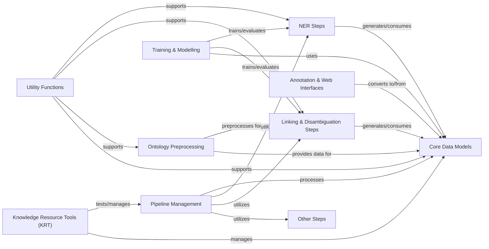

## Component Details

The KAZU system is designed for processing and analyzing biomedical text, primarily focusing on Named Entity Recognition (NER) and entity linking. It orchestrates a pipeline of steps, from data model definition and ontology preprocessing to various NER and linking strategies. The system also includes functionalities for training machine learning models, providing utility functions, and offering web interfaces for annotation and interaction. Its core purpose is to extract and link biomedical entities to knowledge bases, facilitating downstream analysis.

### Core Data Models

Defines fundamental data structures (documents, entities, sections, mappings, ontology resources) used across the KAZU system.

**Related Classes/Methods**:

- `kazu.data.Entity` (160:340)

- `kazu.data.Document` (400:579)

- `kazu.data.Section` (343:397)

- `kazu.data.Mapping` (100:157)

- `kazu.data.OntologyStringResource` (582:630)

- `kazu.data.EquivalentIdSet` (633:650)

- `kazu.data.CharSpan` (19:34)

- `kazu.data.Synonym` (653:666)

- `kazu.data.LinkingCandidate` (69:97)

- `kazu.data.MentionConfidence` (37:46)

- `kazu.data.LinkingMetrics` (49:66)

- `kazu.data.TokWordSpan` (700:715)

- `kazu.data.GliNERBatchItem` (718:725)

- `kazu.data.SavedModel` (728:733)

- `kazu.data.GlobalParserActions` (669:697)

- `kazu.data.PipelineValueError` (736:739)

- `kazu.data.KazuConfigurationError` (742:745)

### Pipeline Management

This component is responsible for orchestrating the overall document processing workflow within KAZU. It manages the execution of various steps, handles document pre-filtering, updates failed documents, and provides profiling capabilities for performance monitoring. It acts as the central control flow for processing documents through the KAZU system.

**Related Classes/Methods**:

- `kazu.pipeline.Pipeline.__call__` (full file reference)

- `kazu.pipeline.Pipeline.prefilter_docs` (full file reference)

- `kazu.pipeline.Pipeline.update_failed_docs` (full file reference)

- `kazu.pipeline.Pipeline.profile` (full file reference)

- `kazu.pipeline.Pipeline.reset` (full file reference)

- `kazu.pipeline.batch_metrics` (full file reference)

### NER Steps

This component encompasses various Named Entity Recognition (NER) steps, each implementing different strategies for identifying and extracting entities from text. This includes rule-based approaches (Seth, Opsin), machine learning models (Spacy, Transformers, GLiNER, LLM-NER), and utilities for processing tokenized words and post-processing entities.

**Related Classes/Methods**:

- <a href="https://github.com/AstraZeneca/KAZU/blob/master/kazu/steps/ner/seth.py#L98-L133" target="_blank" rel="noopener noreferrer">`kazu.steps.ner.seth.SethStep.__call__` (98:133)</a>

- <a href="https://github.com/AstraZeneca/KAZU/blob/master/kazu/steps/ner/llm_ner.py#L269-L290" target="_blank" rel="noopener noreferrer">`kazu.steps.ner.llm_ner.LLMNERStep._automaton_matching` (269:290)</a>

- <a href="https://github.com/AstraZeneca/KAZU/blob/master/kazu/steps/ner/spacy_ner.py#L24-L40" target="_blank" rel="noopener noreferrer">`kazu.steps.ner.spacy_ner.SpacyNerStep.__call__` (24:40)</a>

- <a href="https://github.com/AstraZeneca/KAZU/blob/master/kazu/steps/ner/entity_post_processing.py#L9-L25" target="_blank" rel="noopener noreferrer">`kazu.steps.ner.entity_post_processing._copy_ent_with_new_spans` (9:25)</a>

- <a href="https://github.com/AstraZeneca/KAZU/blob/master/kazu/steps/ner/opsin.py#L283-L309" target="_blank" rel="noopener noreferrer">`kazu.steps.ner.opsin.OpsinStep.__call__` (283:309)</a>

- <a href="https://github.com/AstraZeneca/KAZU/blob/master/kazu/steps/ner/opsin.py#L312-L344" target="_blank" rel="noopener noreferrer">`kazu.steps.ner.opsin.OpsinStep.extendString` (312:344)</a>

- <a href="https://github.com/AstraZeneca/KAZU/blob/master/kazu/steps/ner/opsin.py#L346-L380" target="_blank" rel="noopener noreferrer">`kazu.steps.ner.opsin.OpsinStep.parseString` (346:380)</a>

- <a href="https://github.com/AstraZeneca/KAZU/blob/master/kazu/steps/ner/tokenized_word_processor.py#L126-L140" target="_blank" rel="noopener noreferrer">`kazu.steps.ner.tokenized_word_processor.SimpleSpanFinder.start_span` (126:140)</a>

- <a href="https://github.com/AstraZeneca/KAZU/blob/master/kazu/steps/ner/tokenized_word_processor.py#L238-L247" target="_blank" rel="noopener noreferrer">`kazu.steps.ner.tokenized_word_processor.MultilabelSpanFinder.start_span` (238:247)</a>

- <a href="https://github.com/AstraZeneca/KAZU/blob/master/kazu/steps/ner/tokenized_word_processor.py#L370-L404" target="_blank" rel="noopener noreferrer">`kazu.steps.ner.tokenized_word_processor.TokenizedWordProcessor.spans_to_entities` (370:404)</a>

- <a href="https://github.com/AstraZeneca/KAZU/blob/master/kazu/steps/ner/tokenized_word_processor.py#L406-L411" target="_blank" rel="noopener noreferrer">`kazu.steps.ner.tokenized_word_processor.TokenizedWordProcessor.calculate_span_offsets` (406:411)</a>

- <a href="https://github.com/AstraZeneca/KAZU/blob/master/kazu/steps/ner/tokenized_word_processor.py#L413-L432" target="_blank" rel="noopener noreferrer">`kazu.steps.ner.tokenized_word_processor.TokenizedWordProcessor.attempt_strip_suffixes` (413:432)</a>

- <a href="https://github.com/AstraZeneca/KAZU/blob/master/kazu/steps/ner/gliner.py#L72-L91" target="_blank" rel="noopener noreferrer">`kazu.steps.ner.gliner.ConflictScorer._automaton_matching` (72:91)</a>

- <a href="https://github.com/AstraZeneca/KAZU/blob/master/kazu/steps/ner/gliner.py#L233-L251" target="_blank" rel="noopener noreferrer">`kazu.steps.ner.gliner.GLiNERStep._create_multidoc_batches` (233:251)</a>

- <a href="https://github.com/AstraZeneca/KAZU/blob/master/kazu/steps/ner/gliner.py#L253-L282" target="_blank" rel="noopener noreferrer">`kazu.steps.ner.gliner.GLiNERStep._create_batches` (253:282)</a>

- <a href="https://github.com/AstraZeneca/KAZU/blob/master/kazu/steps/ner/gliner.py#L285-L318" target="_blank" rel="noopener noreferrer">`kazu.steps.ner.gliner.GLiNERStep.__call__` (285:318)</a>

- <a href="https://github.com/AstraZeneca/KAZU/blob/master/kazu/steps/ner/hf_token_classification.py#L63-L351" target="_blank" rel="noopener noreferrer">`kazu.steps.ner.hf_token_classification.TransformersModelForTokenClassificationNerStep` (63:351)</a>

### Linking & Disambiguation Steps

This component focuses on linking identified entities to knowledge base identifiers and resolving ambiguities. It includes strategies for mapping entities, disambiguating candidates based on various criteria (e.g., document context, default labels, embedding similarity), and managing cross-references.

**Related Classes/Methods**:

- <a href="https://github.com/AstraZeneca/KAZU/blob/master/kazu/steps/linking/post_processing/mapping_strategies/strategies.py#L77-L104" target="_blank" rel="noopener noreferrer">`kazu.steps.linking.post_processing.mapping_strategies.strategies.MappingFactory.create_mapping` (77:104)</a>

- <a href="https://github.com/AstraZeneca/KAZU/blob/master/kazu/steps/linking/post_processing/mapping_strategies/strategies.py#L68-L74" target="_blank" rel="noopener noreferrer">`kazu.steps.linking.post_processing.mapping_strategies.strategies.MappingFactory._get_default_label_and_metadata_from_parser` (68:74)</a>

- <a href="https://github.com/AstraZeneca/KAZU/blob/master/kazu/steps/linking/post_processing/disambiguation/strategies.py#L128-L148" target="_blank" rel="noopener noreferrer">`kazu.steps.linking.post_processing.disambiguation.strategies.DefinedElsewhereInDocumentDisambiguationStrategy.disambiguate` (128:148)</a>

- <a href="https://github.com/AstraZeneca/KAZU/blob/master/kazu/steps/linking/post_processing/disambiguation/strategies.py#L417-L445" target="_blank" rel="noopener noreferrer">`kazu.steps.linking.post_processing.disambiguation.strategies.PreferDefaultLabelMatchDisambiguationStrategy.disambiguate` (417:445)</a>

- <a href="https://github.com/AstraZeneca/KAZU/blob/master/kazu/steps/linking/post_processing/disambiguation/strategies.py#L467-L506" target="_blank" rel="noopener noreferrer">`kazu.steps.linking.post_processing.disambiguation.strategies.PreferNearestEmbeddingToDefaultLabelDisambiguationStrategy.disambiguate` (467:506)</a>

- <a href="https://github.com/AstraZeneca/KAZU/blob/master/kazu/steps/joint_ner_and_linking/memory_efficient_string_matching.py#L101-L167" target="_blank" rel="noopener noreferrer">`kazu.steps.joint_ner_and_linking.memory_efficient_string_matching.MemoryEfficientStringMatchingStep._process_automaton` (101:167)</a>

- <a href="https://github.com/AstraZeneca/KAZU/blob/master/kazu/steps/joint_ner_and_linking/memory_efficient_string_matching.py#L95-L99" target="_blank" rel="noopener noreferrer">`kazu.steps.joint_ner_and_linking.memory_efficient_string_matching.MemoryEfficientStringMatchingStep._case_matches` (95:99)</a>

- <a href="https://github.com/AstraZeneca/KAZU/blob/master/kazu/steps/joint_ner_and_linking/explosion.py#L76-L126" target="_blank" rel="noopener noreferrer">`kazu.steps.joint_ner_and_linking.explosion.ExplosionStringMatchingStep.__call__` (76:126)</a>

- <a href="https://github.com/AstraZeneca/KAZU/blob/master/kazu/steps/joint_ner_and_linking/explosion.py#L69-L73" target="_blank" rel="noopener noreferrer">`kazu.steps.joint_ner_and_linking.explosion.ExplosionStringMatchingStep.extract_entity_data_from_spans` (69:73)</a>

### Ontology Preprocessing

This component is responsible for preparing and managing ontology data. It includes utilities for loading ontology resources, handling global parser actions, resolving linking candidates, scoring and grouping IDs, and generating synonyms. It ensures that ontology data is in a usable format for the NER and linking steps.

**Related Classes/Methods**:

- <a href="https://github.com/AstraZeneca/KAZU/blob/master/kazu/ontology_preprocessing/curation_utils.py#L39-L57" target="_blank" rel="noopener noreferrer">`kazu.ontology_preprocessing.curation_utils.load_ontology_string_resources` (39:57)</a>

- <a href="https://github.com/AstraZeneca/KAZU/blob/master/kazu/ontology_preprocessing/curation_utils.py#L104-L118" target="_blank" rel="noopener noreferrer">`kazu.ontology_preprocessing.curation_utils.load_global_actions` (104:118)</a>

- <a href="https://github.com/AstraZeneca/KAZU/blob/master/kazu/ontology_preprocessing/curation_utils.py#L344-L421" target="_blank" rel="noopener noreferrer">`kazu.ontology_preprocessing.curation_utils.OntologyStringConflictAnalyser.autofix_resources` (344:421)</a>

- <a href="https://github.com/AstraZeneca/KAZU/blob/master/kazu/ontology_preprocessing/curation_utils.py#L480-L553" target="_blank" rel="noopener noreferrer">`kazu.ontology_preprocessing.curation_utils.OntologyStringConflictAnalyser.check_for_normalised_behaviour_conflicts_and_merge_if_possible` (480:553)</a>

- <a href="https://github.com/AstraZeneca/KAZU/blob/master/kazu/ontology_preprocessing/curation_utils.py#L555-L576" target="_blank" rel="noopener noreferrer">`kazu.ontology_preprocessing.curation_utils.OntologyStringConflictAnalyser._group_resources_by_syn_norm_and_check_for_normalisation_consistency_errors` (555:576)</a>

- <a href="https://github.com/AstraZeneca/KAZU/blob/master/kazu/ontology_preprocessing/curation_utils.py#L884-L905" target="_blank" rel="noopener noreferrer">`kazu.ontology_preprocessing.curation_utils.OntologyResourceProcessor._drop_id_from_associated_id_sets` (884:905)</a>

- <a href="https://github.com/AstraZeneca/KAZU/blob/master/kazu/ontology_preprocessing/curation_utils.py#L1046-L1164" target="_blank" rel="noopener noreferrer">`kazu.ontology_preprocessing.curation_utils.OntologyResourceProcessor._attempt_to_add_database_entry_for_resource` (1046:1164)</a>

- <a href="https://github.com/AstraZeneca/KAZU/blob/master/kazu/ontology_preprocessing/curation_utils.py#L766-L798" target="_blank" rel="noopener noreferrer">`kazu.ontology_preprocessing.curation_utils.OntologyResourceProcessor._update_candidate_lookups` (766:798)</a>

- <a href="https://github.com/AstraZeneca/KAZU/blob/master/kazu/ontology_preprocessing/base.py#L159-L208" target="_blank" rel="noopener noreferrer">`kazu.ontology_preprocessing.base.OntologyParser._resolve_candidates` (159:208)</a>

- <a href="https://github.com/AstraZeneca/KAZU/blob/master/kazu/ontology_preprocessing/base.py#L151-L157" target="_blank" rel="noopener noreferrer">`kazu.ontology_preprocessing.base.OntologyParser.find_kb` (151:157)</a>

- <a href="https://github.com/AstraZeneca/KAZU/blob/master/kazu/ontology_preprocessing/base.py#L210-L308" target="_blank" rel="noopener noreferrer">`kazu.ontology_preprocessing.base.OntologyParser.score_and_group_ids` (210:308)</a>

- `kazu.ontology_preprocessing.parsers.OpenTargetsDiseaseOntologyParser.score_and_group_ids` (full file reference)

- `kazu.ontology_preprocessing.parsers.OpenTargetsTargetOntologyParser.score_and_group_ids` (full file reference)

- `kazu.ontology_preprocessing.parsers.CellosaurusOntologyParser.score_and_group_ids` (full file reference)

- <a href="https://github.com/AstraZeneca/KAZU/blob/master/kazu/ontology_preprocessing/synonym_generation.py#L49-L105" target="_blank" rel="noopener noreferrer">`kazu.ontology_preprocessing.synonym_generation.CombinatorialSynonymGenerator.__call__` (49:105)</a>

### Training & Modelling

This component provides functionalities for training and evaluating machine learning models within KAZU. It includes utilities for getting label lists, creating model wrappers, managing training data, and saving trained models. It supports the development and deployment of custom NER and linking models.

**Related Classes/Methods**:

- `kazu.training.predict_script.main` (full file reference)

- <a href="https://github.com/AstraZeneca/KAZU/blob/master/kazu/training/modelling_utils.py#L72-L77" target="_blank" rel="noopener noreferrer">`kazu.training.modelling_utils.get_label_list_from_model` (72:77)</a>

- <a href="https://github.com/AstraZeneca/KAZU/blob/master/kazu/training/modelling_utils.py#L123-L132" target="_blank" rel="noopener noreferrer">`kazu.training.modelling_utils.create_wrapper` (123:132)</a>

- <a href="https://github.com/AstraZeneca/KAZU/blob/master/kazu/training/modelling_utils.py#L102-L120" target="_blank" rel="noopener noreferrer">`kazu.training.modelling_utils.LSManagerViewWrapper.update` (102:120)</a>

- <a href="https://github.com/AstraZeneca/KAZU/blob/master/kazu/training/modelling_utils.py#L26-L32" target="_blank" rel="noopener noreferrer">`kazu.training.modelling_utils.doc_yielder` (26:32)</a>

- <a href="https://github.com/AstraZeneca/KAZU/blob/master/kazu/training/modelling_utils.py#L35-L53" target="_blank" rel="noopener noreferrer">`kazu.training.modelling_utils.test_doc_yielder` (35:53)</a>

- <a href="https://github.com/AstraZeneca/KAZU/blob/master/kazu/training/modelling_utils.py#L85-L100" target="_blank" rel="noopener noreferrer">`kazu.training.modelling_utils.LSManagerViewWrapper.get_gold_ents_for_side_by_side_view` (85:100)</a>

- <a href="https://github.com/AstraZeneca/KAZU/blob/master/kazu/training/train_multilabel_ner.py#L70-L106" target="_blank" rel="noopener noreferrer">`kazu.training.train_multilabel_ner.ModelSaver.save` (70:106)</a>

- <a href="https://github.com/AstraZeneca/KAZU/blob/master/kazu/training/train_multilabel_ner.py#L66-L68" target="_blank" rel="noopener noreferrer">`kazu.training.train_multilabel_ner.ModelSaver.save_model` (66:68)</a>

- <a href="https://github.com/AstraZeneca/KAZU/blob/master/kazu/training/train_multilabel_ner.py#L108-L113" target="_blank" rel="noopener noreferrer">`kazu.training.train_multilabel_ner.ModelSaver._save_test_docs` (108:113)</a>

### Utility Functions

This component provides a collection of general-purpose utility functions used across various parts of the KAZU system. This includes string normalization, abbreviation detection, grouping and sorting, file path handling, and managing link indices. These utilities support common operations and improve code reusability.

**Related Classes/Methods**:

- <a href="https://github.com/AstraZeneca/KAZU/blob/master/kazu/utils/utils.py#L121-L122" target="_blank" rel="noopener noreferrer">`kazu.utils.utils.as_path` (121:122)</a>

- <a href="https://github.com/AstraZeneca/KAZU/blob/master/kazu/utils/utils.py#L203-L206" target="_blank" rel="noopener noreferrer">`kazu.utils.utils.word_is_valid` (203:206)</a>

- <a href="https://github.com/AstraZeneca/KAZU/blob/master/kazu/utils/utils.py#L23-L49" target="_blank" rel="noopener noreferrer">`kazu.utils.utils.linking_candidates_to_ontology_string_resources` (23:49)</a>

- <a href="https://github.com/AstraZeneca/KAZU/blob/master/kazu/utils/string_normalizer.py#L428-L431" target="_blank" rel="noopener noreferrer">`kazu.utils.string_normalizer.StringNormalizer.classify_symbolic` (428:431)</a>

- <a href="https://github.com/AstraZeneca/KAZU/blob/master/kazu/utils/string_normalizer.py#L435-L442" target="_blank" rel="noopener noreferrer">`kazu.utils.string_normalizer.StringNormalizer.normalize` (435:442)</a>

- <a href="https://github.com/AstraZeneca/KAZU/blob/master/kazu/utils/grouping.py#L23-L27" target="_blank" rel="noopener noreferrer">`kazu.utils.grouping.sort_then_group` (23:27)</a>

- `kazu.utils.abbreviation_detector.KazuAbbreviationDetector._create_ent_from_span_and_source_ent` (full file reference)

- <a href="https://github.com/AstraZeneca/KAZU/blob/master/kazu/utils/link_index.py#L71-L120" target="_blank" rel="noopener noreferrer">`kazu.utils.link_index.DictionaryIndex.search` (71:120)</a>

- <a href="https://github.com/AstraZeneca/KAZU/blob/master/kazu/utils/link_index.py#L61-L69" target="_blank" rel="noopener noreferrer">`kazu.utils.link_index.DictionaryIndex.apply_boolean_scorers` (61:69)</a>

### Annotation & Web Interfaces

This component handles the conversion of annotation data from external tools like Label Studio into KAZU's internal document format. It also provides functionalities for web-based document conversion, enabling interaction with the KAZU system through a web interface.

**Related Classes/Methods**:

- <a href="https://github.com/AstraZeneca/KAZU/blob/master/kazu/annotation/label_studio.py#L195-L232" target="_blank" rel="noopener noreferrer">`kazu.annotation.label_studio.LSToKazuConversion.__init__` (195:232)</a>

- <a href="https://github.com/AstraZeneca/KAZU/blob/master/kazu/annotation/label_studio.py#L240-L268" target="_blank" rel="noopener noreferrer">`kazu.annotation.label_studio.LSToKazuConversion.create_mappings` (240:268)</a>

- <a href="https://github.com/AstraZeneca/KAZU/blob/master/kazu/annotation/label_studio.py#L234-L238" target="_blank" rel="noopener noreferrer">`kazu.annotation.label_studio.LSToKazuConversion.create_section` (234:238)</a>

- <a href="https://github.com/AstraZeneca/KAZU/blob/master/kazu/annotation/label_studio.py#L270-L279" target="_blank" rel="noopener noreferrer">`kazu.annotation.label_studio.LSToKazuConversion.create_ents` (270:279)</a>

- <a href="https://github.com/AstraZeneca/KAZU/blob/master/kazu/annotation/label_studio.py#L281-L300" target="_blank" rel="noopener noreferrer">`kazu.annotation.label_studio.LSToKazuConversion._create_non_contiguous_entities` (281:300)</a>

- <a href="https://github.com/AstraZeneca/KAZU/blob/master/kazu/annotation/label_studio.py#L302-L311" target="_blank" rel="noopener noreferrer">`kazu.annotation.label_studio.LSToKazuConversion._create_contiguous_entity` (302:311)</a>

- <a href="https://github.com/AstraZeneca/KAZU/blob/master/kazu/annotation/label_studio.py#L319-L335" target="_blank" rel="noopener noreferrer">`kazu.annotation.label_studio.LSToKazuConversion.convert_tasks_to_docs` (319:335)</a>

- <a href="https://github.com/AstraZeneca/KAZU/blob/master/kazu/web/server.py#L208-L209" target="_blank" rel="noopener noreferrer">`kazu.web.server.SectionedWebDocument.to_kazu_document` (208:209)</a>

- <a href="https://github.com/AstraZeneca/KAZU/blob/master/kazu/web/server.py#L218-L219" target="_blank" rel="noopener noreferrer">`kazu.web.server.SimpleWebDocument.to_kazu_document` (218:219)</a>

- <a href="https://github.com/AstraZeneca/KAZU/blob/master/kazu/web/server.py#L331-L344" target="_blank" rel="noopener noreferrer">`kazu.web.server.SingleEntityDocumentConverter.convert_to_kazu_documents` (331:344)</a>

### Knowledge Resource Tools (KRT)

This component provides tools and functionalities for managing and interacting with knowledge resources. It includes capabilities for creating placeholder resources, extracting associated ID sets from dataframes, and processing text for pipeline testing within the KRT environment.

**Related Classes/Methods**:

- <a href="https://github.com/AstraZeneca/KAZU/blob/master/kazu/krt/components.py#L58-L76" target="_blank" rel="noopener noreferrer">`kazu.krt.components.PlaceholderResource.create_placeholder_resource` (58:76)</a>

- <a href="https://github.com/AstraZeneca/KAZU/blob/master/kazu/krt/components.py#L358-L379" target="_blank" rel="noopener noreferrer">`kazu.krt.components.ResourceEditor._extract_associated_id_set_from_df` (358:379)</a>

- `kazu.krt.pages.4_pipeline_test._process_text` (full file reference)

- `kazu.krt.pages.4_pipeline_test.load_pipeline_after_change` (full file reference)

### Other Steps

This component includes miscellaneous processing steps that don't fit into the core NER or Linking categories. Examples include Stanza for linguistic processing and cleanup actions for refining document data.

**Related Classes/Methods**:

- `kazu.steps.other.stanza.StanzaStep.__call__` (full file reference)

- <a href="https://github.com/AstraZeneca/KAZU/blob/master/kazu/steps/other/cleanup.py#L198-L212" target="_blank" rel="noopener noreferrer">`kazu.steps.other.cleanup.DropMappingsByParserNameRankAction.cleanup` (198:212)</a>

### [FAQ](https://github.com/CodeBoarding/GeneratedOnBoardings/tree/main?tab=readme-ov-file#faq)