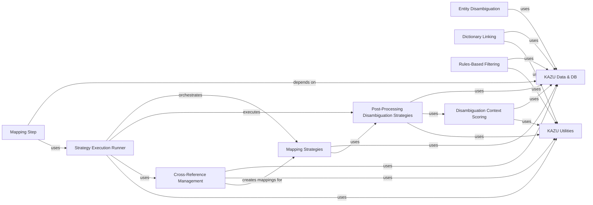

## Component Details

The Entity Linking & Disambiguation subsystem in KAZU is responsible for identifying entities in text and linking them to external knowledge bases, as well as resolving ambiguities between potential links. This process involves several key steps: initial dictionary-based linking, rule-based filtering for disambiguation, and a sophisticated post-processing phase that applies various mapping and disambiguation strategies. The subsystem leverages TF-IDF for context scoring and manages cross-references between different ontologies to ensure accurate and robust entity resolution. The overall purpose is to provide precise and contextually relevant entity annotations.

### Entity Disambiguation

This component is responsible for disambiguating entity classes using a TF-IDF scoring mechanism. It builds TF-IDF documents from spans and scores entity contexts to determine the most appropriate entity class.

**Related Classes/Methods**:

- <a href="https://github.com/AstraZeneca/KAZU/blob/master/kazu/steps/linking/entity_class_disambiguation.py#L33-L98" target="_blank" rel="noopener noreferrer">`KAZU.kazu.steps.linking.entity_class_disambiguation.EntityClassTfIdfScorer` (33:98)</a>

- <a href="https://github.com/AstraZeneca/KAZU/blob/master/kazu/steps/linking/entity_class_disambiguation.py#L101-L192" target="_blank" rel="noopener noreferrer">`KAZU.kazu.steps.linking.entity_class_disambiguation.EntityClassDisambiguationStep` (101:192)</a>

### Dictionary Linking

This component performs entity linking based on a dictionary lookup. It utilizes a caching mechanism to store and retrieve entity linking candidates efficiently.

**Related Classes/Methods**:

- <a href="https://github.com/AstraZeneca/KAZU/blob/master/kazu/steps/linking/dictionary.py#L13-L83" target="_blank" rel="noopener noreferrer">`KAZU.kazu.steps.linking.dictionary.DictionaryEntityLinkingStep` (13:83)</a>

### Rules-Based Filtering

This component applies a set of predefined rules to filter and disambiguate entity classes. It uses Spacy matchers to identify true positive and false positive matches based on custom extensions and mention patterns.

**Related Classes/Methods**:

- <a href="https://github.com/AstraZeneca/KAZU/blob/master/kazu/steps/linking/rules_based_disambiguation.py#L36-L287" target="_blank" rel="noopener noreferrer">`KAZU.kazu.steps.linking.rules_based_disambiguation.RulesBasedEntityClassDisambiguationFilterStep` (36:287)</a>

### Cross-Reference Management

This component manages cross-references between different knowledge bases or ontologies. It can build a cache of cross-references, including fetching data from external services like Oxo.

**Related Classes/Methods**:

- <a href="https://github.com/AstraZeneca/KAZU/blob/master/kazu/steps/linking/post_processing/xref_manager.py#L40-L104" target="_blank" rel="noopener noreferrer">`KAZU.kazu.steps.linking.post_processing.xref_manager.CrossReferenceManager` (40:104)</a>

- <a href="https://github.com/AstraZeneca/KAZU/blob/master/kazu/steps/linking/post_processing/xref_manager.py#L107-L215" target="_blank" rel="noopener noreferrer">`KAZU.kazu.steps.linking.post_processing.xref_manager.OxoCrossReferenceManager` (107:215)</a>

### Mapping Strategies

This component defines and implements various strategies for mapping entities to their canonical identifiers. It includes a factory for creating mapping objects and different matching strategies like symbol match and strong match.

**Related Classes/Methods**:

- <a href="https://github.com/AstraZeneca/KAZU/blob/master/kazu/steps/linking/post_processing/mapping_strategies/strategies.py#L20-L104" target="_blank" rel="noopener noreferrer">`KAZU.kazu.steps.linking.post_processing.mapping_strategies.strategies.MappingFactory` (20:104)</a>

- <a href="https://github.com/AstraZeneca/KAZU/blob/master/kazu/steps/linking/post_processing/mapping_strategies/strategies.py#L107-L278" target="_blank" rel="noopener noreferrer">`KAZU.kazu.steps.linking.post_processing.mapping_strategies.strategies.MappingStrategy` (107:278)</a>

- <a href="https://github.com/AstraZeneca/KAZU/blob/master/kazu/steps/linking/post_processing/mapping_strategies/strategies.py#L295-L334" target="_blank" rel="noopener noreferrer">`KAZU.kazu.steps.linking.post_processing.mapping_strategies.strategies.SymbolMatchMappingStrategy` (295:334)</a>

- <a href="https://github.com/AstraZeneca/KAZU/blob/master/kazu/steps/linking/post_processing/mapping_strategies/strategies.py#L337-L398" target="_blank" rel="noopener noreferrer">`KAZU.kazu.steps.linking.post_processing.mapping_strategies.strategies.SynNormIsSubStringMappingStrategy` (337:398)</a>

- <a href="https://github.com/AstraZeneca/KAZU/blob/master/kazu/steps/linking/post_processing/mapping_strategies/strategies.py#L401-L476" target="_blank" rel="noopener noreferrer">`KAZU.kazu.steps.linking.post_processing.mapping_strategies.strategies.StrongMatchMappingStrategy` (401:476)</a>

- <a href="https://github.com/AstraZeneca/KAZU/blob/master/kazu/steps/linking/post_processing/mapping_strategies/strategies.py#L479-L552" target="_blank" rel="noopener noreferrer">`KAZU.kazu.steps.linking.post_processing.mapping_strategies.strategies.StrongMatchWithEmbeddingConfirmationStringMatchingStrategy` (479:552)</a>

### Post-Processing Disambiguation Strategies

This component provides a collection of strategies for disambiguating entities after initial linking. These strategies leverage various contextual cues, including TF-IDF scores, document context, and default labels.

**Related Classes/Methods**:

- <a href="https://github.com/AstraZeneca/KAZU/blob/master/kazu/steps/linking/post_processing/disambiguation/strategies.py#L33-L96" target="_blank" rel="noopener noreferrer">`KAZU.kazu.steps.linking.post_processing.disambiguation.strategies.DisambiguationStrategy` (33:96)</a>

- <a href="https://github.com/AstraZeneca/KAZU/blob/master/kazu/steps/linking/post_processing/disambiguation/strategies.py#L99-L148" target="_blank" rel="noopener noreferrer">`KAZU.kazu.steps.linking.post_processing.disambiguation.strategies.DefinedElsewhereInDocumentDisambiguationStrategy` (99:148)</a>

- <a href="https://github.com/AstraZeneca/KAZU/blob/master/kazu/steps/linking/post_processing/disambiguation/strategies.py#L151-L268" target="_blank" rel="noopener noreferrer">`KAZU.kazu.steps.linking.post_processing.disambiguation.strategies.TfIdfDisambiguationStrategy` (151:268)</a>

- <a href="https://github.com/AstraZeneca/KAZU/blob/master/kazu/steps/linking/post_processing/disambiguation/strategies.py#L271-L357" target="_blank" rel="noopener noreferrer">`KAZU.kazu.steps.linking.post_processing.disambiguation.strategies.GildaTfIdfDisambiguationStrategy` (271:357)</a>

- <a href="https://github.com/AstraZeneca/KAZU/blob/master/kazu/steps/linking/post_processing/disambiguation/strategies.py#L360-L396" target="_blank" rel="noopener noreferrer">`KAZU.kazu.steps.linking.post_processing.disambiguation.strategies.AnnotationLevelDisambiguationStrategy` (360:396)</a>

- <a href="https://github.com/AstraZeneca/KAZU/blob/master/kazu/steps/linking/post_processing/disambiguation/strategies.py#L399-L445" target="_blank" rel="noopener noreferrer">`KAZU.kazu.steps.linking.post_processing.disambiguation.strategies.PreferDefaultLabelMatchDisambiguationStrategy` (399:445)</a>

- <a href="https://github.com/AstraZeneca/KAZU/blob/master/kazu/steps/linking/post_processing/disambiguation/strategies.py#L448-L506" target="_blank" rel="noopener noreferrer">`KAZU.kazu.steps.linking.post_processing.disambiguation.strategies.PreferNearestEmbeddingToDefaultLabelDisambiguationStrategy` (448:506)</a>

### Disambiguation Context Scoring

This component is dedicated to generating and scoring context representations for disambiguation. It uses TF-IDF models and n-gram generation to create vector representations of text for similarity calculations.

**Related Classes/Methods**:

- <a href="https://github.com/AstraZeneca/KAZU/blob/master/kazu/steps/linking/post_processing/disambiguation/context_scoring.py#L48-L88" target="_blank" rel="noopener noreferrer">`KAZU.kazu.steps.linking.post_processing.disambiguation.context_scoring.TfIdfScorer` (48:88)</a>

- <a href="https://github.com/AstraZeneca/KAZU/blob/master/kazu/steps/linking/post_processing/disambiguation/context_scoring.py#L91-L231" target="_blank" rel="noopener noreferrer">`KAZU.kazu.steps.linking.post_processing.disambiguation.context_scoring.GildaTfIdfScorer` (91:231)</a>

### Strategy Execution Runner

This component orchestrates the execution of various post-processing strategies, including mapping and disambiguation. It groups entities and applies strategies based on confidence levels and symbolism.

**Related Classes/Methods**:

- <a href="https://github.com/AstraZeneca/KAZU/blob/master/kazu/steps/linking/post_processing/strategy_runner.py#L39-L158" target="_blank" rel="noopener noreferrer">`KAZU.kazu.steps.linking.post_processing.strategy_runner.ConfidenceLevelStrategyExecution` (39:158)</a>

- <a href="https://github.com/AstraZeneca/KAZU/blob/master/kazu/steps/linking/post_processing/strategy_runner.py#L161-L341" target="_blank" rel="noopener noreferrer">`KAZU.kazu.steps.linking.post_processing.strategy_runner.StrategyRunner` (161:341)</a>

### Mapping Step

This component represents a processing step within the KAZU pipeline specifically designed for applying mapping strategies to entities. It inherits from a general parser-dependent step.

**Related Classes/Methods**:

- <a href="https://github.com/AstraZeneca/KAZU/blob/master/kazu/steps/linking/post_processing/mapping_step.py#L12-L25" target="_blank" rel="noopener noreferrer">`KAZU.kazu.steps.linking.post_processing.mapping_step.MappingStep` (12:25)</a>

### KAZU Utilities

This component provides a collection of utility functions used across the KAZU system, including caching, grouping, Spacy object mapping, string normalization, and n-gram generation.

**Related Classes/Methods**:

- <a href="https://github.com/AstraZeneca/KAZU/blob/master/kazu/utils/caching.py#L95-L128" target="_blank" rel="noopener noreferrer">`kazu.utils.caching.EntityLinkingLookupCache` (95:128)</a>

- <a href="https://github.com/AstraZeneca/KAZU/blob/master/kazu/utils/grouping.py#L23-L27" target="_blank" rel="noopener noreferrer">`kazu.utils.grouping.sort_then_group` (23:27)</a>

- <a href="https://github.com/AstraZeneca/KAZU/blob/master/kazu/utils/spacy_object_mapper.py#L7-L96" target="_blank" rel="noopener noreferrer">`kazu.utils.spacy_object_mapper.KazuToSpacyObjectMapper` (7:96)</a>

- <a href="https://github.com/AstraZeneca/KAZU/blob/master/kazu/utils/spacy_pipeline.py#L87-L254" target="_blank" rel="noopener noreferrer">`kazu.utils.spacy_pipeline.SpacyPipelines` (87:254)</a>

- <a href="https://github.com/AstraZeneca/KAZU/blob/master/kazu/utils/string_normalizer.py#L415-L442" target="_blank" rel="noopener noreferrer">`kazu.utils.string_normalizer.StringNormalizer` (415:442)</a>

- <a href="https://github.com/AstraZeneca/KAZU/blob/master/kazu/utils/utils.py#L176-L180" target="_blank" rel="noopener noreferrer">`kazu.utils.utils.create_word_ngrams` (176:180)</a>

- <a href="https://github.com/AstraZeneca/KAZU/blob/master/kazu/utils/utils.py#L171-L173" target="_blank" rel="noopener noreferrer">`kazu.utils.utils.create_char_ngrams` (171:173)</a>

### KAZU Data & DB

This component encompasses core data structures and in-memory database interactions within the KAZU system, including mappings, equivalent ID sets, and metadata/synonym databases.

**Related Classes/Methods**:

- `kazu.data.Mapping` (full file reference)

- `kazu.data.EquivalentIdSet` (full file reference)

- <a href="https://github.com/AstraZeneca/KAZU/blob/master/kazu/database/in_memory_db.py#L22-L73" target="_blank" rel="noopener noreferrer">`kazu.database.in_memory_db.MetadataDatabase` (22:73)</a>

- <a href="https://github.com/AstraZeneca/KAZU/blob/master/kazu/database/in_memory_db.py#L76-L148" target="_blank" rel="noopener noreferrer">`kazu.database.in_memory_db.SynonymDatabase` (76:148)</a>

- <a href="https://github.com/AstraZeneca/KAZU/blob/master/kazu/steps/step.py#L36-L50" target="_blank" rel="noopener noreferrer">`kazu.steps.step.ParserDependentStep` (36:50)</a>

### [FAQ](https://github.com/CodeBoarding/GeneratedOnBoardings/tree/main?tab=readme-ov-file#faq)