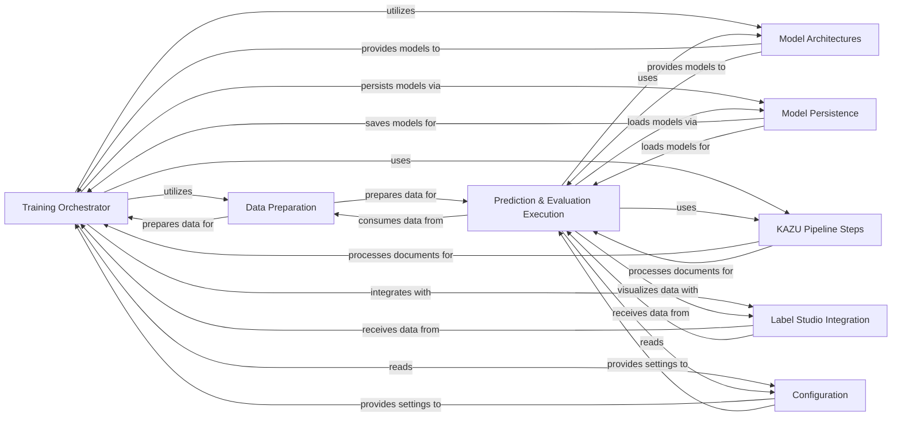

## Component Details

The Model Training & Evaluation subsystem in KAZU provides a comprehensive suite of functionalities for developing, training, and assessing machine learning models, specifically tailored for multi-label Named Entity Recognition (NER). Its main flow involves preparing raw data, training various transformer-based models, persisting these models, and then using them for prediction and evaluation. The subsystem also integrates with external tools like Label Studio for annotation visualization and leverages KAZU's internal pipeline steps for document processing, ensuring a cohesive and efficient machine learning workflow.

### Training Orchestrator

Manages the entire lifecycle of model training, including initialization, data loading, optimization, evaluation, and model saving. It coordinates interactions with datasets, model architectures, and persistence mechanisms.

**Related Classes/Methods**:

- <a href="https://github.com/AstraZeneca/KAZU/blob/master/kazu/training/train_multilabel_ner.py#L305-L514" target="_blank" rel="noopener noreferrer">`KAZU.kazu.training.train_multilabel_ner.Trainer` (305:514)</a>

- <a href="https://github.com/AstraZeneca/KAZU/blob/master/kazu/training/train_script.py#L40-L100" target="_blank" rel="noopener noreferrer">`KAZU.kazu.training.train_script.run` (40:100)</a>

### Data Preparation

Responsible for transforming raw documents and annotations into a format suitable for model training and evaluation. This includes tokenization, alignment of entities, and creation of multi-hot encoded labels, along with utilities for yielding documents from various sources.

**Related Classes/Methods**:

- <a href="https://github.com/AstraZeneca/KAZU/blob/master/kazu/training/train_multilabel_ner.py#L116-L225" target="_blank" rel="noopener noreferrer">`KAZU.kazu.training.train_multilabel_ner.KazuMultiHotNerMultiLabelTrainingDataset` (116:225)</a>

- <a href="https://github.com/AstraZeneca/KAZU/blob/master/kazu/training/modelling_utils.py#L26-L32" target="_blank" rel="noopener noreferrer">`KAZU.kazu.training.modelling_utils.doc_yielder` (26:32)</a>

- <a href="https://github.com/AstraZeneca/KAZU/blob/master/kazu/training/modelling_utils.py#L35-L53" target="_blank" rel="noopener noreferrer">`KAZU.kazu.training.modelling_utils.test_doc_yielder` (35:53)</a>

- <a href="https://github.com/AstraZeneca/KAZU/blob/master/kazu/training/modelling_utils.py#L62-L69" target="_blank" rel="noopener noreferrer">`KAZU.kazu.training.modelling_utils.get_label_list` (62:69)</a>

### Model Architectures

Defines the specific neural network models used for multi-label token classification. These models typically extend pre-trained Hugging Face Transformers models and are adapted to handle multi-label outputs.

**Related Classes/Methods**:

- <a href="https://github.com/AstraZeneca/KAZU/blob/master/kazu/training/modelling.py#L52-L101" target="_blank" rel="noopener noreferrer">`KAZU.kazu.training.modelling.DebertaForMultiLabelTokenClassification` (52:101)</a>

- <a href="https://github.com/AstraZeneca/KAZU/blob/master/kazu/training/modelling.py#L104-L155" target="_blank" rel="noopener noreferrer">`KAZU.kazu.training.modelling.DistilBertForMultiLabelTokenClassification` (104:155)</a>

- <a href="https://github.com/AstraZeneca/KAZU/blob/master/kazu/training/modelling.py#L158-L214" target="_blank" rel="noopener noreferrer">`KAZU.kazu.training.modelling.BertForMultiLabelTokenClassification` (158:214)</a>

### Model Persistence

Handles the saving and loading of trained models, their configurations, and associated artifacts, ensuring that trained models can be reused for prediction or further evaluation.

**Related Classes/Methods**:

- <a href="https://github.com/AstraZeneca/KAZU/blob/master/kazu/training/train_multilabel_ner.py#L55-L113" target="_blank" rel="noopener noreferrer">`KAZU.kazu.training.train_multilabel_ner.ModelSaver` (55:113)</a>

### Prediction & Evaluation Execution

Manages the execution of prediction and evaluation tasks. It orchestrates the loading of trained models, processing of documents through the KAZU pipeline, generation of predictions, and calculation of performance metrics.

**Related Classes/Methods**:

- `KAZU.kazu.training.predict_script.main` (full file reference)

- `KAZU.kazu.training.evaluate_script.main` (full file reference)

- <a href="https://github.com/AstraZeneca/KAZU/blob/master/kazu/training/train_multilabel_ner.py#L242-L302" target="_blank" rel="noopener noreferrer">`KAZU.kazu.training.train_multilabel_ner.calculate_metrics` (242:302)</a>

### Label Studio Integration

Provides functionalities to interact with Label Studio, an annotation tool. It enables the creation and updating of annotation views, allowing for visualization of model predictions alongside gold annotations for human review.

**Related Classes/Methods**:

- <a href="https://github.com/AstraZeneca/KAZU/blob/master/kazu/training/modelling_utils.py#L80-L120" target="_blank" rel="noopener noreferrer">`KAZU.kazu.training.modelling_utils.LSManagerViewWrapper` (80:120)</a>

- <a href="https://github.com/AstraZeneca/KAZU/blob/master/kazu/training/modelling_utils.py#L123-L132" target="_blank" rel="noopener noreferrer">`KAZU.kazu.training.modelling_utils.create_wrapper` (123:132)</a>

- <a href="https://github.com/AstraZeneca/KAZU/blob/master/kazu/training/train_script.py#L28-L36" target="_blank" rel="noopener noreferrer">`KAZU.kazu.training.train_script.create_view_for_labels` (28:36)</a>

### KAZU Pipeline Steps

Encompasses the KAZU pipeline steps specifically designed for Named Entity Recognition (NER) using Hugging Face Transformers models. These steps integrate the Transformer models into the KAZU processing pipeline and convert their token-level outputs into structured KAZU Entity objects.

**Related Classes/Methods**:

- <a href="https://github.com/AstraZeneca/KAZU/blob/master/kazu/steps/ner/hf_token_classification.py#L63-L351" target="_blank" rel="noopener noreferrer">`kazu.steps.ner.hf_token_classification.TransformersModelForTokenClassificationNerStep` (63:351)</a>

- <a href="https://github.com/AstraZeneca/KAZU/blob/master/kazu/steps/ner/tokenized_word_processor.py#L319-L432" target="_blank" rel="noopener noreferrer">`kazu.steps.ner.tokenized_word_processor.TokenizedWordProcessor` (319:432)</a>

- `kazu.pipeline.Pipeline` (full file reference)

### Configuration

Manages configuration settings for model training and evaluation, such as model paths, training parameters, and data directories.

**Related Classes/Methods**:

- `KAZU.kazu.training.config` (full file reference)

### [FAQ](https://github.com/CodeBoarding/GeneratedOnBoardings/tree/main?tab=readme-ov-file#faq)