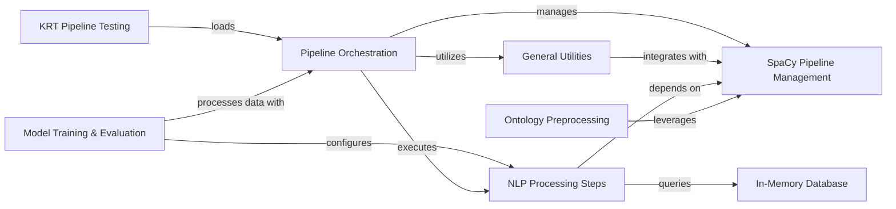

## Component Details

The NLP Pipeline Management subsystem in KAZU is responsible for orchestrating the execution of Natural Language Processing (NLP) steps on documents and efficiently managing spaCy models within these pipelines. It encompasses the core pipeline execution flow, including error handling and performance monitoring, and provides foundational utilities for loading, reloading, and processing documents with spaCy models. This subsystem integrates various NLP processing steps, leverages an in-memory database for efficient lookups, and interacts with training and evaluation components, as well as ontology preprocessing for knowledge enrichment. It also supports testing and management within the Kazu Resource Tool (KRT) environment.

### Pipeline Orchestration

Manages the execution flow of documents through a series of NLP steps, handling pre-filtering, error management, and performance profiling. It is the central component for processing documents within KAZU.

**Related Classes/Methods**:

- `kazu.pipeline.Pipeline` (132:194)

- `kazu.pipeline.batch_metrics` (50:61)

- `kazu.pipeline.FailedDocsFileHandler` (92:117)

### SpaCy Pipeline Management

A foundational utility for managing and providing access to spaCy language models and custom pipeline components, including mechanisms for adding, retrieving, and reloading models.

**Related Classes/Methods**:

- <a href="https://github.com/AstraZeneca/KAZU/blob/master/kazu/utils/spacy_pipeline.py#L124-L132" target="_blank" rel="noopener noreferrer">`KAZU.kazu.utils.spacy_pipeline.SpacyPipelines.add_from_path` (124:132)</a>

- <a href="https://github.com/AstraZeneca/KAZU/blob/master/kazu/utils/spacy_pipeline.py#L135-L143" target="_blank" rel="noopener noreferrer">`KAZU.kazu.utils.spacy_pipeline.SpacyPipelines.add_from_func` (135:143)</a>

- <a href="https://github.com/AstraZeneca/KAZU/blob/master/kazu/utils/spacy_pipeline.py#L146-L160" target="_blank" rel="noopener noreferrer">`KAZU.kazu.utils.spacy_pipeline.SpacyPipelines.add_reload_callback_func` (146:160)</a>

- <a href="https://github.com/AstraZeneca/KAZU/blob/master/kazu/utils/spacy_pipeline.py#L163-L166" target="_blank" rel="noopener noreferrer">`KAZU.kazu.utils.spacy_pipeline.SpacyPipelines.get_model` (163:166)</a>

- <a href="https://github.com/AstraZeneca/KAZU/blob/master/kazu/utils/spacy_pipeline.py#L169-L175" target="_blank" rel="noopener noreferrer">`KAZU.kazu.utils.spacy_pipeline.SpacyPipelines.process_batch` (169:175)</a>

- <a href="https://github.com/AstraZeneca/KAZU/blob/master/kazu/utils/spacy_pipeline.py#L220-L232" target="_blank" rel="noopener noreferrer">`KAZU.kazu.utils.spacy_pipeline.SpacyPipelines.process_single` (220:232)</a>

- <a href="https://github.com/AstraZeneca/KAZU/blob/master/kazu/utils/spacy_pipeline.py#L234-L246" target="_blank" rel="noopener noreferrer">`KAZU.kazu.utils.spacy_pipeline.SpacyPipelines._reload_if_required` (234:246)</a>

- <a href="https://github.com/AstraZeneca/KAZU/blob/master/kazu/utils/spacy_pipeline.py#L248-L254" target="_blank" rel="noopener noreferrer">`KAZU.kazu.utils.spacy_pipeline.SpacyPipelines.reload_model` (248:254)</a>

- <a href="https://github.com/AstraZeneca/KAZU/blob/master/kazu/utils/spacy_pipeline.py#L80-L84" target="_blank" rel="noopener noreferrer">`kazu.utils.spacy_pipeline.basic_spacy_pipeline` (80:84)</a>

### NLP Processing Steps

A collection of individual processing steps for Named Entity Recognition (NER) and entity linking, encompassing various model-based (e.g., LLM, HuggingFace, spaCy) and rule-based approaches.

**Related Classes/Methods**:

- <a href="https://github.com/AstraZeneca/KAZU/blob/master/kazu/steps/ner/llm_ner.py#L202-L219" target="_blank" rel="noopener noreferrer">`KAZU.kazu.steps.ner.llm_ner.LLMNERStep.__init__` (202:219)</a>

- <a href="https://github.com/AstraZeneca/KAZU/blob/master/kazu/steps/ner/spacy_ner.py#L12-L21" target="_blank" rel="noopener noreferrer">`KAZU.kazu.steps.ner.spacy_ner.SpacyNerStep.__init__` (12:21)</a>

- <a href="https://github.com/AstraZeneca/KAZU/blob/master/kazu/steps/ner/entity_post_processing.py#L29-L36" target="_blank" rel="noopener noreferrer">`KAZU.kazu.steps.ner.entity_post_processing.SplitOnConjunctionPattern.__init__` (29:36)</a>

- <a href="https://github.com/AstraZeneca/KAZU/blob/master/kazu/steps/ner/gliner.py#L38-L42" target="_blank" rel="noopener noreferrer">`KAZU.kazu.steps.ner.gliner.ConflictScorer.__init__` (38:42)</a>

- <a href="https://github.com/AstraZeneca/KAZU/blob/master/kazu/steps/ner/hf_token_classification.py#L72-L119" target="_blank" rel="noopener noreferrer">`KAZU.kazu.steps.ner.hf_token_classification.TransformersModelForTokenClassificationNerStep.__init__` (72:119)</a>

- <a href="https://github.com/AstraZeneca/KAZU/blob/master/kazu/steps/ner/hf_token_classification.py#L121-L138" target="_blank" rel="noopener noreferrer">`KAZU.kazu.steps.ner.hf_token_classification.TransformersModelForTokenClassificationNerStep._optimize_model` (121:138)</a>

- <a href="https://github.com/AstraZeneca/KAZU/blob/master/kazu/steps/joint_ner_and_linking/memory_efficient_string_matching.py#L33-L39" target="_blank" rel="noopener noreferrer">`KAZU.kazu.steps.joint_ner_and_linking.memory_efficient_string_matching.MemoryEfficientStringMatchingStep.__init__` (33:39)</a>

- <a href="https://github.com/AstraZeneca/KAZU/blob/master/kazu/steps/joint_ner_and_linking/memory_efficient_string_matching.py#L42-L93" target="_blank" rel="noopener noreferrer">`KAZU.kazu.steps.joint_ner_and_linking.memory_efficient_string_matching.MemoryEfficientStringMatchingStep._create_automaton` (42:93)</a>

- <a href="https://github.com/AstraZeneca/KAZU/blob/master/kazu/steps/joint_ner_and_linking/explosion.py#L28-L67" target="_blank" rel="noopener noreferrer">`KAZU.kazu.steps.joint_ner_and_linking.explosion.ExplosionStringMatchingStep.__init__` (28:67)</a>

- <a href="https://github.com/AstraZeneca/KAZU/blob/master/kazu/steps/step.py#L44-L50" target="_blank" rel="noopener noreferrer">`kazu.steps.step.ParserDependentStep.__init__` (44:50)</a>

- <a href="https://github.com/AstraZeneca/KAZU/blob/master/kazu/steps/step.py#L11-L19" target="_blank" rel="noopener noreferrer">`kazu.steps.step.Step.namespace` (11:19)</a>

- <a href="https://github.com/AstraZeneca/KAZU/blob/master/kazu/steps/ner/tokenized_word_processor.py#L319-L432" target="_blank" rel="noopener noreferrer">`kazu.steps.ner.tokenized_word_processor.TokenizedWordProcessor` (319:432)</a>

### General Utilities

Provides common utility functions used across the KAZU system, such as path handling, simple document creation, and specialized NLP utilities like abbreviation detection and spaCy object mapping.

**Related Classes/Methods**:

- <a href="https://github.com/AstraZeneca/KAZU/blob/master/kazu/utils/utils.py#L121-L122" target="_blank" rel="noopener noreferrer">`kazu.utils.utils.as_path` (121:122)</a>

- `kazu.data.Document.create_simple_document` (full file reference)

- `KAZU.kazu.utils.abbreviation_detector.KazuAbbreviationDetector.__init__` (full file reference)

- `KAZU.kazu.utils.abbreviation_detector.KazuAbbreviationDetector.load_matcher` (full file reference)

- <a href="https://github.com/AstraZeneca/KAZU/blob/master/kazu/utils/spacy_object_mapper.py#L36-L68" target="_blank" rel="noopener noreferrer">`KAZU.kazu.utils.spacy_object_mapper.KazuToSpacyObjectMapper.__init__` (36:68)</a>

### In-Memory Database

Manages an in-memory database primarily used for storing and retrieving synonym data, enabling efficient lookups and matching during NLP processing steps.

**Related Classes/Methods**:

- <a href="https://github.com/AstraZeneca/KAZU/blob/master/kazu/database/in_memory_db.py#L76-L148" target="_blank" rel="noopener noreferrer">`kazu.database.in_memory_db.SynonymDatabase` (76:148)</a>

### Model Training & Evaluation

Provides functionalities for training, predicting, and evaluating machine learning models, particularly for Named Entity Recognition (NER). It includes utilities for data handling, model wrapping, and metric calculation.

**Related Classes/Methods**:

- `KAZU.kazu.training.predict_script.main` (full file reference)

- <a href="https://github.com/AstraZeneca/KAZU/blob/master/kazu/training/train_multilabel_ner.py#L396-L404" target="_blank" rel="noopener noreferrer">`KAZU.kazu.training.train_multilabel_ner.Trainer._process_docs_with_kazu_step` (396:404)</a>

- `KAZU.kazu.training.evaluate_script.main` (full file reference)

- <a href="https://github.com/AstraZeneca/KAZU/blob/master/kazu/training/train_script.py#L40-L100" target="_blank" rel="noopener noreferrer">`KAZU.kazu.training.train_script.run` (40:100)</a>

- <a href="https://github.com/AstraZeneca/KAZU/blob/master/kazu/training/modelling_utils.py#L72-L77" target="_blank" rel="noopener noreferrer">`kazu.training.modelling_utils.get_label_list_from_model` (72:77)</a>

- <a href="https://github.com/AstraZeneca/KAZU/blob/master/kazu/training/modelling_utils.py#L123-L132" target="_blank" rel="noopener noreferrer">`kazu.training.modelling_utils.create_wrapper` (123:132)</a>

- <a href="https://github.com/AstraZeneca/KAZU/blob/master/kazu/training/modelling_utils.py#L102-L120" target="_blank" rel="noopener noreferrer">`kazu.training.modelling_utils.LSManagerViewWrapper.update` (102:120)</a>

- <a href="https://github.com/AstraZeneca/KAZU/blob/master/kazu/training/modelling_utils.py#L56-L59" target="_blank" rel="noopener noreferrer">`kazu.training.modelling_utils.chunks` (56:59)</a>

- <a href="https://github.com/AstraZeneca/KAZU/blob/master/kazu/training/modelling_utils.py#L26-L32" target="_blank" rel="noopener noreferrer">`kazu.training.modelling_utils.doc_yielder` (26:32)</a>

- <a href="https://github.com/AstraZeneca/KAZU/blob/master/kazu/training/modelling_utils.py#L35-L53" target="_blank" rel="noopener noreferrer">`kazu.training.modelling_utils.test_doc_yielder` (35:53)</a>

- <a href="https://github.com/AstraZeneca/KAZU/blob/master/kazu/training/modelling_utils.py#L62-L69" target="_blank" rel="noopener noreferrer">`kazu.training.modelling_utils.get_label_list` (62:69)</a>

- <a href="https://github.com/AstraZeneca/KAZU/blob/master/kazu/training/train_multilabel_ner.py#L228-L239" target="_blank" rel="noopener noreferrer">`kazu.training.train_multilabel_ner.move_entities_to_metadata` (228:239)</a>

- `KAZU.kazu.training.evaluate_script.save_out_predictions` (full file reference)

- <a href="https://github.com/AstraZeneca/KAZU/blob/master/kazu/training/train_multilabel_ner.py#L242-L302" target="_blank" rel="noopener noreferrer">`kazu.training.train_multilabel_ner.calculate_metrics` (242:302)</a>

- <a href="https://github.com/AstraZeneca/KAZU/blob/master/kazu/training/train_multilabel_ner.py#L116-L225" target="_blank" rel="noopener noreferrer">`kazu.training.train_multilabel_ner.KazuMultiHotNerMultiLabelTrainingDataset` (116:225)</a>

- <a href="https://github.com/AstraZeneca/KAZU/blob/master/kazu/training/train_multilabel_ner.py#L305-L514" target="_blank" rel="noopener noreferrer">`kazu.training.train_multilabel_ner.Trainer` (305:514)</a>

- <a href="https://github.com/AstraZeneca/KAZU/blob/master/kazu/training/train_multilabel_ner.py#L432-L514" target="_blank" rel="noopener noreferrer">`kazu.training.train_multilabel_ner.Trainer.train_model` (432:514)</a>

### Ontology Preprocessing

Responsible for generating and expanding synonyms and variants from ontological data, often leveraging spaCy pipelines for linguistic analysis to enrich the knowledge base.

**Related Classes/Methods**:

- <a href="https://github.com/AstraZeneca/KAZU/blob/master/kazu/ontology_preprocessing/synonym_generation.py#L111-L115" target="_blank" rel="noopener noreferrer">`KAZU.kazu.ontology_preprocessing.synonym_generation.SeparatorExpansion.__init__` (111:115)</a>

- <a href="https://github.com/AstraZeneca/KAZU/blob/master/kazu/ontology_preprocessing/synonym_generation.py#L351-L364" target="_blank" rel="noopener noreferrer">`KAZU.kazu.ontology_preprocessing.synonym_generation.TokenListReplacementGenerator.__init__` (351:364)</a>

- <a href="https://github.com/AstraZeneca/KAZU/blob/master/kazu/ontology_preprocessing/synonym_generation.py#L366-L370" target="_blank" rel="noopener noreferrer">`KAZU.kazu.ontology_preprocessing.synonym_generation.TokenListReplacementGenerator._init_token_matcher` (366:370)</a>

- <a href="https://github.com/AstraZeneca/KAZU/blob/master/kazu/ontology_preprocessing/synonym_generation.py#L372-L382" target="_blank" rel="noopener noreferrer">`KAZU.kazu.ontology_preprocessing.synonym_generation.TokenListReplacementGenerator.call` (372:382)</a>

- <a href="https://github.com/AstraZeneca/KAZU/blob/master/kazu/ontology_preprocessing/synonym_generation.py#L395-L422" target="_blank" rel="noopener noreferrer">`KAZU.kazu.ontology_preprocessing.synonym_generation.VerbPhraseVariantGenerator.__init__` (395:422)</a>

- <a href="https://github.com/AstraZeneca/KAZU/blob/master/kazu/ontology_preprocessing/synonym_generation.py#L424-L427" target="_blank" rel="noopener noreferrer">`KAZU.kazu.ontology_preprocessing.synonym_generation.VerbPhraseVariantGenerator._init_lemma_matcher` (424:427)</a>

- <a href="https://github.com/AstraZeneca/KAZU/blob/master/kazu/ontology_preprocessing/synonym_generation.py#L435-L460" target="_blank" rel="noopener noreferrer">`KAZU.kazu.ontology_preprocessing.synonym_generation.VerbPhraseVariantGenerator.call` (435:460)</a>

- <a href="https://github.com/AstraZeneca/KAZU/blob/master/kazu/ontology_preprocessing/synonym_generation.py#L429-L433" target="_blank" rel="noopener noreferrer">`KAZU.kazu.ontology_preprocessing.synonym_generation.VerbPhraseVariantGenerator._populate_lemma_template` (429:433)</a>

### KRT Pipeline Testing

Facilitates the testing and management of Kazu pipelines within the Kazu Resource Tool (KRT) environment, interacting with resource managers to load and test pipeline configurations.

**Related Classes/Methods**:

- `KAZU.kazu.krt.pages.4_pipeline_test.load_pipeline_after_change` (full file reference)

- <a href="https://github.com/AstraZeneca/KAZU/blob/master/kazu/krt/utils.py#L21-L22" target="_blank" rel="noopener noreferrer">`kazu.krt.utils.get_resource_manager` (21:22)</a>

- <a href="https://github.com/AstraZeneca/KAZU/blob/master/kazu/krt/resource_manager.py#L175-L177" target="_blank" rel="noopener noreferrer">`kazu.krt.resource_manager.ResourceManager.load_cache_state_aware_pipeline` (175:177)</a>

### [FAQ](https://github.com/CodeBoarding/GeneratedOnBoardings/tree/main?tab=readme-ov-file#faq)