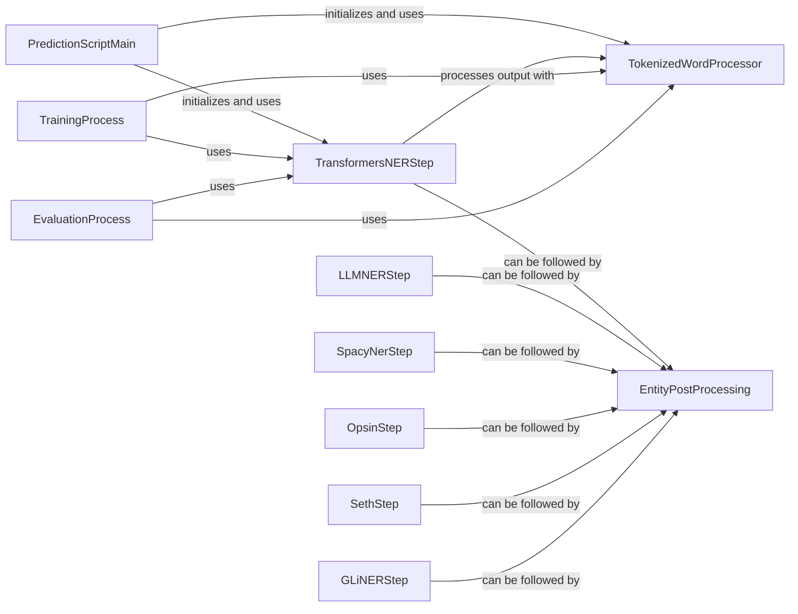

## Component Details

The Named Entity Recognition (NER) subsystem in KAZU is designed to identify and extract named entities from text. It employs a multifaceted approach, integrating advanced transformer models, rule-based systems, and specialized algorithms for various entity types. The core flow involves initial entity detection by different NER steps, followed by a tokenized word processing stage to convert raw predictions into structured entities, and finally, an optional post-processing phase to refine the extracted entities. This modular design allows for flexibility in integrating diverse NER techniques and ensures robust entity extraction capabilities.

### TransformersNERStep

This component is a wrapper around Hugging Face's AutoModelForTokenClassification for Named Entity Recognition (NER). It handles tokenization, batch processing, and prediction using a sliding window approach for long documents. It also includes model optimization features like quantization and Torch Inductor. The raw predictions are then passed to a TokenizedWordProcessor for further processing into structured entities.

**Related Classes/Methods**:

- <a href="https://github.com/AstraZeneca/KAZU/blob/master/kazu/steps/ner/hf_token_classification.py#L63-L351" target="_blank" rel="noopener noreferrer">`KAZU.kazu.steps.ner.hf_token_classification.TransformersModelForTokenClassificationNerStep` (63:351)</a>

- <a href="https://github.com/AstraZeneca/KAZU/blob/master/kazu/steps/ner/hf_token_classification.py#L121-L138" target="_blank" rel="noopener noreferrer">`KAZU.kazu.steps.ner.hf_token_classification.TransformersModelForTokenClassificationNerStep._optimize_model` (121:138)</a>

- <a href="https://github.com/AstraZeneca/KAZU/blob/master/kazu/steps/ner/hf_token_classification.py#L141-L162" target="_blank" rel="noopener noreferrer">`KAZU.kazu.steps.ner.hf_token_classification.TransformersModelForTokenClassificationNerStep.__call__` (141:162)</a>

- <a href="https://github.com/AstraZeneca/KAZU/blob/master/kazu/steps/ner/hf_token_classification.py#L164-L181" target="_blank" rel="noopener noreferrer">`KAZU.kazu.steps.ner.hf_token_classification.TransformersModelForTokenClassificationNerStep.get_dataloader` (164:181)</a>

- <a href="https://github.com/AstraZeneca/KAZU/blob/master/kazu/steps/ner/hf_token_classification.py#L183-L276" target="_blank" rel="noopener noreferrer">`KAZU.kazu.steps.ner.hf_token_classification.TransformersModelForTokenClassificationNerStep.frame_to_tok_word` (183:276)</a>

- <a href="https://github.com/AstraZeneca/KAZU/blob/master/kazu/steps/ner/hf_token_classification.py#L278-L305" target="_blank" rel="noopener noreferrer">`KAZU.kazu.steps.ner.hf_token_classification.TransformersModelForTokenClassificationNerStep.section_frames_to_tokenised_words` (278:305)</a>

- <a href="https://github.com/AstraZeneca/KAZU/blob/master/kazu/steps/ner/hf_token_classification.py#L308-L323" target="_blank" rel="noopener noreferrer">`KAZU.kazu.steps.ner.hf_token_classification.TransformersModelForTokenClassificationNerStep.get_list_of_batch_encoding_frames_for_section` (308:323)</a>

- <a href="https://github.com/AstraZeneca/KAZU/blob/master/kazu/steps/ner/hf_token_classification.py#L325-L337" target="_blank" rel="noopener noreferrer">`KAZU.kazu.steps.ner.hf_token_classification.TransformersModelForTokenClassificationNerStep.get_multilabel_activations` (325:337)</a>

- <a href="https://github.com/AstraZeneca/KAZU/blob/master/kazu/steps/ner/hf_token_classification.py#L339-L351" target="_blank" rel="noopener noreferrer">`KAZU.kazu.steps.ner.hf_token_classification.TransformersModelForTokenClassificationNerStep.get_single_label_activations` (339:351)</a>

- <a href="https://github.com/AstraZeneca/KAZU/blob/master/kazu/quantization/int8_x86_quantizer.py#L12-L41" target="_blank" rel="noopener noreferrer">`kazu.quantization.int8_x86_quantizer._Int8X86Quantizer` (12:41)</a>

- <a href="https://github.com/AstraZeneca/KAZU/blob/master/kazu/quantization/int8_x86_quantizer.py#L21-L41" target="_blank" rel="noopener noreferrer">`kazu.quantization.int8_x86_quantizer._Int8X86Quantizer.quantize` (21:41)</a>

- <a href="https://github.com/AstraZeneca/KAZU/blob/master/kazu/utils/utils.py#L80-L106" target="_blank" rel="noopener noreferrer">`kazu.utils.utils.documents_to_document_section_batch_encodings_map` (80:106)</a>

- <a href="https://github.com/AstraZeneca/KAZU/blob/master/kazu/steps/ner/hf_token_classification.py#L41-L60" target="_blank" rel="noopener noreferrer">`KAZU.kazu.steps.ner.hf_token_classification.HFDataset` (41:60)</a>

- <a href="https://github.com/AstraZeneca/KAZU/blob/master/kazu/steps/ner/tokenized_word_processor.py#L16-L31" target="_blank" rel="noopener noreferrer">`kazu.steps.ner.tokenized_word_processor.TokenizedWord` (16:31)</a>

### TokenizedWordProcessor

This component is responsible for post-processing the token-level predictions from a transformer model into meaningful entities. It uses SpanFinder (either SimpleSpanFinder or MultilabelSpanFinder depending on the configuration) to identify entity spans from tokenized words and then converts these spans into Entity objects, handling offset calculations and optional suffix stripping.

**Related Classes/Methods**:

- <a href="https://github.com/AstraZeneca/KAZU/blob/master/kazu/steps/ner/tokenized_word_processor.py#L319-L432" target="_blank" rel="noopener noreferrer">`KAZU.kazu.steps.ner.tokenized_word_processor.TokenizedWordProcessor` (319:432)</a>

- <a href="https://github.com/AstraZeneca/KAZU/blob/master/kazu/steps/ner/tokenized_word_processor.py#L350-L351" target="_blank" rel="noopener noreferrer">`KAZU.kazu.steps.ner.tokenized_word_processor.TokenizedWordProcessor.id2labels_from_label_list` (350:351)</a>

- <a href="https://github.com/AstraZeneca/KAZU/blob/master/kazu/steps/ner/tokenized_word_processor.py#L353-L354" target="_blank" rel="noopener noreferrer">`KAZU.kazu.steps.ner.tokenized_word_processor.TokenizedWordProcessor._make_simple_span_finder` (353:354)</a>

- <a href="https://github.com/AstraZeneca/KAZU/blob/master/kazu/steps/ner/tokenized_word_processor.py#L356-L357" target="_blank" rel="noopener noreferrer">`KAZU.kazu.steps.ner.tokenized_word_processor.TokenizedWordProcessor._make_multilabel_span_finder` (356:357)</a>

- <a href="https://github.com/AstraZeneca/KAZU/blob/master/kazu/steps/ner/tokenized_word_processor.py#L359-L362" target="_blank" rel="noopener noreferrer">`KAZU.kazu.steps.ner.tokenized_word_processor.TokenizedWordProcessor.make_span_finder` (359:362)</a>

- <a href="https://github.com/AstraZeneca/KAZU/blob/master/kazu/steps/ner/tokenized_word_processor.py#L364-L368" target="_blank" rel="noopener noreferrer">`KAZU.kazu.steps.ner.tokenized_word_processor.TokenizedWordProcessor.__call__` (364:368)</a>

- <a href="https://github.com/AstraZeneca/KAZU/blob/master/kazu/steps/ner/tokenized_word_processor.py#L370-L404" target="_blank" rel="noopener noreferrer">`KAZU.kazu.steps.ner.tokenized_word_processor.TokenizedWordProcessor.spans_to_entities` (370:404)</a>

- <a href="https://github.com/AstraZeneca/KAZU/blob/master/kazu/steps/ner/tokenized_word_processor.py#L406-L411" target="_blank" rel="noopener noreferrer">`KAZU.kazu.steps.ner.tokenized_word_processor.TokenizedWordProcessor.calculate_span_offsets` (406:411)</a>

- <a href="https://github.com/AstraZeneca/KAZU/blob/master/kazu/steps/ner/tokenized_word_processor.py#L413-L432" target="_blank" rel="noopener noreferrer">`KAZU.kazu.steps.ner.tokenized_word_processor.TokenizedWordProcessor.attempt_strip_suffixes` (413:432)</a>

- <a href="https://github.com/AstraZeneca/KAZU/blob/master/kazu/steps/ner/tokenized_word_processor.py#L68-L211" target="_blank" rel="noopener noreferrer">`KAZU.kazu.steps.ner.tokenized_word_processor.SimpleSpanFinder` (68:211)</a>

- <a href="https://github.com/AstraZeneca/KAZU/blob/master/kazu/steps/ner/tokenized_word_processor.py#L214-L316" target="_blank" rel="noopener noreferrer">`KAZU.kazu.steps.ner.tokenized_word_processor.MultilabelSpanFinder` (214:316)</a>

- `kazu.data.Entity.load_contiguous_entity` (full file reference)

### LLMNERStep

This component leverages Large Language Models (LLMs) for Named Entity Recognition. It defines how to interact with an LLM (e.g., Vertex AI) to extract entities based on provided prompts and examples. It handles the parsing of LLM responses into structured entities.

**Related Classes/Methods**:

- <a href="https://github.com/AstraZeneca/KAZU/blob/master/kazu/steps/ner/llm_ner.py#L193-L290" target="_blank" rel="noopener noreferrer">`KAZU.kazu.steps.ner.llm_ner.LLMNERStep` (193:290)</a>

- <a href="https://github.com/AstraZeneca/KAZU/blob/master/kazu/steps/ner/llm_ner.py#L133-L179" target="_blank" rel="noopener noreferrer">`KAZU.kazu.steps.ner.llm_ner.VertexLLMModel` (133:179)</a>

### SpacyNerStep

This component integrates spaCy for Named Entity Recognition. It allows the use of pre-trained spaCy models to identify entities within text. It's a simpler NER approach compared to transformer models, often used for its speed and efficiency.

**Related Classes/Methods**:

- <a href="https://github.com/AstraZeneca/KAZU/blob/master/kazu/steps/ner/spacy_ner.py#L5-L40" target="_blank" rel="noopener noreferrer">`KAZU.kazu.steps.ner.spacy_ner.SpacyNerStep` (5:40)</a>

### OpsinStep

This component utilizes OPSIN (Open Parser for Systematic IUPAC Nomenclature) to identify and parse chemical names into chemical structures. It's a specialized NER step for chemical entities, converting systematic chemical nomenclature into standardized representations.

**Related Classes/Methods**:

- <a href="https://github.com/AstraZeneca/KAZU/blob/master/kazu/steps/ner/opsin.py#L24-L380" target="_blank" rel="noopener noreferrer">`KAZU.kazu.steps.ner.opsin.OpsinStep` (24:380)</a>

### SethStep

This component implements the Seth algorithm for identifying and normalizing gene and protein mentions in text. It's a rule-based or dictionary-based NER approach specifically tailored for biological entities.

**Related Classes/Methods**:

- <a href="https://github.com/AstraZeneca/KAZU/blob/master/kazu/steps/ner/seth.py#L19-L133" target="_blank" rel="noopener noreferrer">`KAZU.kazu.steps.ner.seth.SethStep` (19:133)</a>

### GLiNERStep

This component integrates GLiNER (General-purpose Language-Independent Named Entity Recognition) for NER. It's designed to be a flexible and language-agnostic NER solution, potentially using different scoring mechanisms for conflict resolution.

**Related Classes/Methods**:

- <a href="https://github.com/AstraZeneca/KAZU/blob/master/kazu/steps/ner/gliner.py#L125-L318" target="_blank" rel="noopener noreferrer">`KAZU.kazu.steps.ner.gliner.GLiNERStep` (125:318)</a>

- <a href="https://github.com/AstraZeneca/KAZU/blob/master/kazu/steps/ner/gliner.py#L37-L91" target="_blank" rel="noopener noreferrer">`KAZU.kazu.steps.ner.gliner.ConflictScorer` (37:91)</a>

- <a href="https://github.com/AstraZeneca/KAZU/blob/master/kazu/steps/ner/gliner.py#L94-L106" target="_blank" rel="noopener noreferrer">`KAZU.kazu.steps.ner.gliner.MajorityVoteScorer` (94:106)</a>

- <a href="https://github.com/AstraZeneca/KAZU/blob/master/kazu/steps/ner/gliner.py#L109-L122" target="_blank" rel="noopener noreferrer">`KAZU.kazu.steps.ner.gliner.MaxScoreScorer` (109:122)</a>

### EntityPostProcessing

This component provides various post-processing functionalities for refining extracted entities. This includes splitting entities based on conjunction patterns or numerical list patterns, which helps in correcting over-segmented or under-segmented entities.

**Related Classes/Methods**:

- <a href="https://github.com/AstraZeneca/KAZU/blob/master/kazu/steps/ner/entity_post_processing.py#L28-L92" target="_blank" rel="noopener noreferrer">`KAZU.kazu.steps.ner.entity_post_processing.SplitOnConjunctionPattern` (28:92)</a>

- <a href="https://github.com/AstraZeneca/KAZU/blob/master/kazu/steps/ner/entity_post_processing.py#L95-L166" target="_blank" rel="noopener noreferrer">`KAZU.kazu.steps.ner.entity_post_processing.SplitOnNumericalListPatternWithPrefix` (95:166)</a>

### PredictionScriptMain

This component serves as the main entry point for running predictions using a pre-trained Hugging Face token classification model within the KAZU framework. It initializes the TransformersModelForTokenClassificationNerStep and TokenizedWordProcessor, sets up a processing pipeline, and applies it to input documents.

**Related Classes/Methods**:

- `KAZU.kazu.training.predict_script.main` (full file reference)

### TrainingProcess

This component encapsulates the logic for training a multi-label Named Entity Recognition (NER) model. It interacts with the TransformersNERStep and TokenizedWordProcessor to prepare data, train the model, and process documents during the training phase.

**Related Classes/Methods**:

- <a href="https://github.com/AstraZeneca/KAZU/blob/master/kazu/training/train_multilabel_ner.py#L378-L394" target="_blank" rel="noopener noreferrer">`KAZU.kazu.training.train_multilabel_ner.Trainer._process_docs` (378:394)</a>

### EvaluationProcess

This component represents the main entry point for evaluating the performance of a Named Entity Recognition (NER) model. Similar to the prediction script, it utilizes the TransformersNERStep and TokenizedWordProcessor to process documents and generate predictions for evaluation.

**Related Classes/Methods**:

- `KAZU.kazu.training.evaluate_script.main` (full file reference)

### [FAQ](https://github.com/CodeBoarding/GeneratedOnBoardings/tree/main?tab=readme-ov-file#faq)