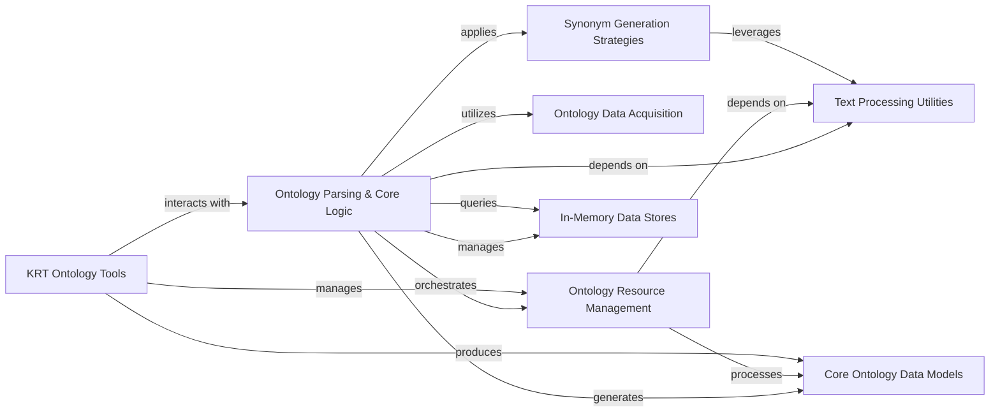

## Component Details

Manages the parsing, curation, and generation of synonyms for various ontologies, supporting external knowledge integration.

### Ontology Parsing & Core Logic

This central component encompasses the abstract base class for all ontology parsers and its concrete implementations. It defines the fundamental process of converting raw ontology data into a structured format, resolving linking candidates, managing data persistence, and orchestrating the overall ontology preprocessing pipeline, including interactions with other components for curation, synonym generation, and database population.

**Related Classes/Methods**:

- <a href="https://github.com/AstraZeneca/KAZU/blob/master/kazu/ontology_preprocessing/base.py#L52-L742" target="_blank" rel="noopener noreferrer">`kazu.ontology_preprocessing.base.OntologyParser` (52:742)</a>

- <a href="https://github.com/AstraZeneca/KAZU/blob/master/kazu/ontology_preprocessing/base.py#L159-L208" target="_blank" rel="noopener noreferrer">`kazu.ontology_preprocessing.base.OntologyParser._resolve_candidates` (159:208)</a>

- <a href="https://github.com/AstraZeneca/KAZU/blob/master/kazu/ontology_preprocessing/base.py#L210-L308" target="_blank" rel="noopener noreferrer">`kazu.ontology_preprocessing.base.OntologyParser.score_and_group_ids` (210:308)</a>

- <a href="https://github.com/AstraZeneca/KAZU/blob/master/kazu/ontology_preprocessing/base.py#L310-L346" target="_blank" rel="noopener noreferrer">`kazu.ontology_preprocessing.base.OntologyParser._parse_df_if_not_already_parsed` (310:346)</a>

- <a href="https://github.com/AstraZeneca/KAZU/blob/master/kazu/ontology_preprocessing/base.py#L349-L366" target="_blank" rel="noopener noreferrer">`kazu.ontology_preprocessing.base.OntologyParser._export_metadata` (349:366)</a>

- <a href="https://github.com/AstraZeneca/KAZU/blob/master/kazu/ontology_preprocessing/base.py#L368-L379" target="_blank" rel="noopener noreferrer">`kazu.ontology_preprocessing.base.OntologyParser._process_candidates_and_string_resources` (368:379)</a>

- <a href="https://github.com/AstraZeneca/KAZU/blob/master/kazu/ontology_preprocessing/base.py#L381-L391" target="_blank" rel="noopener noreferrer">`kazu.ontology_preprocessing.base.OntologyParser._resolve_autogenerated_resources` (381:391)</a>

- <a href="https://github.com/AstraZeneca/KAZU/blob/master/kazu/ontology_preprocessing/base.py#L393-L424" target="_blank" rel="noopener noreferrer">`kazu.ontology_preprocessing.base.OntologyParser._create_human_conflict_report` (393:424)</a>

- <a href="https://github.com/AstraZeneca/KAZU/blob/master/kazu/ontology_preprocessing/base.py#L426-L442" target="_blank" rel="noopener noreferrer">`kazu.ontology_preprocessing.base.OntologyParser._create_merge_report` (426:442)</a>

- <a href="https://github.com/AstraZeneca/KAZU/blob/master/kazu/ontology_preprocessing/base.py#L444-L453" target="_blank" rel="noopener noreferrer">`kazu.ontology_preprocessing.base.OntologyParser._create_combined_conflict_report` (444:453)</a>

- <a href="https://github.com/AstraZeneca/KAZU/blob/master/kazu/ontology_preprocessing/base.py#L455-L468" target="_blank" rel="noopener noreferrer">`kazu.ontology_preprocessing.base.OntologyParser.download_ontology` (455:468)</a>

- <a href="https://github.com/AstraZeneca/KAZU/blob/master/kazu/ontology_preprocessing/base.py#L470-L516" target="_blank" rel="noopener noreferrer">`kazu.ontology_preprocessing.base.OntologyParser.upgrade_ontology_version` (470:516)</a>

- <a href="https://github.com/AstraZeneca/KAZU/blob/master/kazu/ontology_preprocessing/base.py#L518-L560" target="_blank" rel="noopener noreferrer">`kazu.ontology_preprocessing.base.OntologyParser._generate_clean_default_resources` (518:560)</a>

- <a href="https://github.com/AstraZeneca/KAZU/blob/master/kazu/ontology_preprocessing/base.py#L562-L584" target="_blank" rel="noopener noreferrer">`kazu.ontology_preprocessing.base.OntologyParser._generate_dirty_default_resources` (562:584)</a>

- <a href="https://github.com/AstraZeneca/KAZU/blob/master/kazu/ontology_preprocessing/base.py#L587-L604" target="_blank" rel="noopener noreferrer">`kazu.ontology_preprocessing.base.OntologyParser._export_linking_candidates` (587:604)</a>

- <a href="https://github.com/AstraZeneca/KAZU/blob/master/kazu/ontology_preprocessing/base.py#L607-L630" target="_blank" rel="noopener noreferrer">`kazu.ontology_preprocessing.base.OntologyParser._populate_databases` (607:630)</a>

- <a href="https://github.com/AstraZeneca/KAZU/blob/master/kazu/ontology_preprocessing/base.py#L632-L673" target="_blank" rel="noopener noreferrer">`kazu.ontology_preprocessing.base.OntologyParser.populate_metadata_db_and_resolve_string_resources` (632:673)</a>

- <a href="https://github.com/AstraZeneca/KAZU/blob/master/kazu/ontology_preprocessing/base.py#L675-L687" target="_blank" rel="noopener noreferrer">`kazu.ontology_preprocessing.base.OntologyParser._export_metadata_and_intermediate_linking_candidates` (675:687)</a>

- <a href="https://github.com/AstraZeneca/KAZU/blob/master/kazu/ontology_preprocessing/base.py#L689-L715" target="_blank" rel="noopener noreferrer">`kazu.ontology_preprocessing.base.OntologyParser.populate_databases` (689:715)</a>

- <a href="https://github.com/AstraZeneca/KAZU/blob/master/kazu/ontology_preprocessing/base.py#L717-L722" target="_blank" rel="noopener noreferrer">`kazu.ontology_preprocessing.base.OntologyParser.clear_cache` (717:722)</a>

- <a href="https://github.com/AstraZeneca/KAZU/blob/master/kazu/ontology_preprocessing/base.py#L725-L742" target="_blank" rel="noopener noreferrer">`kazu.ontology_preprocessing.base.OntologyParser.parse_to_dataframe` (725:742)</a>

- `kazu.ontology_preprocessing.parsers.JsonLinesOntologyParser` (full file reference)

- `kazu.ontology_preprocessing.parsers.JsonLinesOntologyParser.json_dict_to_parser_records` (full file reference)

- `kazu.ontology_preprocessing.parsers.JsonLinesOntologyParser.read` (full file reference)

- `kazu.ontology_preprocessing.parsers.OpenTargetsDiseaseOntologyParser` (full file reference)

- `kazu.ontology_preprocessing.parsers.OpenTargetsDiseaseOntologyParser.score_and_group_ids` (full file reference)

- `kazu.ontology_preprocessing.parsers.OpenTargetsTargetOntologyParser` (full file reference)

- `kazu.ontology_preprocessing.parsers.OpenTargetsTargetOntologyParser.score_and_group_ids` (full file reference)

- `kazu.ontology_preprocessing.parsers.RDFGraphParser` (full file reference)

- `kazu.ontology_preprocessing.parsers.RDFGraphParser.convert_to_rdflib_ref` (full file reference)

- `kazu.ontology_preprocessing.parsers.RDFGraphParser.parse_to_dataframe` (full file reference)

- `kazu.ontology_preprocessing.parsers.RDFGraphParser.is_valid_iri` (full file reference)

- `kazu.ontology_preprocessing.parsers.SKOSXLGraphParser` (full file reference)

- `kazu.ontology_preprocessing.parsers.GeneOntologyParser` (full file reference)

- `kazu.ontology_preprocessing.parsers.GeneOntologyParser.populate_databases` (full file reference)

- `kazu.ontology_preprocessing.parsers.GeneOntologyParser.parse_to_dataframe` (full file reference)

- `kazu.ontology_preprocessing.parsers.BiologicalProcessGeneOntologyParser` (full file reference)

- `kazu.ontology_preprocessing.parsers.MolecularFunctionGeneOntologyParser` (full file reference)

- `kazu.ontology_preprocessing.parsers.CellularComponentGeneOntologyParser` (full file reference)

- `kazu.ontology_preprocessing.parsers.UberonOntologyParser` (full file reference)

- `kazu.ontology_preprocessing.parsers.MondoOntologyParser` (full file reference)

- `kazu.ontology_preprocessing.parsers.MondoOntologyParser.parse_to_dataframe` (full file reference)

- `kazu.ontology_preprocessing.parsers.MondoOntologyParser.is_valid_iri` (full file reference)

- `kazu.ontology_preprocessing.parsers.HGNCGeneOntologyParser` (full file reference)

- `kazu.ontology_preprocessing.parsers.HGNCGeneOntologyParser.parse_to_dataframe` (full file reference)

- `kazu.ontology_preprocessing.parsers.HGNCGeneOntologyParser.parse_to_dataframe.get_with_default_list` (full file reference)

- `kazu.ontology_preprocessing.parsers.CLOOntologyParser` (full file reference)

- `kazu.ontology_preprocessing.parsers.CellosaurusOntologyParser` (full file reference)

- `kazu.ontology_preprocessing.parsers.CellosaurusOntologyParser.score_and_group_ids` (full file reference)

- `kazu.ontology_preprocessing.parsers.CellosaurusOntologyParser.parse_to_dataframe` (full file reference)

- `kazu.ontology_preprocessing.parsers.CellosaurusOntologyParser._remove_cell_line_text` (full file reference)

- `kazu.ontology_preprocessing.parsers.MeddraOntologyParser` (full file reference)

- `kazu.ontology_preprocessing.parsers.CLOntologyParser` (full file reference)

- `kazu.ontology_preprocessing.parsers.TabularOntologyParser` (full file reference)

- `kazu.ontology_preprocessing.parsers.ATCDrugClassificationParser` (full file reference)

- `kazu.ontology_preprocessing.parsers.StatoParser` (full file reference)

### Ontology Resource Management

This component handles the loading, dumping, processing, and conflict resolution of ontology string resources. It includes functionalities for analyzing various types of conflicts (e.g., case, normalization), applying autofixes, merging resource sets, and generating comprehensive reports on the state and integrity of these resources.

**Related Classes/Methods**:

- <a href="https://github.com/AstraZeneca/KAZU/blob/master/kazu/ontology_preprocessing/curation_utils.py#L39-L57" target="_blank" rel="noopener noreferrer">`kazu.ontology_preprocessing.curation_utils.load_ontology_string_resources` (39:57)</a>

- <a href="https://github.com/AstraZeneca/KAZU/blob/master/kazu/ontology_preprocessing/curation_utils.py#L73-L101" target="_blank" rel="noopener noreferrer">`kazu.ontology_preprocessing.curation_utils.dump_ontology_string_resources` (73:101)</a>

- <a href="https://github.com/AstraZeneca/KAZU/blob/master/kazu/ontology_preprocessing/curation_utils.py#L64-L70" target="_blank" rel="noopener noreferrer">`kazu.ontology_preprocessing.curation_utils.batch` (64:70)</a>

- <a href="https://github.com/AstraZeneca/KAZU/blob/master/kazu/ontology_preprocessing/curation_utils.py#L104-L118" target="_blank" rel="noopener noreferrer">`kazu.ontology_preprocessing.curation_utils.load_global_actions` (104:118)</a>

- <a href="https://github.com/AstraZeneca/KAZU/blob/master/kazu/ontology_preprocessing/curation_utils.py#L132-L163" target="_blank" rel="noopener noreferrer">`kazu.ontology_preprocessing.curation_utils.OntologyResourceSetConflictReport` (132:163)</a>

- <a href="https://github.com/AstraZeneca/KAZU/blob/master/kazu/ontology_preprocessing/curation_utils.py#L143-L163" target="_blank" rel="noopener noreferrer">`kazu.ontology_preprocessing.curation_utils.OntologyResourceSetConflictReport.write_normalisation_conflict_report` (143:163)</a>

- <a href="https://github.com/AstraZeneca/KAZU/blob/master/kazu/ontology_preprocessing/curation_utils.py#L167-L208" target="_blank" rel="noopener noreferrer">`kazu.ontology_preprocessing.curation_utils.OntologyResourceSetMergeReport` (167:208)</a>

- <a href="https://github.com/AstraZeneca/KAZU/blob/master/kazu/ontology_preprocessing/curation_utils.py#L181-L208" target="_blank" rel="noopener noreferrer">`kazu.ontology_preprocessing.curation_utils.OntologyResourceSetMergeReport.write_ontology_merge_report` (181:208)</a>

- <a href="https://github.com/AstraZeneca/KAZU/blob/master/kazu/ontology_preprocessing/curation_utils.py#L212-L259" target="_blank" rel="noopener noreferrer">`kazu.ontology_preprocessing.curation_utils.OntologyResourceSetCompleteReport` (212:259)</a>

- <a href="https://github.com/AstraZeneca/KAZU/blob/master/kazu/ontology_preprocessing/curation_utils.py#L228-L259" target="_blank" rel="noopener noreferrer">`kazu.ontology_preprocessing.curation_utils.OntologyResourceSetCompleteReport.write_reports_for_parser` (228:259)</a>

- <a href="https://github.com/AstraZeneca/KAZU/blob/master/kazu/ontology_preprocessing/curation_utils.py#L268-L699" target="_blank" rel="noopener noreferrer">`kazu.ontology_preprocessing.curation_utils.OntologyStringConflictAnalyser` (268:699)</a>

- <a href="https://github.com/AstraZeneca/KAZU/blob/master/kazu/ontology_preprocessing/curation_utils.py#L283-L342" target="_blank" rel="noopener noreferrer">`kazu.ontology_preprocessing.curation_utils.OntologyStringConflictAnalyser.verify_resource_set_integrity` (283:342)</a>

- <a href="https://github.com/AstraZeneca/KAZU/blob/master/kazu/ontology_preprocessing/curation_utils.py#L344-L421" target="_blank" rel="noopener noreferrer">`kazu.ontology_preprocessing.curation_utils.OntologyStringConflictAnalyser.autofix_resources` (344:421)</a>

- <a href="https://github.com/AstraZeneca/KAZU/blob/master/kazu/ontology_preprocessing/curation_utils.py#L424-L445" target="_blank" rel="noopener noreferrer">`kazu.ontology_preprocessing.curation_utils.OntologyStringConflictAnalyser.check_for_case_conflicts_across_resources` (424:445)</a>

- <a href="https://github.com/AstraZeneca/KAZU/blob/master/kazu/ontology_preprocessing/curation_utils.py#L471-L478" target="_blank" rel="noopener noreferrer">`kazu.ontology_preprocessing.curation_utils.OntologyStringConflictAnalyser.build_synonym_defaultdict` (471:478)</a>

- <a href="https://github.com/AstraZeneca/KAZU/blob/master/kazu/ontology_preprocessing/curation_utils.py#L448-L468" target="_blank" rel="noopener noreferrer">`kazu.ontology_preprocessing.curation_utils.OntologyStringConflictAnalyser.find_case_conflicts` (448:468)</a>

- <a href="https://github.com/AstraZeneca/KAZU/blob/master/kazu/ontology_preprocessing/curation_utils.py#L579-L635" target="_blank" rel="noopener noreferrer">`kazu.ontology_preprocessing.curation_utils.OntologyStringConflictAnalyser._resource_set_has_case_conflicts` (579:635)</a>

- <a href="https://github.com/AstraZeneca/KAZU/blob/master/kazu/ontology_preprocessing/curation_utils.py#L480-L553" target="_blank" rel="noopener noreferrer">`kazu.ontology_preprocessing.curation_utils.OntologyStringConflictAnalyser.check_for_normalised_behaviour_conflicts_and_merge_if_possible` (480:553)</a>

- <a href="https://github.com/AstraZeneca/KAZU/blob/master/kazu/ontology_preprocessing/curation_utils.py#L555-L576" target="_blank" rel="noopener noreferrer">`kazu.ontology_preprocessing.curation_utils.OntologyStringConflictAnalyser._group_resources_by_syn_norm_and_check_for_normalisation_consistency_errors` (555:576)</a>

- <a href="https://github.com/AstraZeneca/KAZU/blob/master/kazu/ontology_preprocessing/curation_utils.py#L637-L699" target="_blank" rel="noopener noreferrer">`kazu.ontology_preprocessing.curation_utils.OntologyStringConflictAnalyser.merge_human_and_auto_resources` (637:699)</a>

- <a href="https://github.com/AstraZeneca/KAZU/blob/master/kazu/ontology_preprocessing/curation_utils.py#L709-L1164" target="_blank" rel="noopener noreferrer">`kazu.ontology_preprocessing.curation_utils.OntologyResourceProcessor` (709:1164)</a>

- <a href="https://github.com/AstraZeneca/KAZU/blob/master/kazu/ontology_preprocessing/curation_utils.py#L728-L752" target="_blank" rel="noopener noreferrer">`kazu.ontology_preprocessing.curation_utils.OntologyResourceProcessor.__init__` (728:752)</a>

- <a href="https://github.com/AstraZeneca/KAZU/blob/master/kazu/ontology_preprocessing/curation_utils.py#L766-L798" target="_blank" rel="noopener noreferrer">`kazu.ontology_preprocessing.curation_utils.OntologyResourceProcessor._update_candidate_lookups` (766:798)</a>

- <a href="https://github.com/AstraZeneca/KAZU/blob/master/kazu/ontology_preprocessing/curation_utils.py#L834-L857" target="_blank" rel="noopener noreferrer">`kazu.ontology_preprocessing.curation_utils.OntologyResourceProcessor._drop_id_from_all_linking_candidates` (834:857)</a>

- <a href="https://github.com/AstraZeneca/KAZU/blob/master/kazu/ontology_preprocessing/curation_utils.py#L859-L882" target="_blank" rel="noopener noreferrer">`kazu.ontology_preprocessing.curation_utils.OntologyResourceProcessor._drop_id_from_linking_candidate` (859:882)</a>

- <a href="https://github.com/AstraZeneca/KAZU/blob/master/kazu/ontology_preprocessing/curation_utils.py#L884-L905" target="_blank" rel="noopener noreferrer">`kazu.ontology_preprocessing.curation_utils.OntologyResourceProcessor._drop_id_from_associated_id_sets` (884:905)</a>

- <a href="https://github.com/AstraZeneca/KAZU/blob/master/kazu/ontology_preprocessing/curation_utils.py#L907-L943" target="_blank" rel="noopener noreferrer">`kazu.ontology_preprocessing.curation_utils.OntologyResourceProcessor._modify_or_drop_linking_candidate_after_id_set_change` (907:943)</a>

- <a href="https://github.com/AstraZeneca/KAZU/blob/master/kazu/ontology_preprocessing/curation_utils.py#L800-L832" target="_blank" rel="noopener noreferrer">`kazu.ontology_preprocessing.curation_utils.OntologyResourceProcessor._drop_linking_candidate` (800:832)</a>

- <a href="https://github.com/AstraZeneca/KAZU/blob/master/kazu/ontology_preprocessing/curation_utils.py#L945-L957" target="_blank" rel="noopener noreferrer">`kazu.ontology_preprocessing.curation_utils.OntologyResourceProcessor.export_resources_and_final_candidates` (945:957)</a>

- <a href="https://github.com/AstraZeneca/KAZU/blob/master/kazu/ontology_preprocessing/curation_utils.py#L984-L1044" target="_blank" rel="noopener noreferrer">`kazu.ontology_preprocessing.curation_utils.OntologyResourceProcessor._process_global_actions` (984:1044)</a>

- <a href="https://github.com/AstraZeneca/KAZU/blob/master/kazu/ontology_preprocessing/curation_utils.py#L959-L963" target="_blank" rel="noopener noreferrer">`kazu.ontology_preprocessing.curation_utils.OntologyResourceProcessor._process_resources` (959:963)</a>

- <a href="https://github.com/AstraZeneca/KAZU/blob/master/kazu/ontology_preprocessing/curation_utils.py#L965-L982" target="_blank" rel="noopener noreferrer">`kazu.ontology_preprocessing.curation_utils.OntologyResourceProcessor._process_resource_action` (965:982)</a>

- <a href="https://github.com/AstraZeneca/KAZU/blob/master/kazu/ontology_preprocessing/curation_utils.py#L1046-L1164" target="_blank" rel="noopener noreferrer">`kazu.ontology_preprocessing.curation_utils.OntologyResourceProcessor._attempt_to_add_database_entry_for_resource` (1046:1164)</a>

- <a href="https://github.com/AstraZeneca/KAZU/blob/master/kazu/ontology_preprocessing/curation_utils.py#L35-L36" target="_blank" rel="noopener noreferrer">`kazu.ontology_preprocessing.curation_utils.CurationError` (35:36)</a>

### Ontology Data Acquisition

This component is responsible for downloading ontology data from various external sources. It includes different downloader implementations tailored for specific ontology formats and provides mechanisms for managing proxy settings and caching downloaded files.

**Related Classes/Methods**:

- <a href="https://github.com/AstraZeneca/KAZU/blob/master/kazu/ontology_preprocessing/downloads.py#L92-L102" target="_blank" rel="noopener noreferrer">`kazu.ontology_preprocessing.downloads.SimpleOntologyDownloader` (92:102)</a>

- <a href="https://github.com/AstraZeneca/KAZU/blob/master/kazu/ontology_preprocessing/downloads.py#L96-L99" target="_blank" rel="noopener noreferrer">`kazu.ontology_preprocessing.downloads.SimpleOntologyDownloader.download` (96:99)</a>

- <a href="https://github.com/AstraZeneca/KAZU/blob/master/kazu/ontology_preprocessing/downloads.py#L101-L102" target="_blank" rel="noopener noreferrer">`kazu.ontology_preprocessing.downloads.SimpleOntologyDownloader.version` (101:102)</a>

- <a href="https://github.com/AstraZeneca/KAZU/blob/master/kazu/ontology_preprocessing/downloads.py#L105-L114" target="_blank" rel="noopener noreferrer">`kazu.ontology_preprocessing.downloads.OBOOntologyDownloader` (105:114)</a>

- <a href="https://github.com/AstraZeneca/KAZU/blob/master/kazu/ontology_preprocessing/downloads.py#L106-L114" target="_blank" rel="noopener noreferrer">`kazu.ontology_preprocessing.downloads.OBOOntologyDownloader.version` (106:114)</a>

- <a href="https://github.com/AstraZeneca/KAZU/blob/master/kazu/ontology_preprocessing/downloads.py#L117-L154" target="_blank" rel="noopener noreferrer">`kazu.ontology_preprocessing.downloads.OwlOntologyDownloader` (117:154)</a>

- <a href="https://github.com/AstraZeneca/KAZU/blob/master/kazu/ontology_preprocessing/downloads.py#L132-L154" target="_blank" rel="noopener noreferrer">`kazu.ontology_preprocessing.downloads.OwlOntologyDownloader.version` (132:154)</a>

- <a href="https://github.com/AstraZeneca/KAZU/blob/master/kazu/ontology_preprocessing/downloads.py#L157-L215" target="_blank" rel="noopener noreferrer">`kazu.ontology_preprocessing.downloads.ChemblParquetOntologyDownloader` (157:215)</a>

- <a href="https://github.com/AstraZeneca/KAZU/blob/master/kazu/ontology_preprocessing/downloads.py#L177-L212" target="_blank" rel="noopener noreferrer">`kazu.ontology_preprocessing.downloads.ChemblParquetOntologyDownloader.download` (177:212)</a>

- <a href="https://github.com/AstraZeneca/KAZU/blob/master/kazu/ontology_preprocessing/downloads.py#L218-L260" target="_blank" rel="noopener noreferrer">`kazu.ontology_preprocessing.downloads.OpenTargetsOntologyDownloader` (218:260)</a>

- <a href="https://github.com/AstraZeneca/KAZU/blob/master/kazu/ontology_preprocessing/downloads.py#L226-L238" target="_blank" rel="noopener noreferrer">`kazu.ontology_preprocessing.downloads.OpenTargetsOntologyDownloader._wget` (226:238)</a>

- <a href="https://github.com/AstraZeneca/KAZU/blob/master/kazu/ontology_preprocessing/downloads.py#L240-L244" target="_blank" rel="noopener noreferrer">`kazu.ontology_preprocessing.downloads.OpenTargetsOntologyDownloader.download` (240:244)</a>

- <a href="https://github.com/AstraZeneca/KAZU/blob/master/kazu/ontology_preprocessing/downloads.py#L41-L50" target="_blank" rel="noopener noreferrer">`kazu.ontology_preprocessing.downloads._cached_request` (41:50)</a>

- <a href="https://github.com/AstraZeneca/KAZU/blob/master/kazu/ontology_preprocessing/downloads.py#L23-L37" target="_blank" rel="noopener noreferrer">`kazu.ontology_preprocessing.downloads._get_proxy_args_for_wget` (23:37)</a>

### Synonym Generation Strategies

This component provides a suite of strategies for generating additional synonyms from existing ontology terms. These strategies range from simple string replacements and combinatorial expansions to more complex token-based and verb phrase variant generation, often leveraging NLP models. It also includes automated curation actions that can modify or generate synonyms.

**Related Classes/Methods**:

- <a href="https://github.com/AstraZeneca/KAZU/blob/master/kazu/ontology_preprocessing/synonym_generation.py#L21-L39" target="_blank" rel="noopener noreferrer">`kazu.ontology_preprocessing.synonym_generation.SynonymGenerator` (21:39)</a>

- <a href="https://github.com/AstraZeneca/KAZU/blob/master/kazu/ontology_preprocessing/synonym_generation.py#L29-L39" target="_blank" rel="noopener noreferrer">`kazu.ontology_preprocessing.synonym_generation.SynonymGenerator.__call__` (29:39)</a>

- <a href="https://github.com/AstraZeneca/KAZU/blob/master/kazu/ontology_preprocessing/synonym_generation.py#L23-L26" target="_blank" rel="noopener noreferrer">`kazu.ontology_preprocessing.synonym_generation.SynonymGenerator.call` (23:26)</a>

- <a href="https://github.com/AstraZeneca/KAZU/blob/master/kazu/ontology_preprocessing/synonym_generation.py#L42-L105" target="_blank" rel="noopener noreferrer">`kazu.ontology_preprocessing.synonym_generation.CombinatorialSynonymGenerator` (42:105)</a>

- <a href="https://github.com/AstraZeneca/KAZU/blob/master/kazu/ontology_preprocessing/synonym_generation.py#L49-L105" target="_blank" rel="noopener noreferrer">`kazu.ontology_preprocessing.synonym_generation.CombinatorialSynonymGenerator.__call__` (49:105)</a>

- <a href="https://github.com/AstraZeneca/KAZU/blob/master/kazu/ontology_preprocessing/synonym_generation.py#L110-L153" target="_blank" rel="noopener noreferrer">`kazu.ontology_preprocessing.synonym_generation.SeparatorExpansion` (110:153)</a>

- <a href="https://github.com/AstraZeneca/KAZU/blob/master/kazu/ontology_preprocessing/synonym_generation.py#L111-L115" target="_blank" rel="noopener noreferrer">`kazu.ontology_preprocessing.synonym_generation.SeparatorExpansion.__init__` (111:115)</a>

- <a href="https://github.com/AstraZeneca/KAZU/blob/master/kazu/ontology_preprocessing/synonym_generation.py#L200-L268" target="_blank" rel="noopener noreferrer">`kazu.ontology_preprocessing.synonym_generation.StringReplacement` (200:268)</a>

- <a href="https://github.com/AstraZeneca/KAZU/blob/master/kazu/ontology_preprocessing/synonym_generation.py#L213-L232" target="_blank" rel="noopener noreferrer">`kazu.ontology_preprocessing.synonym_generation.StringReplacement.call` (213:232)</a>

- <a href="https://github.com/AstraZeneca/KAZU/blob/master/kazu/ontology_preprocessing/synonym_generation.py#L234-L268" target="_blank" rel="noopener noreferrer">`kazu.ontology_preprocessing.synonym_generation.StringReplacement._generate_greek_subs` (234:268)</a>

- <a href="https://github.com/AstraZeneca/KAZU/blob/master/kazu/ontology_preprocessing/synonym_generation.py#L338-L382" target="_blank" rel="noopener noreferrer">`kazu.ontology_preprocessing.synonym_generation.TokenListReplacementGenerator` (338:382)</a>

- <a href="https://github.com/AstraZeneca/KAZU/blob/master/kazu/ontology_preprocessing/synonym_generation.py#L351-L364" target="_blank" rel="noopener noreferrer">`kazu.ontology_preprocessing.synonym_generation.TokenListReplacementGenerator.__init__` (351:364)</a>

- <a href="https://github.com/AstraZeneca/KAZU/blob/master/kazu/ontology_preprocessing/synonym_generation.py#L366-L370" target="_blank" rel="noopener noreferrer">`kazu.ontology_preprocessing.synonym_generation.TokenListReplacementGenerator._init_token_matcher` (366:370)</a>

- <a href="https://github.com/AstraZeneca/KAZU/blob/master/kazu/ontology_preprocessing/synonym_generation.py#L372-L382" target="_blank" rel="noopener noreferrer">`kazu.ontology_preprocessing.synonym_generation.TokenListReplacementGenerator.call` (372:382)</a>

- <a href="https://github.com/AstraZeneca/KAZU/blob/master/kazu/ontology_preprocessing/synonym_generation.py#L385-L460" target="_blank" rel="noopener noreferrer">`kazu.ontology_preprocessing.synonym_generation.VerbPhraseVariantGenerator` (385:460)</a>

- <a href="https://github.com/AstraZeneca/KAZU/blob/master/kazu/ontology_preprocessing/synonym_generation.py#L395-L422" target="_blank" rel="noopener noreferrer">`kazu.ontology_preprocessing.synonym_generation.VerbPhraseVariantGenerator.__init__` (395:422)</a>

- <a href="https://github.com/AstraZeneca/KAZU/blob/master/kazu/ontology_preprocessing/synonym_generation.py#L424-L427" target="_blank" rel="noopener noreferrer">`kazu.ontology_preprocessing.synonym_generation.VerbPhraseVariantGenerator._init_lemma_matcher` (424:427)</a>

- <a href="https://github.com/AstraZeneca/KAZU/blob/master/kazu/ontology_preprocessing/synonym_generation.py#L435-L460" target="_blank" rel="noopener noreferrer">`kazu.ontology_preprocessing.synonym_generation.VerbPhraseVariantGenerator.call` (435:460)</a>

- <a href="https://github.com/AstraZeneca/KAZU/blob/master/kazu/ontology_preprocessing/synonym_generation.py#L429-L433" target="_blank" rel="noopener noreferrer">`kazu.ontology_preprocessing.synonym_generation.VerbPhraseVariantGenerator._populate_lemma_template` (429:433)</a>

- <a href="https://github.com/AstraZeneca/KAZU/blob/master/kazu/ontology_preprocessing/autocuration.py#L12-L33" target="_blank" rel="noopener noreferrer">`kazu.ontology_preprocessing.autocuration.SymbolicToCaseSensitiveAction` (12:33)</a>

- <a href="https://github.com/AstraZeneca/KAZU/blob/master/kazu/ontology_preprocessing/autocuration.py#L16-L33" target="_blank" rel="noopener noreferrer">`kazu.ontology_preprocessing.autocuration.SymbolicToCaseSensitiveAction.__call__` (16:33)</a>

### KRT Ontology Tools

This component represents the functionalities within the Kazu Resource Tool (KRT) that are dedicated to managing and updating ontologies. It includes user interface components for displaying update forms, managing downloader configurations, and utilities for generating and analyzing ontology upgrade reports, as well as managing resource conflicts within the KRT environment.

**Related Classes/Methods**:

- <a href="https://github.com/AstraZeneca/KAZU/blob/master/kazu/krt/resource_manager.py#L19-L177" target="_blank" rel="noopener noreferrer">`kazu.krt.resource_manager.ResourceManager` (19:177)</a>

- <a href="https://github.com/AstraZeneca/KAZU/blob/master/kazu/krt/resource_manager.py#L27-L85" target="_blank" rel="noopener noreferrer">`kazu.krt.resource_manager.ResourceManager.__init__` (27:85)</a>

- <a href="https://github.com/AstraZeneca/KAZU/blob/master/kazu/krt/resource_manager.py#L148-L159" target="_blank" rel="noopener noreferrer">`kazu.krt.resource_manager.ResourceManager.save` (148:159)</a>

- <a href="https://github.com/AstraZeneca/KAZU/blob/master/kazu/krt/resource_manager.py#L168-L173" target="_blank" rel="noopener noreferrer">`kazu.krt.resource_manager.ResourceManager.clear_invalid_caches` (168:173)</a>

- <a href="https://github.com/AstraZeneca/KAZU/blob/master/kazu/krt/ontology_update_editor/components.py#L17-L155" target="_blank" rel="noopener noreferrer">`kazu.krt.ontology_update_editor.components.OntologyUpdateForm` (17:155)</a>

- <a href="https://github.com/AstraZeneca/KAZU/blob/master/kazu/krt/ontology_update_editor/components.py#L104-L140" target="_blank" rel="noopener noreferrer">`kazu.krt.ontology_update_editor.components.OntologyUpdateForm.display_main_form` (104:140)</a>

- <a href="https://github.com/AstraZeneca/KAZU/blob/master/kazu/krt/ontology_update_editor/components.py#L8-L14" target="_blank" rel="noopener noreferrer">`kazu.krt.ontology_update_editor.components.get_upgrade_manager` (8:14)</a>

- <a href="https://github.com/AstraZeneca/KAZU/blob/master/kazu/krt/ontology_update_editor/components.py#L143-L155" target="_blank" rel="noopener noreferrer">`kazu.krt.ontology_update_editor.components.OntologyUpdateForm._build_upgrade_report` (143:155)</a>

- <a href="https://github.com/AstraZeneca/KAZU/blob/master/kazu/krt/ontology_update_editor/components.py#L23-L28" target="_blank" rel="noopener noreferrer">`kazu.krt.ontology_update_editor.components.OntologyUpdateForm.get_download_completed_or_skipped` (23:28)</a>

- <a href="https://github.com/AstraZeneca/KAZU/blob/master/kazu/krt/ontology_update_editor/components.py#L47-L60" target="_blank" rel="noopener noreferrer">`kazu.krt.ontology_update_editor.components.OntologyUpdateForm.display_download_config_modifier_form` (47:60)</a>

- <a href="https://github.com/AstraZeneca/KAZU/blob/master/kazu/krt/ontology_update_editor/components.py#L71-L84" target="_blank" rel="noopener noreferrer">`kazu.krt.ontology_update_editor.components.OntologyUpdateForm.display_download_form` (71:84)</a>

- <a href="https://github.com/AstraZeneca/KAZU/blob/master/kazu/krt/ontology_update_editor/components.py#L43-L44" target="_blank" rel="noopener noreferrer">`kazu.krt.ontology_update_editor.components.OntologyUpdateForm.get_updates_saved` (43:44)</a>

- <a href="https://github.com/AstraZeneca/KAZU/blob/master/kazu/krt/ontology_update_editor/utils.py#L18-L142" target="_blank" rel="noopener noreferrer">`kazu.krt.ontology_update_editor.utils.OntologyUpdateManager` (18:142)</a>

- <a href="https://github.com/AstraZeneca/KAZU/blob/master/kazu/krt/ontology_update_editor/utils.py#L88-L95" target="_blank" rel="noopener noreferrer">`kazu.krt.ontology_update_editor.utils.OntologyUpdateManager.get_or_build_upgrade_report` (88:95)</a>

- <a href="https://github.com/AstraZeneca/KAZU/blob/master/kazu/krt/ontology_update_editor/utils.py#L97-L104" target="_blank" rel="noopener noreferrer">`kazu.krt.ontology_update_editor.utils.OntologyUpdateManager.download_ontology_with_new_config` (97:104)</a>

- <a href="https://github.com/AstraZeneca/KAZU/blob/master/kazu/krt/ontology_update_editor/utils.py#L106-L113" target="_blank" rel="noopener noreferrer">`kazu.krt.ontology_update_editor.utils.OntologyUpdateManager.obsolete_df` (106:113)</a>

- <a href="https://github.com/AstraZeneca/KAZU/blob/master/kazu/krt/ontology_update_editor/utils.py#L123-L128" target="_blank" rel="noopener noreferrer">`kazu.krt.ontology_update_editor.utils.OntologyUpdateManager.novel_df` (123:128)</a>

- <a href="https://github.com/AstraZeneca/KAZU/blob/master/kazu/krt/ontology_update_editor/utils.py#L130-L142" target="_blank" rel="noopener noreferrer">`kazu.krt.ontology_update_editor.utils.OntologyUpdateManager.write_new_defaults_to_model_pack` (130:142)</a>

- <a href="https://github.com/AstraZeneca/KAZU/blob/master/kazu/krt/ontology_update_editor/utils.py#L80-L85" target="_blank" rel="noopener noreferrer">`kazu.krt.ontology_update_editor.utils.OntologyUpdateManager.instantiate_parser_with_new_config` (80:85)</a>

- <a href="https://github.com/AstraZeneca/KAZU/blob/master/kazu/krt/ontology_update_editor/utils.py#L115-L121" target="_blank" rel="noopener noreferrer">`kazu.krt.ontology_update_editor.utils.OntologyUpdateManager._df_from_set` (115:121)</a>

- <a href="https://github.com/AstraZeneca/KAZU/blob/master/kazu/krt/ontology_update_editor/utils.py#L69-L78" target="_blank" rel="noopener noreferrer">`kazu.krt.ontology_update_editor.utils.OntologyUpdateManager.modify_parser_cfg_with_new_args` (69:78)</a>

- <a href="https://github.com/AstraZeneca/KAZU/blob/master/kazu/krt/ontology_update_editor/utils.py#L41-L42" target="_blank" rel="noopener noreferrer">`kazu.krt.ontology_update_editor.utils.OntologyUpdateManager.display_new_parser_config_as_yaml` (41:42)</a>

- <a href="https://github.com/AstraZeneca/KAZU/blob/master/kazu/krt/ontology_update_editor/utils.py#L44-L45" target="_blank" rel="noopener noreferrer">`kazu.krt.ontology_update_editor.utils.OntologyUpdateManager.display_new_downloader_config_as_yaml` (44:45)</a>

- <a href="https://github.com/AstraZeneca/KAZU/blob/master/kazu/krt/string_editor/utils.py#L93-L243" target="_blank" rel="noopener noreferrer">`kazu.krt.string_editor.utils.ResourceConflictManager` (93:243)</a>

- <a href="https://github.com/AstraZeneca/KAZU/blob/master/kazu/krt/string_editor/utils.py#L128-L133" target="_blank" rel="noopener noreferrer">`kazu.krt.string_editor.utils.ResourceConflictManager._init_conflict_maps` (128:133)</a>

- <a href="https://github.com/AstraZeneca/KAZU/blob/master/kazu/krt/string_editor/utils.py#L145-L171" target="_blank" rel="noopener noreferrer">`kazu.krt.string_editor.utils.ResourceConflictManager._find_conflicts_in_resources` (145:171)</a>

- <a href="https://github.com/AstraZeneca/KAZU/blob/master/kazu/krt/string_editor/utils.py#L135-L143" target="_blank" rel="noopener noreferrer">`kazu.krt.string_editor.utils.ResourceConflictManager._update_conflict_parser_map` (135:143)</a>

- <a href="https://github.com/AstraZeneca/KAZU/blob/master/kazu/krt/string_editor/utils.py#L204-L215" target="_blank" rel="noopener noreferrer">`kazu.krt.string_editor.utils.ResourceConflictManager._check_resolved_conflict_for_new_conflicts` (204:215)</a>

- <a href="https://github.com/AstraZeneca/KAZU/blob/master/kazu/krt/string_editor/utils.py#L21-L90" target="_blank" rel="noopener noreferrer">`kazu.krt.string_editor.utils.ResourceConflict` (21:90)</a>

- <a href="https://github.com/AstraZeneca/KAZU/blob/master/kazu/krt/components.py#L501-L517" target="_blank" rel="noopener noreferrer">`kazu.krt.components.ParserSelector.display_parser_selector` (501:517)</a>

- <a href="https://github.com/AstraZeneca/KAZU/blob/master/kazu/krt/components.py#L530-L531" target="_blank" rel="noopener noreferrer">`kazu.krt.components.ParserSelector.get_selected_parser_name` (530:531)</a>

### In-Memory Data Stores

This component provides efficient in-memory databases for storing and retrieving ontology metadata and synonyms. The MetadataDatabase holds descriptive information about ontology IDs, while the SynonymDatabase stores normalized synonyms and their associated linking candidates, enabling fast lookups during NLP processing.

**Related Classes/Methods**:

- <a href="https://github.com/AstraZeneca/KAZU/blob/master/kazu/database/in_memory_db.py#L22-L73" target="_blank" rel="noopener noreferrer">`kazu.database.in_memory_db.MetadataDatabase` (22:73)</a>

- <a href="https://github.com/AstraZeneca/KAZU/blob/master/kazu/database/in_memory_db.py#L76-L148" target="_blank" rel="noopener noreferrer">`kazu.database.in_memory_db.SynonymDatabase` (76:148)</a>

### Core Ontology Data Models

This component defines the fundamental data structures that represent various aspects of ontology information within the KAZU system. These models encapsulate concepts such as curated string resources, potential linking candidates, sets of equivalent IDs, global parser actions, and reports on ontology upgrades.

**Related Classes/Methods**:

- `kazu.data.OntologyStringResource` (full file reference)

- `kazu.data.OntologyStringResource.from_json` (full file reference)

- `kazu.data.GlobalParserActions` (full file reference)

- `kazu.data.GlobalParserActions.from_dict` (full file reference)

- `kazu.data.EquivalentIdSet` (full file reference)

- `kazu.data.LinkingCandidate` (full file reference)

- `kazu.data.Synonym` (full file reference)

- <a href="https://github.com/AstraZeneca/KAZU/blob/master/kazu/ontology_preprocessing/ontology_upgrade_report.py#L15-L81" target="_blank" rel="noopener noreferrer">`kazu.ontology_preprocessing.ontology_upgrade_report.OntologyUpgradeReport` (15:81)</a>

- <a href="https://github.com/AstraZeneca/KAZU/blob/master/kazu/ontology_preprocessing/ontology_upgrade_report.py#L53-L81" target="_blank" rel="noopener noreferrer">`kazu.ontology_preprocessing.ontology_upgrade_report.OntologyUpgradeReport.write_report` (53:81)</a>

### Text Processing Utilities

This component provides a collection of utility functions essential for text manipulation and processing within the KAZU system. This includes string normalization, classification of symbolic strings, general path handling, conversion between data models, grouping functionalities, and string similarity scoring, often leveraging external NLP libraries like spaCy.

**Related Classes/Methods**:

- <a href="https://github.com/AstraZeneca/KAZU/blob/master/kazu/utils/utils.py#L121-L122" target="_blank" rel="noopener noreferrer">`kazu.utils.utils.as_path` (121:122)</a>

- <a href="https://github.com/AstraZeneca/KAZU/blob/master/kazu/utils/utils.py#L23-L49" target="_blank" rel="noopener noreferrer">`kazu.utils.utils.linking_candidates_to_ontology_string_resources` (23:49)</a>

- <a href="https://github.com/AstraZeneca/KAZU/blob/master/kazu/utils/string_normalizer.py#L415-L442" target="_blank" rel="noopener noreferrer">`kazu.utils.string_normalizer.StringNormalizer` (415:442)</a>

- <a href="https://github.com/AstraZeneca/KAZU/blob/master/kazu/utils/string_normalizer.py#L435-L442" target="_blank" rel="noopener noreferrer">`kazu.utils.string_normalizer.StringNormalizer.normalize` (435:442)</a>

- <a href="https://github.com/AstraZeneca/KAZU/blob/master/kazu/utils/string_normalizer.py#L428-L431" target="_blank" rel="noopener noreferrer">`kazu.utils.string_normalizer.StringNormalizer.classify_symbolic` (428:431)</a>

- <a href="https://github.com/AstraZeneca/KAZU/blob/master/kazu/utils/spacy_pipeline.py#L80-L84" target="_blank" rel="noopener noreferrer">`kazu.utils.spacy_pipeline.basic_spacy_pipeline` (80:84)</a>

- <a href="https://github.com/AstraZeneca/KAZU/blob/master/kazu/utils/spacy_pipeline.py#L87-L254" target="_blank" rel="noopener noreferrer">`kazu.utils.spacy_pipeline.SpacyPipelines` (87:254)</a>

- <a href="https://github.com/AstraZeneca/KAZU/blob/master/kazu/utils/spacy_pipeline.py#L163-L166" target="_blank" rel="noopener noreferrer">`kazu.utils.spacy_pipeline.SpacyPipelines.get_model` (163:166)</a>

- <a href="https://github.com/AstraZeneca/KAZU/blob/master/kazu/utils/grouping.py#L23-L27" target="_blank" rel="noopener noreferrer">`kazu.utils.grouping.sort_then_group` (23:27)</a>

- `kazu.language.string_similarity_scorers` (full file reference)

- `kazu.language.language_phenomena` (full file reference)

- `kazu.utils.caching` (full file reference)

### [FAQ](https://github.com/CodeBoarding/GeneratedOnBoardings/tree/main?tab=readme-ov-file#faq)