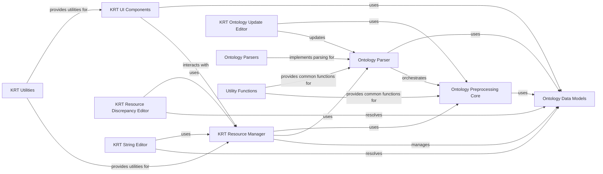

## Component Details

The Resource Management Tools (KRT) subsystem provides a comprehensive suite of interactive tools for managing and curating Kazu resources. Its primary purpose is to facilitate resource editing, resolve conflicts, and manage ontology updates. The main flow involves loading ontology data through various parsers, processing and resolving any discrepancies or conflicts in the data, and then allowing users to interactively edit and save these curated resources. The system ensures data consistency and provides mechanisms for reporting on the state of the ontology resources.

### KRT Resource Manager

This component is responsible for managing ontology resources within the Kazu Resource Tool (KRT). It handles loading, saving, and synchronizing resources, as well as managing caches to ensure efficient access to ontology data.

**Related Classes/Methods**:

- <a href="https://github.com/AstraZeneca/KAZU/blob/master/kazu/krt/resource_manager.py#L19-L177" target="_blank" rel="noopener noreferrer">`KAZU.kazu.krt.resource_manager.ResourceManager` (19:177)</a>

### KRT UI Components

This component provides the user interface elements and logic for interacting with ontology resources within the Kazu Resource Tool (KRT). It includes functionalities for editing resources, selecting parsers, and displaying various forms for user input.

**Related Classes/Methods**:

- <a href="https://github.com/AstraZeneca/KAZU/blob/master/kazu/krt/components.py#L23-L40" target="_blank" rel="noopener noreferrer">`KAZU.kazu.krt.components.save` (23:40)</a>

- <a href="https://github.com/AstraZeneca/KAZU/blob/master/kazu/krt/components.py#L51-L87" target="_blank" rel="noopener noreferrer">`KAZU.kazu.krt.components.PlaceholderResource` (51:87)</a>

- <a href="https://github.com/AstraZeneca/KAZU/blob/master/kazu/krt/components.py#L90-L494" target="_blank" rel="noopener noreferrer">`KAZU.kazu.krt.components.ResourceEditor` (90:494)</a>

- <a href="https://github.com/AstraZeneca/KAZU/blob/master/kazu/krt/components.py#L497-L531" target="_blank" rel="noopener noreferrer">`KAZU.kazu.krt.components.ParserSelector` (497:531)</a>

### KRT Ontology Update Editor

This component facilitates the process of updating ontologies within the Kazu Resource Tool (KRT). It manages the download of new ontology versions, generates upgrade reports, and allows for modification of parser configurations.

**Related Classes/Methods**:

- <a href="https://github.com/AstraZeneca/KAZU/blob/master/kazu/krt/ontology_update_editor/components.py#L8-L14" target="_blank" rel="noopener noreferrer">`KAZU.kazu.krt.ontology_update_editor.components.get_upgrade_manager` (8:14)</a>

- <a href="https://github.com/AstraZeneca/KAZU/blob/master/kazu/krt/ontology_update_editor/components.py#L17-L155" target="_blank" rel="noopener noreferrer">`KAZU.kazu.krt.ontology_update_editor.components.OntologyUpdateForm` (17:155)</a>

- <a href="https://github.com/AstraZeneca/KAZU/blob/master/kazu/krt/ontology_update_editor/utils.py#L18-L142" target="_blank" rel="noopener noreferrer">`KAZU.kazu.krt.ontology_update_editor.utils.OntologyUpdateManager` (18:142)</a>

### KRT Resource Discrepancy Editor

This component is dedicated to identifying and resolving discrepancies within ontology resources in the Kazu Resource Tool (KRT). It provides functionalities for displaying discrepancies, attempting autofixes, and submitting resolutions.

**Related Classes/Methods**:

- <a href="https://github.com/AstraZeneca/KAZU/blob/master/kazu/krt/resource_discrepancy_editor/components.py#L13-L18" target="_blank" rel="noopener noreferrer">`KAZU.kazu.krt.resource_discrepancy_editor.components.get_resource_merge_manager` (13:18)</a>

- <a href="https://github.com/AstraZeneca/KAZU/blob/master/kazu/krt/resource_discrepancy_editor/components.py#L27-L28" target="_blank" rel="noopener noreferrer">`KAZU.kazu.krt.resource_discrepancy_editor.components.get_resource_merge_manager_for_parser` (27:28)</a>

- <a href="https://github.com/AstraZeneca/KAZU/blob/master/kazu/krt/resource_discrepancy_editor/components.py#L31-L192" target="_blank" rel="noopener noreferrer">`KAZU.kazu.krt.resource_discrepancy_editor.components.ResourceDiscrepancyResolutionForm` (31:192)</a>

- <a href="https://github.com/AstraZeneca/KAZU/blob/master/kazu/krt/resource_discrepancy_editor/utils.py#L11-L73" target="_blank" rel="noopener noreferrer">`KAZU.kazu.krt.resource_discrepancy_editor.utils.SynonymDiscrepancy` (11:73)</a>

- <a href="https://github.com/AstraZeneca/KAZU/blob/master/kazu/krt/resource_discrepancy_editor/utils.py#L76-L172" target="_blank" rel="noopener noreferrer">`KAZU.kazu.krt.resource_discrepancy_editor.utils.ResourceDiscrepancyManger` (76:172)</a>

### KRT String Editor

This component provides tools within the Kazu Resource Tool (KRT) for managing and resolving conflicts related to ontology strings. It allows for batch and individual conflict resolution, as well as searching and editing synonyms.

**Related Classes/Methods**:

- <a href="https://github.com/AstraZeneca/KAZU/blob/master/kazu/krt/string_editor/components.py#L18-L19" target="_blank" rel="noopener noreferrer">`KAZU.kazu.krt.string_editor.components.get_manager` (18:19)</a>

- <a href="https://github.com/AstraZeneca/KAZU/blob/master/kazu/krt/string_editor/components.py#L28-L219" target="_blank" rel="noopener noreferrer">`KAZU.kazu.krt.string_editor.components.StringConflictForm` (28:219)</a>

- <a href="https://github.com/AstraZeneca/KAZU/blob/master/kazu/krt/string_editor/utils.py#L21-L90" target="_blank" rel="noopener noreferrer">`KAZU.kazu.krt.string_editor.utils.ResourceConflict` (21:90)</a>

- <a href="https://github.com/AstraZeneca/KAZU/blob/master/kazu/krt/string_editor/utils.py#L93-L243" target="_blank" rel="noopener noreferrer">`KAZU.kazu.krt.string_editor.utils.ResourceConflictManager` (93:243)</a>

### KRT Utilities

This component provides general utility functions used across the Kazu Resource Tool (KRT), including loading configurations, creating new resources, and converting resources to dataframes.

**Related Classes/Methods**:

- <a href="https://github.com/AstraZeneca/KAZU/blob/master/kazu/krt/utils.py#L12-L17" target="_blank" rel="noopener noreferrer">`KAZU.kazu.krt.utils.load_parsers` (12:17)</a>

- <a href="https://github.com/AstraZeneca/KAZU/blob/master/kazu/krt/utils.py#L21-L22" target="_blank" rel="noopener noreferrer">`KAZU.kazu.krt.utils.get_resource_manager` (21:22)</a>

### Ontology Preprocessing Core

This component is responsible for the core logic of ontology parsing, processing, and conflict analysis. It handles loading and dumping ontology string resources, verifying resource integrity, and processing global and resource-specific actions related to ontology data. It also manages the creation of various reports related to ontology conflicts and merges.

**Related Classes/Methods**:

- <a href="https://github.com/AstraZeneca/KAZU/blob/master/kazu/ontology_preprocessing/curation_utils.py#L39-L57" target="_blank" rel="noopener noreferrer">`kazu.ontology_preprocessing.curation_utils.load_ontology_string_resources` (39:57)</a>

- <a href="https://github.com/AstraZeneca/KAZU/blob/master/kazu/ontology_preprocessing/curation_utils.py#L73-L101" target="_blank" rel="noopener noreferrer">`kazu.ontology_preprocessing.curation_utils.dump_ontology_string_resources` (73:101)</a>

- <a href="https://github.com/AstraZeneca/KAZU/blob/master/kazu/ontology_preprocessing/curation_utils.py#L268-L699" target="_blank" rel="noopener noreferrer">`kazu.ontology_preprocessing.curation_utils.OntologyStringConflictAnalyser` (268:699)</a>

- <a href="https://github.com/AstraZeneca/KAZU/blob/master/kazu/ontology_preprocessing/curation_utils.py#L283-L342" target="_blank" rel="noopener noreferrer">`kazu.ontology_preprocessing.curation_utils.OntologyStringConflictAnalyser.verify_resource_set_integrity` (283:342)</a>

- <a href="https://github.com/AstraZeneca/KAZU/blob/master/kazu/ontology_preprocessing/curation_utils.py#L344-L421" target="_blank" rel="noopener noreferrer">`kazu.ontology_preprocessing.curation_utils.OntologyStringConflictAnalyser.autofix_resources` (344:421)</a>

- <a href="https://github.com/AstraZeneca/KAZU/blob/master/kazu/ontology_preprocessing/curation_utils.py#L424-L445" target="_blank" rel="noopener noreferrer">`kazu.ontology_preprocessing.curation_utils.OntologyStringConflictAnalyser.check_for_case_conflicts_across_resources` (424:445)</a>

- <a href="https://github.com/AstraZeneca/KAZU/blob/master/kazu/ontology_preprocessing/curation_utils.py#L448-L468" target="_blank" rel="noopener noreferrer">`kazu.ontology_preprocessing.curation_utils.OntologyStringConflictAnalyser.find_case_conflicts` (448:468)</a>

- <a href="https://github.com/AstraZeneca/KAZU/blob/master/kazu/ontology_preprocessing/curation_utils.py#L480-L553" target="_blank" rel="noopener noreferrer">`kazu.ontology_preprocessing.curation_utils.OntologyStringConflictAnalyser.check_for_normalised_behaviour_conflicts_and_merge_if_possible` (480:553)</a>

- <a href="https://github.com/AstraZeneca/KAZU/blob/master/kazu/ontology_preprocessing/curation_utils.py#L555-L576" target="_blank" rel="noopener noreferrer">`kazu.ontology_preprocessing.curation_utils.OntologyStringConflictAnalyser._group_resources_by_syn_norm_and_check_for_normalisation_consistency_errors` (555:576)</a>

- <a href="https://github.com/AstraZeneca/KAZU/blob/master/kazu/ontology_preprocessing/curation_utils.py#L637-L699" target="_blank" rel="noopener noreferrer">`kazu.ontology_preprocessing.curation_utils.OntologyStringConflictAnalyser.merge_human_and_auto_resources` (637:699)</a>

- <a href="https://github.com/AstraZeneca/KAZU/blob/master/kazu/ontology_preprocessing/curation_utils.py#L709-L1164" target="_blank" rel="noopener noreferrer">`kazu.ontology_preprocessing.curation_utils.OntologyResourceProcessor` (709:1164)</a>

- <a href="https://github.com/AstraZeneca/KAZU/blob/master/kazu/ontology_preprocessing/curation_utils.py#L945-L957" target="_blank" rel="noopener noreferrer">`kazu.ontology_preprocessing.curation_utils.OntologyResourceProcessor.export_resources_and_final_candidates` (945:957)</a>

- <a href="https://github.com/AstraZeneca/KAZU/blob/master/kazu/ontology_preprocessing/curation_utils.py#L959-L963" target="_blank" rel="noopener noreferrer">`kazu.ontology_preprocessing.curation_utils.OntologyResourceProcessor._process_resources` (959:963)</a>

- <a href="https://github.com/AstraZeneca/KAZU/blob/master/kazu/ontology_preprocessing/curation_utils.py#L965-L982" target="_blank" rel="noopener noreferrer">`kazu.ontology_preprocessing.curation_utils.OntologyResourceProcessor._process_resource_action` (965:982)</a>

- <a href="https://github.com/AstraZeneca/KAZU/blob/master/kazu/ontology_preprocessing/curation_utils.py#L984-L1044" target="_blank" rel="noopener noreferrer">`kazu.ontology_preprocessing.curation_utils.OntologyResourceProcessor._process_global_actions` (984:1044)</a>

- <a href="https://github.com/AstraZeneca/KAZU/blob/master/kazu/ontology_preprocessing/curation_utils.py#L1046-L1164" target="_blank" rel="noopener noreferrer">`kazu.ontology_preprocessing.curation_utils.OntologyResourceProcessor._attempt_to_add_database_entry_for_resource` (1046:1164)</a>

- <a href="https://github.com/AstraZeneca/KAZU/blob/master/kazu/ontology_preprocessing/curation_utils.py#L132-L163" target="_blank" rel="noopener noreferrer">`kazu.ontology_preprocessing.curation_utils.OntologyResourceSetConflictReport` (132:163)</a>

- <a href="https://github.com/AstraZeneca/KAZU/blob/master/kazu/ontology_preprocessing/curation_utils.py#L167-L208" target="_blank" rel="noopener noreferrer">`kazu.ontology_preprocessing.curation_utils.OntologyResourceSetMergeReport` (167:208)</a>

- <a href="https://github.com/AstraZeneca/KAZU/blob/master/kazu/ontology_preprocessing/curation_utils.py#L212-L259" target="_blank" rel="noopener noreferrer">`kazu.ontology_preprocessing.curation_utils.OntologyResourceSetCompleteReport` (212:259)</a>

- <a href="https://github.com/AstraZeneca/KAZU/blob/master/kazu/ontology_preprocessing/curation_utils.py#L35-L36" target="_blank" rel="noopener noreferrer">`kazu.ontology_preprocessing.curation_utils.CurationError` (35:36)</a>

### Ontology Parser

This component provides the base functionality for parsing and managing ontologies. It orchestrates the process of populating metadata databases, resolving string resources, generating default resources, and creating various conflict and merge reports. It also handles the upgrade of ontology versions.

**Related Classes/Methods**:

- <a href="https://github.com/AstraZeneca/KAZU/blob/master/kazu/ontology_preprocessing/base.py#L52-L742" target="_blank" rel="noopener noreferrer">`kazu.ontology_preprocessing.base.OntologyParser` (52:742)</a>

- <a href="https://github.com/AstraZeneca/KAZU/blob/master/kazu/ontology_preprocessing/base.py#L368-L379" target="_blank" rel="noopener noreferrer">`kazu.ontology_preprocessing.base.OntologyParser._process_candidates_and_string_resources` (368:379)</a>

- <a href="https://github.com/AstraZeneca/KAZU/blob/master/kazu/ontology_preprocessing/base.py#L381-L391" target="_blank" rel="noopener noreferrer">`kazu.ontology_preprocessing.base.OntologyParser._resolve_autogenerated_resources` (381:391)</a>

- <a href="https://github.com/AstraZeneca/KAZU/blob/master/kazu/ontology_preprocessing/base.py#L393-L424" target="_blank" rel="noopener noreferrer">`kazu.ontology_preprocessing.base.OntologyParser._create_human_conflict_report` (393:424)</a>

- <a href="https://github.com/AstraZeneca/KAZU/blob/master/kazu/ontology_preprocessing/base.py#L426-L442" target="_blank" rel="noopener noreferrer">`kazu.ontology_preprocessing.base.OntologyParser._create_merge_report` (426:442)</a>

- <a href="https://github.com/AstraZeneca/KAZU/blob/master/kazu/ontology_preprocessing/base.py#L444-L453" target="_blank" rel="noopener noreferrer">`kazu.ontology_preprocessing.base.OntologyParser._create_combined_conflict_report` (444:453)</a>

- <a href="https://github.com/AstraZeneca/KAZU/blob/master/kazu/ontology_preprocessing/base.py#L518-L560" target="_blank" rel="noopener noreferrer">`kazu.ontology_preprocessing.base.OntologyParser._generate_clean_default_resources` (518:560)</a>

- <a href="https://github.com/AstraZeneca/KAZU/blob/master/kazu/ontology_preprocessing/base.py#L562-L584" target="_blank" rel="noopener noreferrer">`kazu.ontology_preprocessing.base.OntologyParser._generate_dirty_default_resources` (562:584)</a>

- <a href="https://github.com/AstraZeneca/KAZU/blob/master/kazu/ontology_preprocessing/base.py#L632-L673" target="_blank" rel="noopener noreferrer">`kazu.ontology_preprocessing.base.OntologyParser.populate_metadata_db_and_resolve_string_resources` (632:673)</a>

- <a href="https://github.com/AstraZeneca/KAZU/blob/master/kazu/ontology_preprocessing/base.py#L470-L516" target="_blank" rel="noopener noreferrer">`kazu.ontology_preprocessing.base.OntologyParser.upgrade_ontology_version` (470:516)</a>

- <a href="https://github.com/AstraZeneca/KAZU/blob/master/kazu/ontology_preprocessing/base.py#L675-L687" target="_blank" rel="noopener noreferrer">`kazu.ontology_preprocessing.base.OntologyParser._export_metadata_and_intermediate_linking_candidates` (675:687)</a>

- <a href="https://github.com/AstraZeneca/KAZU/blob/master/kazu/ontology_preprocessing/base.py#L349-L366" target="_blank" rel="noopener noreferrer">`kazu.ontology_preprocessing.base.OntologyParser._export_metadata` (349:366)</a>

- <a href="https://github.com/AstraZeneca/KAZU/blob/master/kazu/ontology_preprocessing/base.py#L310-L346" target="_blank" rel="noopener noreferrer">`kazu.ontology_preprocessing.base.OntologyParser._parse_df_if_not_already_parsed` (310:346)</a>

- <a href="https://github.com/AstraZeneca/KAZU/blob/master/kazu/ontology_preprocessing/base.py#L587-L604" target="_blank" rel="noopener noreferrer">`kazu.ontology_preprocessing.base.OntologyParser._export_linking_candidates` (587:604)</a>

- <a href="https://github.com/AstraZeneca/KAZU/blob/master/kazu/ontology_preprocessing/base.py#L159-L208" target="_blank" rel="noopener noreferrer">`kazu.ontology_preprocessing.base.OntologyParser._resolve_candidates` (159:208)</a>

- <a href="https://github.com/AstraZeneca/KAZU/blob/master/kazu/ontology_preprocessing/base.py#L210-L308" target="_blank" rel="noopener noreferrer">`kazu.ontology_preprocessing.base.OntologyParser.score_and_group_ids` (210:308)</a>

- <a href="https://github.com/AstraZeneca/KAZU/blob/master/kazu/ontology_preprocessing/base.py#L689-L715" target="_blank" rel="noopener noreferrer">`kazu.ontology_preprocessing.base.OntologyParser.populate_databases` (689:715)</a>

- <a href="https://github.com/AstraZeneca/KAZU/blob/master/kazu/ontology_preprocessing/base.py#L607-L630" target="_blank" rel="noopener noreferrer">`kazu.ontology_preprocessing.base.OntologyParser._populate_databases` (607:630)</a>

- <a href="https://github.com/AstraZeneca/KAZU/blob/master/kazu/ontology_preprocessing/base.py#L717-L722" target="_blank" rel="noopener noreferrer">`kazu.ontology_preprocessing.base.OntologyParser.clear_cache` (717:722)</a>

- <a href="https://github.com/AstraZeneca/KAZU/blob/master/kazu/ontology_preprocessing/base.py#L725-L742" target="_blank" rel="noopener noreferrer">`kazu.ontology_preprocessing.base.OntologyParser.parse_to_dataframe` (725:742)</a>

- <a href="https://github.com/AstraZeneca/KAZU/blob/master/kazu/ontology_preprocessing/base.py#L151-L157" target="_blank" rel="noopener noreferrer">`kazu.ontology_preprocessing.base.OntologyParser.find_kb` (151:157)</a>

### Ontology Data Models

This component defines the fundamental data structures used throughout the KAZU system for representing ontology information, including synonyms, equivalent ID sets, and linking candidates. These models ensure data consistency and facilitate interactions between different parts of the system.

**Related Classes/Methods**:

- `kazu.data.OntologyStringResource` (100:200)

- `kazu.data.OntologyStringResource.__post_init__` (126:130)

- `kazu.data.OntologyStringResource.syn_norm_for_linking` (132:135)

- `kazu.data.OntologyStringResource.from_json` (137:140)

- `kazu.data.OntologyStringResource.to_json` (142:145)

- `kazu.data.OntologyStringResource.all_strings` (147:150)

- `kazu.data.OntologyStringResource.from_dict` (152:155)

- `kazu.data.OntologyStringResource.to_dict` (157:160)

- `kazu.data.OntologyStringResource.all_synonyms` (162:165)

- `kazu.data.Synonym` (40:59)

- `kazu.data.EquivalentIdSet` (62:79)

- `kazu.data.LinkingCandidate` (203:230)

- `kazu.data.Document.create_simple_document` (260:263)

- `kazu.data.Document.to_dict` (265:268)

- `kazu.data.Document` (233:268)

- `kazu.data.Section` (271:280)

### Ontology Parsers

This component encompasses various specific implementations for parsing different ontology formats into a standardized dataframe representation. Each parser handles the unique structure and content of its respective ontology source.

**Related Classes/Methods**:

- <a href="https://github.com/AstraZeneca/KAZU/blob/master/kazu/ontology_preprocessing/parsers.py#L24-L30" target="_blank" rel="noopener noreferrer">`kazu.ontology_preprocessing.parsers.JsonLinesOntologyParser.parse_to_dataframe` (24:30)</a>

- <a href="https://github.com/AstraZeneca/KAZU/blob/master/kazu/ontology_preprocessing/parsers.py#L32-L40" target="_blank" rel="noopener noreferrer">`kazu.ontology_preprocessing.parsers.JsonLinesOntologyParser.json_dict_to_parser_records` (32:40)</a>

- <a href="https://github.com/AstraZeneca/KAZU/blob/master/kazu/ontology_preprocessing/parsers.py#L42-L46" target="_blank" rel="noopener noreferrer">`kazu.ontology_preprocessing.parsers.JsonLinesOntologyParser.read` (42:46)</a>

- <a href="https://github.com/AstraZeneca/KAZU/blob/master/kazu/ontology_preprocessing/parsers.py#L54-L60" target="_blank" rel="noopener noreferrer">`kazu.ontology_preprocessing.parsers.OpenTargetsDiseaseOntologyParser.score_and_group_ids` (54:60)</a>

- <a href="https://github.com/AstraZeneca/KAZU/blob/master/kazu/ontology_preprocessing/parsers.py#L68-L74" target="_blank" rel="noopener noreferrer">`kazu.ontology_preprocessing.parsers.OpenTargetsTargetOntologyParser.score_and_group_ids` (68:74)</a>

- <a href="https://github.com/AstraZeneca/KAZU/blob/master/kazu/ontology_preprocessing/parsers.py#L82-L100" target="_blank" rel="noopener noreferrer">`kazu.ontology_preprocessing.parsers.RDFGraphParser.parse_to_dataframe` (82:100)</a>

- <a href="https://github.com/AstraZeneca/KAZU/blob/master/kazu/ontology_preprocessing/parsers.py#L102-L105" target="_blank" rel="noopener noreferrer">`kazu.ontology_preprocessing.parsers.RDFGraphParser.parse_to_graph` (102:105)</a>

- <a href="https://github.com/AstraZeneca/KAZU/blob/master/kazu/ontology_preprocessing/parsers.py#L107-L110" target="_blank" rel="noopener noreferrer">`kazu.ontology_preprocessing.parsers.RDFGraphParser.is_valid_iri` (107:110)</a>

- <a href="https://github.com/AstraZeneca/KAZU/blob/master/kazu/ontology_preprocessing/parsers.py#L118-L121" target="_blank" rel="noopener noreferrer">`kazu.ontology_preprocessing.parsers.GeneOntologyParser.populate_databases` (118:121)</a>

- <a href="https://github.com/AstraZeneca/KAZU/blob/master/kazu/ontology_preprocessing/parsers.py#L123-L130" target="_blank" rel="noopener noreferrer">`kazu.ontology_preprocessing.parsers.GeneOntologyParser.parse_to_dataframe` (123:130)</a>

- <a href="https://github.com/AstraZeneca/KAZU/blob/master/kazu/ontology_preprocessing/parsers.py#L138-L145" target="_blank" rel="noopener noreferrer">`kazu.ontology_preprocessing.parsers.MondoOntologyParser.parse_to_dataframe` (138:145)</a>

- <a href="https://github.com/AstraZeneca/KAZU/blob/master/kazu/ontology_preprocessing/parsers.py#L147-L150" target="_blank" rel="noopener noreferrer">`kazu.ontology_preprocessing.parsers.MondoOntologyParser.is_valid_iri` (147:150)</a>

- <a href="https://github.com/AstraZeneca/KAZU/blob/master/kazu/ontology_preprocessing/parsers.py#L158-L170" target="_blank" rel="noopener noreferrer">`kazu.ontology_preprocessing.parsers.HGNCGeneOntologyParser.parse_to_dataframe` (158:170)</a>

- `kazu.ontology_preprocessing.parsers.HGNCGeneOntologyParser.parse_to_dataframe.get_with_default_list` (163:166)

- <a href="https://github.com/AstraZeneca/KAZU/blob/master/kazu/ontology_preprocessing/parsers.py#L178-L184" target="_blank" rel="noopener noreferrer">`kazu.ontology_preprocessing.parsers.CellosaurusOntologyParser.score_and_group_ids` (178:184)</a>

- <a href="https://github.com/AstraZeneca/KAZU/blob/master/kazu/ontology_preprocessing/parsers.py#L186-L193" target="_blank" rel="noopener noreferrer">`kazu.ontology_preprocessing.parsers.CellosaurusOntologyParser.parse_to_dataframe` (186:193)</a>

- <a href="https://github.com/AstraZeneca/KAZU/blob/master/kazu/ontology_preprocessing/parsers.py#L195-L200" target="_blank" rel="noopener noreferrer">`kazu.ontology_preprocessing.parsers.CellosaurusOntologyParser._remove_cell_line_text` (195:200)</a>

### Utility Functions

This component provides a collection of general utility functions used across the KAZU project. These include string normalization, path manipulation, and grouping functionalities, which support various data processing and management tasks.

**Related Classes/Methods**:

- <a href="https://github.com/AstraZeneca/KAZU/blob/master/kazu/utils/string_normalizer.py#L435-L442" target="_blank" rel="noopener noreferrer">`kazu.utils.string_normalizer.StringNormalizer.normalize` (435:442)</a>

- <a href="https://github.com/AstraZeneca/KAZU/blob/master/kazu/utils/string_normalizer.py#L428-L431" target="_blank" rel="noopener noreferrer">`kazu.utils.string_normalizer.StringNormalizer.classify_symbolic` (428:431)</a>

- <a href="https://github.com/AstraZeneca/KAZU/blob/master/kazu/utils/utils.py#L121-L122" target="_blank" rel="noopener noreferrer">`kazu.utils.utils.as_path` (121:122)</a>

- <a href="https://github.com/AstraZeneca/KAZU/blob/master/kazu/utils/utils.py#L23-L49" target="_blank" rel="noopener noreferrer">`kazu.utils.utils.linking_candidates_to_ontology_string_resources` (23:49)</a>

- <a href="https://github.com/AstraZeneca/KAZU/blob/master/kazu/utils/grouping.py#L23-L27" target="_blank" rel="noopener noreferrer">`kazu.utils.grouping.sort_then_group` (23:27)</a>

- <a href="https://github.com/AstraZeneca/KAZU/blob/master/kazu/database/in_memory_db.py#L22-L73" target="_blank" rel="noopener noreferrer">`kazu.database.in_memory_db.MetadataDatabase` (22:73)</a>

- <a href="https://github.com/AstraZeneca/KAZU/blob/master/kazu/database/in_memory_db.py#L76-L148" target="_blank" rel="noopener noreferrer">`kazu.database.in_memory_db.SynonymDatabase` (76:148)</a>

### [FAQ](https://github.com/CodeBoarding/GeneratedOnBoardings/tree/main?tab=readme-ov-file#faq)