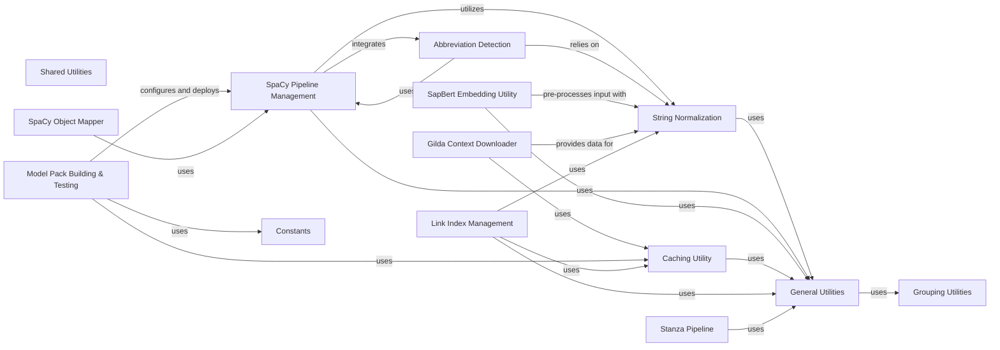

## Component Details

This set of components represents the core utility and NLP processing layers of the KAZU system. It encompasses functionalities for managing spaCy and Stanza NLP pipelines, building and testing model packs, detecting abbreviations, generating SapBert embeddings, downloading external contexts, and performing various string normalization and general data manipulation tasks. These components collectively provide the foundational capabilities for KAZU's natural language processing and knowledge extraction workflows, ensuring efficient data handling, model deployment, and text standardization.

### Shared Utilities

A collection of reusable utility functions and helper classes supporting various KAZU functionalities, including string normalization, caching, and abbreviation detection.

**Related Classes/Methods**:

- `KAZU.kazu.utils.abbreviation_detector.filter_matches` (full file reference)

- `KAZU.kazu.utils.abbreviation_detector.KazuAbbreviationDetector` (full file reference)

- <a href="https://github.com/AstraZeneca/KAZU/blob/master/kazu/utils/caching.py#L95-L128" target="_blank" rel="noopener noreferrer">`KAZU.kazu.utils.caching.EntityLinkingLookupCache` (95:128)</a>

- <a href="https://github.com/AstraZeneca/KAZU/blob/master/kazu/utils/spacy_object_mapper.py#L7-L96" target="_blank" rel="noopener noreferrer">`KAZU.kazu.utils.spacy_object_mapper.KazuToSpacyObjectMapper` (7:96)</a>

- <a href="https://github.com/AstraZeneca/KAZU/blob/master/kazu/utils/sapbert.py#L83-L253" target="_blank" rel="noopener noreferrer">`KAZU.kazu.utils.sapbert.SapBertHelper` (83:253)</a>

- `KAZU.kazu.utils.download_gilda_contexts.retry_wiki_with_maxlag` (full file reference)

- `KAZU.kazu.utils.download_gilda_contexts.get_wikipedia_url_from_wikidata_id` (full file reference)

- `KAZU.kazu.utils.download_gilda_contexts.get_wikipedia_contents_from_urls` (full file reference)

- `KAZU.kazu.utils.download_gilda_contexts.create_wiki_mappings` (full file reference)

- `KAZU.kazu.utils.download_gilda_contexts.extract_open_targets` (full file reference)

- <a href="https://github.com/AstraZeneca/KAZU/blob/master/kazu/utils/link_index.py#L25-L138" target="_blank" rel="noopener noreferrer">`KAZU.kazu.utils.link_index.DictionaryIndex` (25:138)</a>

- <a href="https://github.com/AstraZeneca/KAZU/blob/master/kazu/utils/string_normalizer.py#L42-L235" target="_blank" rel="noopener noreferrer">`KAZU.kazu.utils.string_normalizer.DefaultStringNormalizer` (42:235)</a>

- <a href="https://github.com/AstraZeneca/KAZU/blob/master/kazu/utils/string_normalizer.py#L238-L264" target="_blank" rel="noopener noreferrer">`KAZU.kazu.utils.string_normalizer.DiseaseStringNormalizer` (238:264)</a>

- <a href="https://github.com/AstraZeneca/KAZU/blob/master/kazu/utils/string_normalizer.py#L267-L291" target="_blank" rel="noopener noreferrer">`KAZU.kazu.utils.string_normalizer.AnatomyStringNormalizer` (267:291)</a>

- <a href="https://github.com/AstraZeneca/KAZU/blob/master/kazu/utils/string_normalizer.py#L294-L387" target="_blank" rel="noopener noreferrer">`KAZU.kazu.utils.string_normalizer.GeneStringNormalizer` (294:387)</a>

- <a href="https://github.com/AstraZeneca/KAZU/blob/master/kazu/utils/string_normalizer.py#L390-L412" target="_blank" rel="noopener noreferrer">`KAZU.kazu.utils.string_normalizer.CompanyStringNormalizer` (390:412)</a>

- <a href="https://github.com/AstraZeneca/KAZU/blob/master/kazu/utils/utils.py#L23-L49" target="_blank" rel="noopener noreferrer">`KAZU.kazu.utils.utils.linking_candidates_to_ontology_string_resources` (23:49)</a>

- <a href="https://github.com/AstraZeneca/KAZU/blob/master/kazu/utils/utils.py#L80-L106" target="_blank" rel="noopener noreferrer">`KAZU.kazu.utils.utils.documents_to_document_section_batch_encodings_map` (80:106)</a>

- <a href="https://github.com/AstraZeneca/KAZU/blob/master/kazu/utils/utils.py#L171-L173" target="_blank" rel="noopener noreferrer">`KAZU.kazu.utils.utils.create_char_ngrams` (171:173)</a>

- <a href="https://github.com/AstraZeneca/KAZU/blob/master/kazu/utils/utils.py#L176-L180" target="_blank" rel="noopener noreferrer">`KAZU.kazu.utils.utils.create_word_ngrams` (176:180)</a>

- <a href="https://github.com/AstraZeneca/KAZU/blob/master/kazu/utils/build_and_test_model_packs.py#L65-L309" target="_blank" rel="noopener noreferrer">`KAZU.kazu.utils.build_and_test_model_packs.ModelPackBuilder` (65:309)</a>

- <a href="https://github.com/AstraZeneca/KAZU/blob/master/kazu/utils/build_and_test_model_packs.py#L317-L385" target="_blank" rel="noopener noreferrer">`KAZU.kazu.utils.build_and_test_model_packs.build_all_model_packs` (317:385)</a>

### SpaCy Pipeline Management

This component is responsible for managing spaCy models within the KAZU system. It handles the addition of models from various sources, retrieves models for processing, and includes mechanisms for reloading models when necessary to ensure efficient and up-to-date NLP processing. It provides core functionalities for batch and single document processing.

**Related Classes/Methods**:

- <a href="https://github.com/AstraZeneca/KAZU/blob/master/kazu/utils/spacy_pipeline.py#L87-L254" target="_blank" rel="noopener noreferrer">`KAZU.kazu.utils.spacy_pipeline.SpacyPipelines` (87:254)</a>

- <a href="https://github.com/AstraZeneca/KAZU/blob/master/kazu/utils/spacy_pipeline.py#L124-L132" target="_blank" rel="noopener noreferrer">`KAZU.kazu.utils.spacy_pipeline.SpacyPipelines.add_from_path` (124:132)</a>

- <a href="https://github.com/AstraZeneca/KAZU/blob/master/kazu/utils/spacy_pipeline.py#L135-L143" target="_blank" rel="noopener noreferrer">`KAZU.kazu.utils.spacy_pipeline.SpacyPipelines.add_from_func` (135:143)</a>

- <a href="https://github.com/AstraZeneca/KAZU/blob/master/kazu/utils/spacy_pipeline.py#L146-L160" target="_blank" rel="noopener noreferrer">`KAZU.kazu.utils.spacy_pipeline.SpacyPipelines.add_reload_callback_func` (146:160)</a>

- <a href="https://github.com/AstraZeneca/KAZU/blob/master/kazu/utils/spacy_pipeline.py#L163-L166" target="_blank" rel="noopener noreferrer">`KAZU.kazu.utils.spacy_pipeline.SpacyPipelines.get_model` (163:166)</a>

- <a href="https://github.com/AstraZeneca/KAZU/blob/master/kazu/utils/spacy_pipeline.py#L169-L175" target="_blank" rel="noopener noreferrer">`KAZU.kazu.utils.spacy_pipeline.SpacyPipelines.process_batch` (169:175)</a>

- <a href="https://github.com/AstraZeneca/KAZU/blob/master/kazu/utils/spacy_pipeline.py#L220-L232" target="_blank" rel="noopener noreferrer">`KAZU.kazu.utils.spacy_pipeline.SpacyPipelines.process_single` (220:232)</a>

- <a href="https://github.com/AstraZeneca/KAZU/blob/master/kazu/utils/spacy_pipeline.py#L234-L246" target="_blank" rel="noopener noreferrer">`KAZU.kazu.utils.spacy_pipeline.SpacyPipelines._reload_if_required` (234:246)</a>

- <a href="https://github.com/AstraZeneca/KAZU/blob/master/kazu/utils/spacy_pipeline.py#L248-L254" target="_blank" rel="noopener noreferrer">`KAZU.kazu.utils.spacy_pipeline.SpacyPipelines.reload_model` (248:254)</a>

### Model Pack Building & Testing

This component orchestrates the entire lifecycle of KAZU model packs, from loading build configurations to applying merge strategies, clearing cached resources, building caches, running sanity checks, and executing acceptance tests. Its primary purpose is to ensure the robust creation and validation of deployable model artifacts.

**Related Classes/Methods**:

- <a href="https://github.com/AstraZeneca/KAZU/blob/master/kazu/utils/build_and_test_model_packs.py#L65-L309" target="_blank" rel="noopener noreferrer">`KAZU.kazu.utils.build_and_test_model_packs.ModelPackBuilder` (65:309)</a>

- <a href="https://github.com/AstraZeneca/KAZU/blob/master/kazu/utils/build_and_test_model_packs.py#L317-L385" target="_blank" rel="noopener noreferrer">`KAZU.kazu.utils.build_and_test_model_packs.build_all_model_packs` (317:385)</a>

- <a href="https://github.com/AstraZeneca/KAZU/blob/master/kazu/utils/build_and_test_model_packs.py#L66-L107" target="_blank" rel="noopener noreferrer">`KAZU.kazu.utils.build_and_test_model_packs.ModelPackBuilder.__init__` (66:107)</a>

- <a href="https://github.com/AstraZeneca/KAZU/blob/master/kazu/utils/build_and_test_model_packs.py#L113-L142" target="_blank" rel="noopener noreferrer">`KAZU.kazu.utils.build_and_test_model_packs.ModelPackBuilder.build_model_pack` (113:142)</a>

- <a href="https://github.com/AstraZeneca/KAZU/blob/master/kazu/utils/build_and_test_model_packs.py#L188-L202" target="_blank" rel="noopener noreferrer">`KAZU.kazu.utils.build_and_test_model_packs.ModelPackBuilder.load_build_configuration` (188:202)</a>

- <a href="https://github.com/AstraZeneca/KAZU/blob/master/kazu/utils/build_and_test_model_packs.py#L204-L231" target="_blank" rel="noopener noreferrer">`KAZU.kazu.utils.build_and_test_model_packs.ModelPackBuilder.apply_merge_configurations` (204:231)</a>

- <a href="https://github.com/AstraZeneca/KAZU/blob/master/kazu/utils/build_and_test_model_packs.py#L246-L258" target="_blank" rel="noopener noreferrer">`KAZU.kazu.utils.build_and_test_model_packs.ModelPackBuilder.clear_cached_resources_from_model_pack_dir` (246:258)</a>

- <a href="https://github.com/AstraZeneca/KAZU/blob/master/kazu/utils/build_and_test_model_packs.py#L283-L302" target="_blank" rel="noopener noreferrer">`KAZU.kazu.utils.build_and_test_model_packs.ModelPackBuilder.build_caches_and_run_sanity_checks` (283:302)</a>

- <a href="https://github.com/AstraZeneca/KAZU/blob/master/kazu/utils/build_and_test_model_packs.py#L144-L186" target="_blank" rel="noopener noreferrer">`KAZU.kazu.utils.build_and_test_model_packs.ModelPackBuilder.run_acceptance_tests` (144:186)</a>

- <a href="https://github.com/AstraZeneca/KAZU/blob/master/kazu/utils/build_and_test_model_packs.py#L304-L309" target="_blank" rel="noopener noreferrer">`KAZU.kazu.utils.build_and_test_model_packs.ModelPackBuilder.report_tested_dependencies` (304:309)</a>

- <a href="https://github.com/AstraZeneca/KAZU/blob/master/kazu/utils/build_and_test_model_packs.py#L260-L278" target="_blank" rel="noopener noreferrer">`KAZU.kazu.utils.build_and_test_model_packs.ModelPackBuilder.zip_model_pack` (260:278)</a>

- <a href="https://github.com/AstraZeneca/KAZU/blob/master/kazu/utils/build_and_test_model_packs.py#L61-L62" target="_blank" rel="noopener noreferrer">`KAZU.kazu.utils.build_and_test_model_packs.ModelPackBuildError` (61:62)</a>

- <a href="https://github.com/AstraZeneca/KAZU/blob/master/kazu/utils/build_and_test_model_packs.py#L23-L58" target="_blank" rel="noopener noreferrer">`KAZU.kazu.utils.build_and_test_model_packs.BuildConfiguration` (23:58)</a>

- <a href="https://github.com/AstraZeneca/KAZU/blob/master/kazu/utils/build_and_test_model_packs.py#L388-L405" target="_blank" rel="noopener noreferrer">`KAZU.kazu.utils.build_and_test_model_packs.wait_for_model_pack_completion` (388:405)</a>

### Abbreviation Detection

This component is dedicated to identifying and processing abbreviations within text. It includes functionalities to find candidate abbreviations, build matchers, and override existing entities with detected abbreviations, contributing to the normalization and enrichment of textual data.

**Related Classes/Methods**:

- <a href="https://github.com/AstraZeneca/KAZU/blob/master/kazu/utils/abbreviation_detector.py#L10-L20" target="_blank" rel="noopener noreferrer">`KAZU.kazu.utils.abbreviation_detector.filter_matches` (10:20)</a>

- <a href="https://github.com/AstraZeneca/KAZU/blob/master/kazu/utils/abbreviation_detector.py#L23-L140" target="_blank" rel="noopener noreferrer">`KAZU.kazu.utils.abbreviation_detector.KazuAbbreviationDetector` (23:140)</a>

- `KAZU.kazu.utils.abbreviation_detector.KazuAbbreviationDetector.__call__` (full file reference)

- `KAZU.kazu.utils.abbreviation_detector.KazuAbbreviationDetector._find_candidates_and_index_sections` (full file reference)

- `KAZU.kazu.utils.abbreviation_detector.KazuAbbreviationDetector._build_matcher_and_identify_source_entities` (full file reference)

- `KAZU.kazu.utils.abbreviation_detector.KazuAbbreviationDetector._find_abbreviations_and_override_entities` (full file reference)

- `KAZU.kazu.utils.abbreviation_detector.KazuAbbreviationDetector._remove_existing_entities` (full file reference)

- `KAZU.kazu.utils.abbreviation_detector.KazuAbbreviationDetector._create_abbreviation_entities` (full file reference)

- `KAZU.kazu.utils.abbreviation_detector.KazuAbbreviationDetector._create_ent_from_span_and_source_ent` (full file reference)

- `KAZU.kazu.utils.abbreviation_detector.short_form_filter` (full file reference)

- `KAZU.kazu.utils.abbreviation_detector.find_abbreviation` (full file reference)

### SapBert Embedding Utility

This component provides utilities for generating and retrieving embeddings using the SapBert model. It supports obtaining embeddings from data loaders or directly from strings, facilitating tasks that require semantic representations of text, such as similarity comparisons or information retrieval.

**Related Classes/Methods**:

- <a href="https://github.com/AstraZeneca/KAZU/blob/master/kazu/utils/sapbert.py#L83-L253" target="_blank" rel="noopener noreferrer">`KAZU.kazu.utils.sapbert.SapBertHelper` (83:253)</a>

- <a href="https://github.com/AstraZeneca/KAZU/blob/master/kazu/utils/sapbert.py#L177-L189" target="_blank" rel="noopener noreferrer">`KAZU.kazu.utils.sapbert.SapBertHelper.get_embeddings_from_dataloader` (177:189)</a>

- <a href="https://github.com/AstraZeneca/KAZU/blob/master/kazu/utils/sapbert.py#L192-L203" target="_blank" rel="noopener noreferrer">`KAZU.kazu.utils.sapbert.SapBertHelper.get_prediction_from_batch` (192:203)</a>

- <a href="https://github.com/AstraZeneca/KAZU/blob/master/kazu/utils/sapbert.py#L162-L175" target="_blank" rel="noopener noreferrer">`KAZU.kazu.utils.sapbert.SapBertHelper.get_embeddings` (162:175)</a>

- <a href="https://github.com/AstraZeneca/KAZU/blob/master/kazu/utils/sapbert.py#L240-L253" target="_blank" rel="noopener noreferrer">`KAZU.kazu.utils.sapbert.SapBertHelper.get_embeddings_for_strings` (240:253)</a>

- <a href="https://github.com/AstraZeneca/KAZU/blob/master/kazu/utils/sapbert.py#L205-L238" target="_blank" rel="noopener noreferrer">`KAZU.kazu.utils.sapbert.SapBertHelper.get_embedding_dataloader_from_strings` (205:238)</a>

### Gilda Context Downloader

This component is responsible for downloading and processing contextual information, primarily for Gilda, from external knowledge bases like Wikipedia and Wikidata. It includes functionalities to retry requests, retrieve URLs and content, and extract specific data such as Open Targets information.

**Related Classes/Methods**:

- <a href="https://github.com/AstraZeneca/KAZU/blob/master/kazu/utils/download_gilda_contexts.py#L10-L20" target="_blank" rel="noopener noreferrer">`KAZU.kazu.utils.download_gilda_contexts.retry_wiki_with_maxlag` (10:20)</a>

- <a href="https://github.com/AstraZeneca/KAZU/blob/master/kazu/utils/download_gilda_contexts.py#L23-L33" target="_blank" rel="noopener noreferrer">`KAZU.kazu.utils.download_gilda_contexts.get_wikipedia_url_from_wikidata_id` (23:33)</a>

- <a href="https://github.com/AstraZeneca/KAZU/blob/master/kazu/utils/download_gilda_contexts.py#L36-L50" target="_blank" rel="noopener noreferrer">`KAZU.kazu.utils.download_gilda_contexts.get_wikipedia_contents_from_urls` (36:50)</a>

- <a href="https://github.com/AstraZeneca/KAZU/blob/master/kazu/utils/download_gilda_contexts.py#L53-L69" target="_blank" rel="noopener noreferrer">`KAZU.kazu.utils.download_gilda_contexts.create_wiki_mappings` (53:69)</a>

- <a href="https://github.com/AstraZeneca/KAZU/blob/master/kazu/utils/download_gilda_contexts.py#L72-L82" target="_blank" rel="noopener noreferrer">`KAZU.kazu.utils.download_gilda_contexts.extract_open_targets` (72:82)</a>

- `KAZU.kazu.utils.download_gilda_contexts.get_retry` (full file reference)

- `KAZU.kazu.utils.download_gilda_contexts.divide_chunks` (full file reference)

- `KAZU.kazu.utils.download_gilda_contexts.get_biomart_gene_to_protein` (full file reference)

- `KAZU.kazu.utils.download_gilda_contexts.get_sparql_df` (full file reference)

### String Normalization

This component provides a comprehensive set of tools for standardizing and cleaning text strings. It includes a default normalizer with methods for replacing substrings, handling numbers, Greek characters, and depluralization, along with specialized normalizers for diseases, anatomy, genes, and companies, ensuring consistent text representation across the system.

**Related Classes/Methods**:

- <a href="https://github.com/AstraZeneca/KAZU/blob/master/kazu/utils/string_normalizer.py#L42-L235" target="_blank" rel="noopener noreferrer">`KAZU.kazu.utils.string_normalizer.DefaultStringNormalizer` (42:235)</a>

- <a href="https://github.com/AstraZeneca/KAZU/blob/master/kazu/utils/string_normalizer.py#L238-L264" target="_blank" rel="noopener noreferrer">`KAZU.kazu.utils.string_normalizer.DiseaseStringNormalizer` (238:264)</a>

- <a href="https://github.com/AstraZeneca/KAZU/blob/master/kazu/utils/string_normalizer.py#L267-L291" target="_blank" rel="noopener noreferrer">`KAZU.kazu.utils.string_normalizer.AnatomyStringNormalizer` (267:291)</a>

- <a href="https://github.com/AstraZeneca/KAZU/blob/master/kazu/utils/string_normalizer.py#L294-L387" target="_blank" rel="noopener noreferrer">`KAZU.kazu.utils.string_normalizer.GeneStringNormalizer` (294:387)</a>

- <a href="https://github.com/AstraZeneca/KAZU/blob/master/kazu/utils/string_normalizer.py#L390-L412" target="_blank" rel="noopener noreferrer">`KAZU.kazu.utils.string_normalizer.CompanyStringNormalizer` (390:412)</a>

- <a href="https://github.com/AstraZeneca/KAZU/blob/master/kazu/utils/string_normalizer.py#L126-L133" target="_blank" rel="noopener noreferrer">`KAZU.kazu.utils.string_normalizer.DefaultStringNormalizer.normalize_noun_phrase` (126:133)</a>

- <a href="https://github.com/AstraZeneca/KAZU/blob/master/kazu/utils/string_normalizer.py#L222-L235" target="_blank" rel="noopener noreferrer">`KAZU.kazu.utils.string_normalizer.DefaultStringNormalizer.replace_substrings` (222:235)</a>

- <a href="https://github.com/AstraZeneca/KAZU/blob/master/kazu/utils/string_normalizer.py#L211-L219" target="_blank" rel="noopener noreferrer">`KAZU.kazu.utils.string_normalizer.DefaultStringNormalizer.split_on_numbers` (211:219)</a>

- <a href="https://github.com/AstraZeneca/KAZU/blob/master/kazu/utils/string_normalizer.py#L199-L208" target="_blank" rel="noopener noreferrer">`KAZU.kazu.utils.string_normalizer.DefaultStringNormalizer.replace_greek` (199:208)</a>

- <a href="https://github.com/AstraZeneca/KAZU/blob/master/kazu/utils/string_normalizer.py#L186-L196" target="_blank" rel="noopener noreferrer">`KAZU.kazu.utils.string_normalizer.DefaultStringNormalizer.remove_non_alphanum` (186:196)</a>

- <a href="https://github.com/AstraZeneca/KAZU/blob/master/kazu/utils/string_normalizer.py#L136-L144" target="_blank" rel="noopener noreferrer">`KAZU.kazu.utils.string_normalizer.DefaultStringNormalizer.depluralize` (136:144)</a>

- <a href="https://github.com/AstraZeneca/KAZU/blob/master/kazu/utils/string_normalizer.py#L147-L156" target="_blank" rel="noopener noreferrer">`KAZU.kazu.utils.string_normalizer.DefaultStringNormalizer.sub_greek_char_abbreviations` (147:156)</a>

- <a href="https://github.com/AstraZeneca/KAZU/blob/master/kazu/utils/string_normalizer.py#L80-L119" target="_blank" rel="noopener noreferrer">`KAZU.kazu.utils.string_normalizer.DefaultStringNormalizer.is_symbol_like` (80:119)</a>

- <a href="https://github.com/AstraZeneca/KAZU/blob/master/kazu/utils/string_normalizer.py#L122-L123" target="_blank" rel="noopener noreferrer">`KAZU.kazu.utils.string_normalizer.DefaultStringNormalizer.normalize_symbol` (122:123)</a>

- <a href="https://github.com/AstraZeneca/KAZU/blob/master/kazu/utils/string_normalizer.py#L242-L246" target="_blank" rel="noopener noreferrer">`KAZU.kazu.utils.string_normalizer.DiseaseStringNormalizer.is_symbol_like` (242:246)</a>

- <a href="https://github.com/AstraZeneca/KAZU/blob/master/kazu/utils/string_normalizer.py#L249-L255" target="_blank" rel="noopener noreferrer">`KAZU.kazu.utils.string_normalizer.DiseaseStringNormalizer.normalize_symbol` (249:255)</a>

- <a href="https://github.com/AstraZeneca/KAZU/blob/master/kazu/utils/string_normalizer.py#L258-L264" target="_blank" rel="noopener noreferrer">`KAZU.kazu.utils.string_normalizer.DiseaseStringNormalizer.normalize_noun_phrase` (258:264)</a>

- <a href="https://github.com/AstraZeneca/KAZU/blob/master/kazu/utils/string_normalizer.py#L274-L282" target="_blank" rel="noopener noreferrer">`KAZU.kazu.utils.string_normalizer.AnatomyStringNormalizer.normalize_symbol` (274:282)</a>

- <a href="https://github.com/AstraZeneca/KAZU/blob/master/kazu/utils/string_normalizer.py#L285-L291" target="_blank" rel="noopener noreferrer">`KAZU.kazu.utils.string_normalizer.AnatomyStringNormalizer.normalize_noun_phrase` (285:291)</a>

- <a href="https://github.com/AstraZeneca/KAZU/blob/master/kazu/utils/string_normalizer.py#L298-L317" target="_blank" rel="noopener noreferrer">`KAZU.kazu.utils.string_normalizer.GeneStringNormalizer.is_symbol_like` (298:317)</a>

- <a href="https://github.com/AstraZeneca/KAZU/blob/master/kazu/utils/string_normalizer.py#L364-L377" target="_blank" rel="noopener noreferrer">`KAZU.kazu.utils.string_normalizer.GeneStringNormalizer.normalize_symbol` (364:377)</a>

- <a href="https://github.com/AstraZeneca/KAZU/blob/master/kazu/utils/string_normalizer.py#L380-L387" target="_blank" rel="noopener noreferrer">`KAZU.kazu.utils.string_normalizer.GeneStringNormalizer.normalize_noun_phrase` (380:387)</a>

- <a href="https://github.com/AstraZeneca/KAZU/blob/master/kazu/utils/string_normalizer.py#L406-L412" target="_blank" rel="noopener noreferrer">`KAZU.kazu.utils.string_normalizer.CompanyStringNormalizer.normalize_noun_phrase` (406:412)</a>

- <a href="https://github.com/AstraZeneca/KAZU/blob/master/kazu/utils/string_normalizer.py#L527-L567" target="_blank" rel="noopener noreferrer">`KAZU.kazu.utils.string_normalizer.GildaUtils.depluralize` (527:567)</a>

- <a href="https://github.com/AstraZeneca/KAZU/blob/master/kazu/utils/string_normalizer.py#L578-L584" target="_blank" rel="noopener noreferrer">`KAZU.kazu.utils.string_normalizer.GildaUtils.split_on_dashes_or_space` (578:584)</a>

- <a href="https://github.com/AstraZeneca/KAZU/blob/master/kazu/utils/string_normalizer.py#L320-L347" target="_blank" rel="noopener noreferrer">`KAZU.kazu.utils.string_normalizer.GeneStringNormalizer.gene_token_classifier` (320:347)</a>

- <a href="https://github.com/AstraZeneca/KAZU/blob/master/kazu/utils/string_normalizer.py#L350-L361" target="_blank" rel="noopener noreferrer">`KAZU.kazu.utils.string_normalizer.GeneStringNormalizer.remove_trailing_s_if_otherwise_capitalised` (350:361)</a>

### General Utilities

This component provides foundational helper functions for common data processing tasks across the KAZU project. It includes utilities for mapping documents to section encodings and creating various types of n-grams (character and word), serving as a support layer for other components.

**Related Classes/Methods**:

- <a href="https://github.com/AstraZeneca/KAZU/blob/master/kazu/utils/utils.py#L23-L49" target="_blank" rel="noopener noreferrer">`KAZU.kazu.utils.utils.linking_candidates_to_ontology_string_resources` (23:49)</a>

- <a href="https://github.com/AstraZeneca/KAZU/blob/master/kazu/utils/utils.py#L80-L106" target="_blank" rel="noopener noreferrer">`KAZU.kazu.utils.utils.documents_to_document_section_batch_encodings_map` (80:106)</a>

- <a href="https://github.com/AstraZeneca/KAZU/blob/master/kazu/utils/utils.py#L171-L173" target="_blank" rel="noopener noreferrer">`KAZU.kazu.utils.utils.create_char_ngrams` (171:173)</a>

- <a href="https://github.com/AstraZeneca/KAZU/blob/master/kazu/utils/utils.py#L176-L180" target="_blank" rel="noopener noreferrer">`KAZU.kazu.utils.utils.create_word_ngrams` (176:180)</a>

- <a href="https://github.com/AstraZeneca/KAZU/blob/master/kazu/utils/utils.py#L65-L77" target="_blank" rel="noopener noreferrer">`KAZU.kazu.utils.utils.documents_to_id_section_map` (65:77)</a>

- <a href="https://github.com/AstraZeneca/KAZU/blob/master/kazu/utils/utils.py#L143-L144" target="_blank" rel="noopener noreferrer">`KAZU.kazu.utils.utils._create_ngrams_iter` (143:144)</a>

### Caching Utility

Provides caching mechanisms for various KAZU functionalities, improving performance by storing and retrieving frequently accessed data.

**Related Classes/Methods**:

- <a href="https://github.com/AstraZeneca/KAZU/blob/master/kazu/utils/caching.py#L95-L128" target="_blank" rel="noopener noreferrer">`KAZU.kazu.utils.caching.EntityLinkingLookupCache` (95:128)</a>

### Link Index Management

Manages the indexing and lookup of entities for linking purposes, facilitating efficient retrieval of related information.

**Related Classes/Methods**:

- <a href="https://github.com/AstraZeneca/KAZU/blob/master/kazu/utils/link_index.py#L25-L138" target="_blank" rel="noopener noreferrer">`KAZU.kazu.utils.link_index.DictionaryIndex` (25:138)</a>

### SpaCy Object Mapper

Provides utilities for mapping KAZU data structures to spaCy objects and vice-versa, enabling seamless integration with spaCy's NLP capabilities.

**Related Classes/Methods**:

- <a href="https://github.com/AstraZeneca/KAZU/blob/master/kazu/utils/spacy_object_mapper.py#L7-L96" target="_blank" rel="noopener noreferrer">`KAZU.kazu.utils.spacy_object_mapper.KazuToSpacyObjectMapper` (7:96)</a>

### Constants

Defines various constants used throughout the KAZU project, ensuring consistency and easy configuration of system parameters.

**Related Classes/Methods**: _None_

### Grouping Utilities

Provides utility functions for grouping and organizing data, often used in processing and managing collections of entities or documents.

**Related Classes/Methods**: _None_

### Stanza Pipeline

Manages the integration and usage of Stanza NLP models within KAZU, providing functionalities for text processing with Stanza.

**Related Classes/Methods**: _None_

### [FAQ](https://github.com/CodeBoarding/GeneratedOnBoardings/tree/main?tab=readme-ov-file#faq)