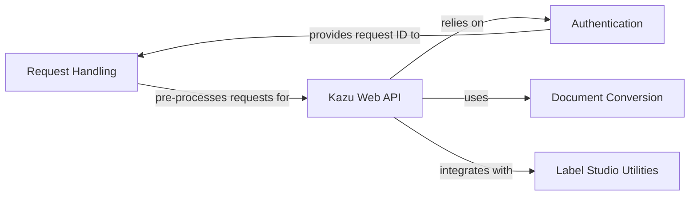

## Component Details

The Web API Interface provides RESTful API endpoints for external applications to interact with the KAZU system, enabling Natural Language Processing (NLP) operations such as Named Entity Recognition (NER) and entity linking. It handles incoming requests by managing request IDs, authenticating users via JWT, converting various document formats into KAZU's internal representation, and orchestrating the execution of NLP pipelines. The interface also includes utilities for integration with external annotation tools like Label Studio.

### Request Handling

This component is responsible for processing incoming web requests, extracting relevant information like request IDs, and logging request details. The `AddRequestIdMiddleware` ensures that a unique request ID is added to each request and subsequently to the response headers, facilitating request tracking and logging.

**Related Classes/Methods**:

- <a href="https://github.com/AstraZeneca/KAZU/blob/master/kazu/web/req_id_header.py#L58-L76" target="_blank" rel="noopener noreferrer">`KAZU.kazu.web.req_id_header.AddRequestIdMiddleware` (58:76)</a>

- <a href="https://github.com/AstraZeneca/KAZU/blob/master/kazu/web/server.py#L150-L160" target="_blank" rel="noopener noreferrer">`KAZU.kazu.web.server.get_id_log_prefix_if_available` (150:160)</a>

- <a href="https://github.com/AstraZeneca/KAZU/blob/master/kazu/web/server.py#L163-L175" target="_blank" rel="noopener noreferrer">`KAZU.kazu.web.server.log_request_to_path_with_prefix` (163:175)</a>

### Authentication

This component handles user authentication using JWT tokens. The `JWTAuthenticationBackend` validates the provided token, extracts user information, and manages access control for different endpoints. It also generates a request ID for each incoming request and logs authentication-related events, including warnings for invalid tokens or missing authorization headers.

**Related Classes/Methods**:

- <a href="https://github.com/AstraZeneca/KAZU/blob/master/kazu/web/jwtauth.py#L82-L148" target="_blank" rel="noopener noreferrer">`KAZU.kazu.web.jwtauth.JWTAuthenticationBackend` (82:148)</a>

### Document Conversion

This component is responsible for converting various web document formats into KAZU's internal Document representation. It handles both simple and sectioned web documents, and also supports converting single entities into KAZU documents, preparing data for NLP processing.

**Related Classes/Methods**:

- <a href="https://github.com/AstraZeneca/KAZU/blob/master/kazu/web/server.py#L205-L212" target="_blank" rel="noopener noreferrer">`KAZU.kazu.web.server.SectionedWebDocument` (205:212)</a>

- <a href="https://github.com/AstraZeneca/KAZU/blob/master/kazu/web/server.py#L215-L222" target="_blank" rel="noopener noreferrer">`KAZU.kazu.web.server.SimpleWebDocument` (215:222)</a>

- <a href="https://github.com/AstraZeneca/KAZU/blob/master/kazu/web/server.py#L228-L244" target="_blank" rel="noopener noreferrer">`KAZU.kazu.web.server.DocumentCollection` (228:244)</a>

- <a href="https://github.com/AstraZeneca/KAZU/blob/master/kazu/web/server.py#L319-L347" target="_blank" rel="noopener noreferrer">`KAZU.kazu.web.server.SingleEntityDocumentConverter` (319:347)</a>

### Kazu Web API

This is the core component of the KAZU web application, providing various API endpoints for natural language processing tasks. It orchestrates the pipeline execution, handles different types of requests (NER, linking, custom pipelines), and interacts with other components for logging, document conversion, and authentication.

**Related Classes/Methods**:

- <a href="https://github.com/AstraZeneca/KAZU/blob/master/kazu/web/server.py#L352-L616" target="_blank" rel="noopener noreferrer">`KAZU.kazu.web.server.KazuWebAPI` (352:616)</a>

### Label Studio Utilities

This component provides utility functions for integrating with Label Studio, a data annotation tool. It includes functionalities for creating default Label Studio annotation views and converting KAZU annotations to Label Studio format, facilitating data labeling workflows.

**Related Classes/Methods**:

- <a href="https://github.com/AstraZeneca/KAZU/blob/master/kazu/web/ls_web_utils.py#L12-L28" target="_blank" rel="noopener noreferrer">`KAZU.kazu.web.ls_web_utils.LSWebUtils` (12:28)</a>

### [FAQ](https://github.com/CodeBoarding/GeneratedOnBoardings/tree/main?tab=readme-ov-file#faq)