```mermaid

graph LR

    Core_Data_Models["Core Data Models"]

    NLP_Pipeline_Management["NLP Pipeline Management"]

    Named_Entity_Recognition_NER_["Named Entity Recognition (NER)"]

    Entity_Linking_Disambiguation["Entity Linking & Disambiguation"]

    Ontology_Management["Ontology Management"]

    Model_Training_Evaluation["Model Training & Evaluation"]

    Resource_Management_Tools_KRT_["Resource Management Tools (KRT)"]

    Web_API_Interface["Web API Interface"]

    Shared_Utilities["Shared Utilities"]

    Annotation_Quality_Assurance["Annotation & Quality Assurance"]

    NLP_Pipeline_Management -- "uses" --> Core_Data_Models

    NLP_Pipeline_Management -- "orchestrates" --> Named_Entity_Recognition_NER_

    NLP_Pipeline_Management -- "orchestrates" --> Entity_Linking_Disambiguation

    Named_Entity_Recognition_NER_ -- "produces" --> Core_Data_Models

    Entity_Linking_Disambiguation -- "consumes" --> Core_Data_Models

    Entity_Linking_Disambiguation -- "uses" --> Ontology_Management

    Ontology_Management -- "produces" --> Core_Data_Models

    Ontology_Management -- "uses" --> Shared_Utilities

    Model_Training_Evaluation -- "uses" --> Core_Data_Models

    Model_Training_Evaluation -- "uses" --> Named_Entity_Recognition_NER_

    Model_Training_Evaluation -- "evaluates" --> NLP_Pipeline_Management

    Model_Training_Evaluation -- "integrates with" --> Annotation_Quality_Assurance

    Resource_Management_Tools_KRT_ -- "manages" --> Ontology_Management

    Resource_Management_Tools_KRT_ -- "uses" --> Core_Data_Models

    Web_API_Interface -- "exposes" --> NLP_Pipeline_Management

    Web_API_Interface -- "consumes" --> Core_Data_Models

    Web_API_Interface -- "integrates with" --> Annotation_Quality_Assurance

    Shared_Utilities -- "supports" --> NLP_Pipeline_Management

    Shared_Utilities -- "supports" --> Named_Entity_Recognition_NER_

    Shared_Utilities -- "supports" --> Entity_Linking_Disambiguation

    Shared_Utilities -- "supports" --> Ontology_Management

    Shared_Utilities -- "supports" --> Model_Training_Evaluation

    Shared_Utilities -- "supports" --> Resource_Management_Tools_KRT_

    Shared_Utilities -- "supports" --> Web_API_Interface

    Shared_Utilities -- "supports" --> Annotation_Quality_Assurance

    Annotation_Quality_Assurance -- "uses" --> Core_Data_Models

    Annotation_Quality_Assurance -- "evaluates" --> NLP_Pipeline_Management

    click Core_Data_Models href "https://github.com/AstraZeneca/KAZU/blob/main/.codeboarding//Core Data Models.md" "Details"

    click NLP_Pipeline_Management href "https://github.com/AstraZeneca/KAZU/blob/main/.codeboarding//NLP Pipeline Management.md" "Details"

    click Named_Entity_Recognition_NER_ href "https://github.com/AstraZeneca/KAZU/blob/main/.codeboarding//Named Entity Recognition (NER).md" "Details"

    click Entity_Linking_Disambiguation href "https://github.com/AstraZeneca/KAZU/blob/main/.codeboarding//Entity Linking & Disambiguation.md" "Details"

    click Ontology_Management href "https://github.com/AstraZeneca/KAZU/blob/main/.codeboarding//Ontology Management.md" "Details"

    click Model_Training_Evaluation href "https://github.com/AstraZeneca/KAZU/blob/main/.codeboarding//Model Training & Evaluation.md" "Details"

    click Resource_Management_Tools_KRT_ href "https://github.com/AstraZeneca/KAZU/blob/main/.codeboarding//Resource Management Tools (KRT).md" "Details"

    click Web_API_Interface href "https://github.com/AstraZeneca/KAZU/blob/main/.codeboarding//Web API Interface.md" "Details"

    click Shared_Utilities href "https://github.com/AstraZeneca/KAZU/blob/main/.codeboarding//Shared Utilities.md" "Details"

    click Annotation_Quality_Assurance href "https://github.com/AstraZeneca/KAZU/blob/main/.codeboarding//Annotation & Quality Assurance.md" "Details"

```

## Component Details

The KAZU system is a comprehensive Natural Language Processing (NLP) framework designed for biomedical text analysis. Its main flow involves processing documents through a configurable NLP pipeline that performs Named Entity Recognition (NER) and Entity Linking & Disambiguation. Core data models underpin all operations, while ontology management provides the necessary knowledge base. The system also includes robust tooling for resource curation, model training and evaluation, and a web API for external integration, all supported by a suite of general utilities and quality assurance mechanisms.

### Core Data Models

Defines fundamental data structures (documents, entities, sections, mappings, ontology resources) used across the KAZU system.

**Related Classes/Methods**:

- `KAZU.kazu.data.Entity` (full file reference)

- `KAZU.kazu.data.Document` (full file reference)

- `KAZU.kazu.data.Section` (full file reference)

- `KAZU.kazu.data.Mapping` (full file reference)

- `KAZU.kazu.data.OntologyStringResource` (full file reference)

- `kazu.data.EquivalentIdSet` (full file reference)

- `kazu.data.CharSpan` (full file reference)

- `kazu.data.Synonym` (full file reference)

- `kazu.data.LinkingCandidate` (full file reference)

- `kazu.data.MentionConfidence` (full file reference)

- `kazu.data.LinkingMetrics` (full file reference)

- `kazu.data.TokWordSpan` (full file reference)

- `KAZU.kazu.data.GliNERBatchItem` (full file reference)

- `KAZU.kazu.data.SavedModel` (full file reference)

- `KAZU.kazu.data.GlobalParserActions` (full file reference)

- `KAZU.kazu.data.PipelineValueError` (full file reference)

- `KAZU.kazu.data.KazuConfigurationError` (full file reference)

### NLP Pipeline Management

Orchestrates the execution of NLP processing steps on documents and manages spaCy models within the pipeline.

**Related Classes/Methods**:

- `KAZU.kazu.pipeline.Pipeline` (full file reference)

- `KAZU.kazu.pipeline.batch_metrics` (full file reference)

- `KAZU.kazu.pipeline.FailedDocsFileHandler` (full file reference)

- <a href="https://github.com/AstraZeneca/KAZU/blob/master/kazu/utils/spacy_pipeline.py#L87-L254" target="_blank" rel="noopener noreferrer">`KAZU.kazu.utils.spacy_pipeline.SpacyPipelines` (87:254)</a>

### Named Entity Recognition (NER)

Identifies and extracts named entities from text using transformer models, rule-based approaches, and post-processing.

**Related Classes/Methods**:

- <a href="https://github.com/AstraZeneca/KAZU/blob/master/kazu/steps/ner/hf_token_classification.py#L63-L351" target="_blank" rel="noopener noreferrer">`KAZU.kazu.steps.ner.hf_token_classification.TransformersModelForTokenClassificationNerStep` (63:351)</a>

- <a href="https://github.com/AstraZeneca/KAZU/blob/master/kazu/steps/ner/tokenized_word_processor.py#L319-L432" target="_blank" rel="noopener noreferrer">`KAZU.kazu.steps.ner.tokenized_word_processor.TokenizedWordProcessor` (319:432)</a>

- <a href="https://github.com/AstraZeneca/KAZU/blob/master/kazu/steps/ner/tokenized_word_processor.py#L68-L211" target="_blank" rel="noopener noreferrer">`KAZU.kazu.steps.ner.tokenized_word_processor.SimpleSpanFinder` (68:211)</a>

- <a href="https://github.com/AstraZeneca/KAZU/blob/master/kazu/steps/ner/tokenized_word_processor.py#L214-L316" target="_blank" rel="noopener noreferrer">`KAZU.kazu.steps.ner.tokenized_word_processor.MultilabelSpanFinder` (214:316)</a>

- <a href="https://github.com/AstraZeneca/KAZU/blob/master/kazu/steps/ner/llm_ner.py#L193-L290" target="_blank" rel="noopener noreferrer">`KAZU.kazu.steps.ner.llm_ner.LLMNERStep` (193:290)</a>

- <a href="https://github.com/AstraZeneca/KAZU/blob/master/kazu/steps/ner/llm_ner.py#L133-L179" target="_blank" rel="noopener noreferrer">`KAZU.kazu.steps.ner.llm_ner.VertexLLMModel` (133:179)</a>

- <a href="https://github.com/AstraZeneca/KAZU/blob/master/kazu/steps/ner/spacy_ner.py#L5-L40" target="_blank" rel="noopener noreferrer">`KAZU.kazu.steps.ner.spacy_ner.SpacyNerStep` (5:40)</a>

- <a href="https://github.com/AstraZeneca/KAZU/blob/master/kazu/steps/ner/opsin.py#L24-L380" target="_blank" rel="noopener noreferrer">`KAZU.kazu.steps.ner.opsin.OpsinStep` (24:380)</a>

- <a href="https://github.com/AstraZeneca/KAZU/blob/master/kazu/steps/ner/seth.py#L19-L133" target="_blank" rel="noopener noreferrer">`KAZU.kazu.steps.ner.seth.SethStep` (19:133)</a>

- <a href="https://github.com/AstraZeneca/KAZU/blob/master/kazu/steps/ner/gliner.py#L125-L318" target="_blank" rel="noopener noreferrer">`KAZU.kazu.steps.ner.gliner.GLiNERStep` (125:318)</a>

- <a href="https://github.com/AstraZeneca/KAZU/blob/master/kazu/steps/ner/gliner.py#L37-L91" target="_blank" rel="noopener noreferrer">`KAZU.kazu.steps.ner.gliner.ConflictScorer` (37:91)</a>

- <a href="https://github.com/AstraZeneca/KAZU/blob/master/kazu/steps/ner/gliner.py#L94-L106" target="_blank" rel="noopener noreferrer">`KAZU.kazu.steps.ner.gliner.MajorityVoteScorer` (94:106)</a>

- <a href="https://github.com/AstraZeneca/KAZU/blob/master/kazu/steps/ner/gliner.py#L109-L122" target="_blank" rel="noopener noreferrer">`KAZU.kazu.steps.ner.gliner.MaxScoreScorer` (109:122)</a>

- <a href="https://github.com/AstraZeneca/KAZU/blob/master/kazu/steps/ner/entity_post_processing.py#L28-L92" target="_blank" rel="noopener noreferrer">`KAZU.kazu.steps.ner.entity_post_processing.SplitOnConjunctionPattern` (28:92)</a>

- <a href="https://github.com/AstraZeneca/KAZU/blob/master/kazu/steps/ner/entity_post_processing.py#L95-L166" target="_blank" rel="noopener noreferrer">`KAZU.kazu.steps.ner.entity_post_processing.SplitOnNumericalListPatternWithPrefix` (95:166)</a>

### Entity Linking & Disambiguation

Links identified entities to external knowledge bases and disambiguates between potential links using dictionary, rule-based, and context-scoring strategies.

**Related Classes/Methods**:

- <a href="https://github.com/AstraZeneca/KAZU/blob/master/kazu/steps/linking/dictionary.py#L13-L83" target="_blank" rel="noopener noreferrer">`KAZU.kazu.steps.linking.dictionary.DictionaryEntityLinkingStep` (13:83)</a>

- <a href="https://github.com/AstraZeneca/KAZU/blob/master/kazu/steps/linking/entity_class_disambiguation.py#L101-L192" target="_blank" rel="noopener noreferrer">`KAZU.kazu.steps.linking.entity_class_disambiguation.EntityClassDisambiguationStep` (101:192)</a>

- <a href="https://github.com/AstraZeneca/KAZU/blob/master/kazu/steps/linking/entity_class_disambiguation.py#L33-L98" target="_blank" rel="noopener noreferrer">`KAZU.kazu.steps.linking.entity_class_disambiguation.EntityClassTfIdfScorer` (33:98)</a>

- <a href="https://github.com/AstraZeneca/KAZU/blob/master/kazu/steps/linking/rules_based_disambiguation.py#L36-L287" target="_blank" rel="noopener noreferrer">`KAZU.kazu.steps.linking.rules_based_disambiguation.RulesBasedEntityClassDisambiguationFilterStep` (36:287)</a>

- <a href="https://github.com/AstraZeneca/KAZU/blob/master/kazu/steps/linking/post_processing/mapping_step.py#L12-L25" target="_blank" rel="noopener noreferrer">`KAZU.kazu.steps.linking.post_processing.mapping_step.MappingStep` (12:25)</a>

- <a href="https://github.com/AstraZeneca/KAZU/blob/master/kazu/steps/linking/post_processing/strategy_runner.py#L161-L341" target="_blank" rel="noopener noreferrer">`KAZU.kazu.steps.linking.post_processing.strategy_runner.StrategyRunner` (161:341)</a>

- <a href="https://github.com/AstraZeneca/KAZU/blob/master/kazu/steps/linking/post_processing/strategy_runner.py#L39-L158" target="_blank" rel="noopener noreferrer">`KAZU.kazu.steps.linking.post_processing.strategy_runner.ConfidenceLevelStrategyExecution` (39:158)</a>

- <a href="https://github.com/AstraZeneca/KAZU/blob/master/kazu/steps/linking/post_processing/xref_manager.py#L40-L104" target="_blank" rel="noopener noreferrer">`KAZU.kazu.steps.linking.post_processing.xref_manager.CrossReferenceManager` (40:104)</a>

- <a href="https://github.com/AstraZeneca/KAZU/blob/master/kazu/steps/linking/post_processing/xref_manager.py#L107-L215" target="_blank" rel="noopener noreferrer">`KAZU.kazu.steps.linking.post_processing.xref_manager.OxoCrossReferenceManager` (107:215)</a>

- <a href="https://github.com/AstraZeneca/KAZU/blob/master/kazu/steps/linking/post_processing/mapping_strategies/strategies.py#L20-L104" target="_blank" rel="noopener noreferrer">`KAZU.kazu.steps.linking.post_processing.mapping_strategies.strategies.MappingFactory` (20:104)</a>

- <a href="https://github.com/AstraZeneca/KAZU/blob/master/kazu/steps/linking/post_processing/mapping_strategies/strategies.py#L107-L278" target="_blank" rel="noopener noreferrer">`KAZU.kazu.steps.linking.post_processing.mapping_strategies.strategies.MappingStrategy` (107:278)</a>

- <a href="https://github.com/AstraZeneca/KAZU/blob/master/kazu/steps/linking/post_processing/mapping_strategies/strategies.py#L295-L334" target="_blank" rel="noopener noreferrer">`KAZU.kazu.steps.linking.post_processing.mapping_strategies.strategies.SymbolMatchMappingStrategy` (295:334)</a>

- <a href="https://github.com/AstraZeneca/KAZU/blob/master/kazu/steps/linking/post_processing/mapping_strategies/strategies.py#L337-L398" target="_blank" rel="noopener noreferrer">`KAZU.kazu.steps.linking.post_processing.mapping_strategies.strategies.SynNormIsSubStringMappingStrategy` (337:398)</a>

- <a href="https://github.com/AstraZeneca/KAZU/blob/master/kazu/steps/linking/post_processing/mapping_strategies/strategies.py#L401-L476" target="_blank" rel="noopener noreferrer">`KAZU.kazu.steps.linking.post_processing.mapping_strategies.strategies.StrongMatchMappingStrategy` (401:476)</a>

- <a href="https://github.com/AstraZeneca/KAZU/blob/master/kazu/steps/linking/post_processing/mapping_strategies/strategies.py#L479-L552" target="_blank" rel="noopener noreferrer">`KAZU.kazu.steps.linking.post_processing.mapping_strategies.strategies.StrongMatchWithEmbeddingConfirmationStringMatchingStrategy` (479:552)</a>

- <a href="https://github.com/AstraZeneca/KAZU/blob/master/kazu/steps/linking/post_processing/disambiguation/strategies.py#L33-L96" target="_blank" rel="noopener noreferrer">`KAZU.kazu.steps.linking.post_processing.disambiguation.strategies.DisambiguationStrategy` (33:96)</a>

- <a href="https://github.com/AstraZeneca/KAZU/blob/master/kazu/steps/linking/post_processing/disambiguation/strategies.py#L99-L148" target="_blank" rel="noopener noreferrer">`KAZU.kazu.steps.linking.post_processing.disambiguation.strategies.DefinedElsewhereInDocumentDisambiguationStrategy` (99:148)</a>

- <a href="https://github.com/AstraZeneca/KAZU/blob/master/kazu/steps/linking/post_processing/disambiguation/strategies.py#L151-L268" target="_blank" rel="noopener noreferrer">`KAZU.kazu.steps.linking.post_processing.disambiguation.strategies.TfIdfDisambiguationStrategy` (151:268)</a>

- <a href="https://github.com/AstraZeneca/KAZU/blob/master/kazu/steps/linking/post_processing/disambiguation/strategies.py#L271-L357" target="_blank" rel="noopener noreferrer">`KAZU.kazu.steps.linking.post_processing.disambiguation.strategies.GildaTfIdfDisambiguationStrategy` (271:357)</a>

- <a href="https://github.com/AstraZeneca/KAZU/blob/master/kazu/steps/linking/post_processing/disambiguation/strategies.py#L360-L396" target="_blank" rel="noopener noreferrer">`KAZU.kazu.steps.linking.post_processing.disambiguation.strategies.AnnotationLevelDisambiguationStrategy` (360:396)</a>

- <a href="https://github.com/AstraZeneca/KAZU/blob/master/kazu/steps/linking/post_processing/disambiguation/strategies.py#L399-L445" target="_blank" rel="noopener noreferrer">`KAZU.kazu.steps.linking.post_processing.disambiguation.strategies.PreferDefaultLabelMatchDisambiguationStrategy` (399:445)</a>

- <a href="https://github.com/AstraZeneca/KAZU/blob/master/kazu/steps/linking/post_processing/disambiguation/strategies.py#L448-L506" target="_blank" rel="noopener noreferrer">`KAZU.kazu.steps.linking.post_processing.disambiguation.strategies.PreferNearestEmbeddingToDefaultLabelDisambiguationStrategy` (448:506)</a>

- <a href="https://github.com/AstraZeneca/KAZU/blob/master/kazu/steps/linking/post_processing/disambiguation/context_scoring.py#L48-L88" target="_blank" rel="noopener noreferrer">`KAZU.kazu.steps.linking.post_processing.disambiguation.context_scoring.TfIdfScorer` (48:88)</a>

- <a href="https://github.com/AstraZeneca/KAZU/blob/master/kazu/steps/linking/post_processing/disambiguation/context_scoring.py#L91-L231" target="_blank" rel="noopener noreferrer">`KAZU.kazu.steps.linking.post_processing.disambiguation.context_scoring.GildaTfIdfScorer` (91:231)</a>

### Ontology Management

Manages the parsing, curation, and generation of synonyms for various ontologies, supporting external knowledge integration.

**Related Classes/Methods**:

- <a href="https://github.com/AstraZeneca/KAZU/blob/master/kazu/ontology_preprocessing/base.py#L52-L742" target="_blank" rel="noopener noreferrer">`KAZU.kazu.ontology_preprocessing.base.OntologyParser` (52:742)</a>

- <a href="https://github.com/AstraZeneca/KAZU/blob/master/kazu/ontology_preprocessing/curation_utils.py#L132-L163" target="_blank" rel="noopener noreferrer">`KAZU.kazu.ontology_preprocessing.curation_utils.OntologyResourceSetConflictReport` (132:163)</a>

- <a href="https://github.com/AstraZeneca/KAZU/blob/master/kazu/ontology_preprocessing/curation_utils.py#L167-L208" target="_blank" rel="noopener noreferrer">`KAZU.kazu.ontology_preprocessing.curation_utils.OntologyResourceSetMergeReport` (167:208)</a>

- <a href="https://github.com/AstraZeneca/KAZU/blob/master/kazu/ontology_preprocessing/curation_utils.py#L212-L259" target="_blank" rel="noopener noreferrer">`KAZU.kazu.ontology_preprocessing.curation_utils.OntologyResourceSetCompleteReport` (212:259)</a>

- <a href="https://github.com/AstraZeneca/KAZU/blob/master/kazu/ontology_preprocessing/curation_utils.py#L268-L699" target="_blank" rel="noopener noreferrer">`KAZU.kazu.ontology_preprocessing.curation_utils.OntologyStringConflictAnalyser` (268:699)</a>

- <a href="https://github.com/AstraZeneca/KAZU/blob/master/kazu/ontology_preprocessing/curation_utils.py#L709-L1164" target="_blank" rel="noopener noreferrer">`KAZU.kazu.ontology_preprocessing.curation_utils.OntologyResourceProcessor` (709:1164)</a>

- <a href="https://github.com/AstraZeneca/KAZU/blob/master/kazu/ontology_preprocessing/downloads.py#L92-L102" target="_blank" rel="noopener noreferrer">`KAZU.kazu.ontology_preprocessing.downloads.SimpleOntologyDownloader` (92:102)</a>

- <a href="https://github.com/AstraZeneca/KAZU/blob/master/kazu/ontology_preprocessing/downloads.py#L105-L114" target="_blank" rel="noopener noreferrer">`KAZU.kazu.ontology_preprocessing.downloads.OBOOntologyDownloader` (105:114)</a>

- <a href="https://github.com/AstraZeneca/KAZU/blob/master/kazu/ontology_preprocessing/downloads.py#L117-L154" target="_blank" rel="noopener noreferrer">`KAZU.kazu.ontology_preprocessing.downloads.OwlOntologyDownloader` (117:154)</a>

- <a href="https://github.com/AstraZeneca/KAZU/blob/master/kazu/ontology_preprocessing/downloads.py#L157-L215" target="_blank" rel="noopener noreferrer">`KAZU.kazu.ontology_preprocessing.downloads.ChemblParquetOntologyDownloader` (157:215)</a>

- <a href="https://github.com/AstraZeneca/KAZU/blob/master/kazu/ontology_preprocessing/downloads.py#L218-L260" target="_blank" rel="noopener noreferrer">`KAZU.kazu.ontology_preprocessing.downloads.OpenTargetsOntologyDownloader` (218:260)</a>

- <a href="https://github.com/AstraZeneca/KAZU/blob/master/kazu/ontology_preprocessing/autocuration.py#L12-L33" target="_blank" rel="noopener noreferrer">`KAZU.kazu.ontology_preprocessing.autocuration.SymbolicToCaseSensitiveAction` (12:33)</a>

- `KAZU.kazu.ontology_preprocessing.parsers.JsonLinesOntologyParser` (full file reference)

- `KAZU.kazu.ontology_preprocessing.parsers.OpenTargetsDiseaseOntologyParser` (full file reference)

- `KAZU.kazu.ontology_preprocessing.parsers.OpenTargetsTargetOntologyParser` (full file reference)

- `KAZU.kazu.ontology_preprocessing.parsers.RDFGraphParser` (full file reference)

- `KAZU.kazu.ontology_preprocessing.parsers.SKOSXLGraphParser` (full file reference)

- `KAZU.kazu.ontology_preprocessing.parsers.GeneOntologyParser` (full file reference)

- `KAZU.kazu.ontology_preprocessing.parsers.BiologicalProcessGeneOntologyParser` (full file reference)

- `KAZU.kazu.ontology_preprocessing.parsers.MolecularFunctionGeneOntologyParser` (full file reference)

- `KAZU.kazu.ontology_preprocessing.parsers.CellularComponentGeneOntologyParser` (full file reference)

- `KAZU.kazu.ontology_preprocessing.parsers.UberonOntologyParser` (full file reference)

- `KAZU.kazu.ontology_preprocessing.parsers.MondoOntologyParser` (full file reference)

- `KAZU.kazu.ontology_preprocessing.parsers.HGNCGeneOntologyParser` (full file reference)

- `KAZU.kazu.ontology_preprocessing.parsers.CLOOntologyParser` (full file reference)

- `KAZU.kazu.ontology_preprocessing.parsers.CellosaurusOntologyParser` (full file reference)

- `KAZU.kazu.ontology_preprocessing.parsers.MeddraOntologyParser` (full file reference)

- `KAZU.kazu.ontology_preprocessing.parsers.CLOntologyParser` (full file reference)

- `KAZU.kazu.ontology_preprocessing.parsers.TabularOntologyParser` (full file reference)

- `KAZU.kazu.ontology_preprocessing.parsers.ATCDrugClassificationParser` (full file reference)

- `KAZU.kazu.ontology_preprocessing.parsers.StatoParser` (full file reference)

- <a href="https://github.com/AstraZeneca/KAZU/blob/master/kazu/ontology_preprocessing/synonym_generation.py#L21-L39" target="_blank" rel="noopener noreferrer">`KAZU.kazu.ontology_preprocessing.synonym_generation.SynonymGenerator` (21:39)</a>

- <a href="https://github.com/AstraZeneca/KAZU/blob/master/kazu/ontology_preprocessing/synonym_generation.py#L42-L105" target="_blank" rel="noopener noreferrer">`KAZU.kazu.ontology_preprocessing.synonym_generation.CombinatorialSynonymGenerator` (42:105)</a>

- <a href="https://github.com/AstraZeneca/KAZU/blob/master/kazu/ontology_preprocessing/synonym_generation.py#L110-L153" target="_blank" rel="noopener noreferrer">`KAZU.kazu.ontology_preprocessing.synonym_generation.SeparatorExpansion` (110:153)</a>

- <a href="https://github.com/AstraZeneca/KAZU/blob/master/kazu/ontology_preprocessing/synonym_generation.py#L200-L268" target="_blank" rel="noopener noreferrer">`KAZU.kazu.ontology_preprocessing.synonym_generation.StringReplacement` (200:268)</a>

- <a href="https://github.com/AstraZeneca/KAZU/blob/master/kazu/ontology_preprocessing/synonym_generation.py#L338-L382" target="_blank" rel="noopener noreferrer">`KAZU.kazu.ontology_preprocessing.synonym_generation.TokenListReplacementGenerator` (338:382)</a>

- <a href="https://github.com/AstraZeneca/KAZU/blob/master/kazu/ontology_preprocessing/synonym_generation.py#L385-L460" target="_blank" rel="noopener noreferrer">`KAZU.kazu.ontology_preprocessing.synonym_generation.VerbPhraseVariantGenerator` (385:460)</a>

- <a href="https://github.com/AstraZeneca/KAZU/blob/master/kazu/ontology_preprocessing/ontology_upgrade_report.py#L15-L81" target="_blank" rel="noopener noreferrer">`KAZU.kazu.ontology_preprocessing.ontology_upgrade_report.OntologyUpgradeReport` (15:81)</a>

### Model Training & Evaluation

Provides functionalities for training, predicting, and evaluating machine learning models, particularly for multi-label NER, including data handling and metric calculation.

**Related Classes/Methods**:

- `KAZU.kazu.training.predict_script.main` (full file reference)

- <a href="https://github.com/AstraZeneca/KAZU/blob/master/kazu/training/train_multilabel_ner.py#L55-L113" target="_blank" rel="noopener noreferrer">`KAZU.kazu.training.train_multilabel_ner.ModelSaver` (55:113)</a>

- <a href="https://github.com/AstraZeneca/KAZU/blob/master/kazu/training/train_multilabel_ner.py#L116-L225" target="_blank" rel="noopener noreferrer">`KAZU.kazu.training.train_multilabel_ner.KazuMultiHotNerMultiLabelTrainingDataset` (116:225)</a>

- <a href="https://github.com/AstraZeneca/KAZU/blob/master/kazu/training/train_multilabel_ner.py#L242-L302" target="_blank" rel="noopener noreferrer">`KAZU.kazu.training.train_multilabel_ner.calculate_metrics` (242:302)</a>

- <a href="https://github.com/AstraZeneca/KAZU/blob/master/kazu/training/train_multilabel_ner.py#L305-L514" target="_blank" rel="noopener noreferrer">`KAZU.kazu.training.train_multilabel_ner.Trainer` (305:514)</a>

- <a href="https://github.com/AstraZeneca/KAZU/blob/master/kazu/training/modelling_utils.py#L26-L32" target="_blank" rel="noopener noreferrer">`KAZU.kazu.training.modelling_utils.doc_yielder` (26:32)</a>

- <a href="https://github.com/AstraZeneca/KAZU/blob/master/kazu/training/modelling_utils.py#L35-L53" target="_blank" rel="noopener noreferrer">`KAZU.kazu.training.modelling_utils.test_doc_yielder` (35:53)</a>

- <a href="https://github.com/AstraZeneca/KAZU/blob/master/kazu/training/modelling_utils.py#L62-L69" target="_blank" rel="noopener noreferrer">`KAZU.kazu.training.modelling_utils.get_label_list` (62:69)</a>

- <a href="https://github.com/AstraZeneca/KAZU/blob/master/kazu/training/modelling_utils.py#L80-L120" target="_blank" rel="noopener noreferrer">`KAZU.kazu.training.modelling_utils.LSManagerViewWrapper` (80:120)</a>

- <a href="https://github.com/AstraZeneca/KAZU/blob/master/kazu/training/modelling_utils.py#L123-L132" target="_blank" rel="noopener noreferrer">`KAZU.kazu.training.modelling_utils.create_wrapper` (123:132)</a>

- `KAZU.kazu.training.evaluate_script.main` (full file reference)

- <a href="https://github.com/AstraZeneca/KAZU/blob/master/kazu/training/train_script.py#L28-L36" target="_blank" rel="noopener noreferrer">`KAZU.kazu.training.train_script.create_view_for_labels` (28:36)</a>

- <a href="https://github.com/AstraZeneca/KAZU/blob/master/kazu/training/train_script.py#L40-L100" target="_blank" rel="noopener noreferrer">`KAZU.kazu.training.train_script.run` (40:100)</a>

- <a href="https://github.com/AstraZeneca/KAZU/blob/master/kazu/training/modelling.py#L52-L101" target="_blank" rel="noopener noreferrer">`KAZU.kazu.training.modelling.DebertaForMultiLabelTokenClassification` (52:101)</a>

- <a href="https://github.com/AstraZeneca/KAZU/blob/master/kazu/training/modelling.py#L104-L155" target="_blank" rel="noopener noreferrer">`KAZU.kazu.training.modelling.DistilBertForMultiLabelTokenClassification` (104:155)</a>

- <a href="https://github.com/AstraZeneca/KAZU/blob/master/kazu/training/modelling.py#L158-L214" target="_blank" rel="noopener noreferrer">`KAZU.kazu.training.modelling.BertForMultiLabelTokenClassification` (158:214)</a>

### Resource Management Tools (KRT)

Offers interactive tools for managing and curating Kazu resources, including resource editing, conflict resolution, and ontology updates.

**Related Classes/Methods**:

- <a href="https://github.com/AstraZeneca/KAZU/blob/master/kazu/krt/resource_manager.py#L19-L177" target="_blank" rel="noopener noreferrer">`KAZU.kazu.krt.resource_manager.ResourceManager` (19:177)</a>

- <a href="https://github.com/AstraZeneca/KAZU/blob/master/kazu/krt/components.py#L23-L40" target="_blank" rel="noopener noreferrer">`KAZU.kazu.krt.components.save` (23:40)</a>

- <a href="https://github.com/AstraZeneca/KAZU/blob/master/kazu/krt/components.py#L51-L87" target="_blank" rel="noopener noreferrer">`KAZU.kazu.krt.components.PlaceholderResource` (51:87)</a>

- <a href="https://github.com/AstraZeneca/KAZU/blob/master/kazu/krt/components.py#L90-L494" target="_blank" rel="noopener noreferrer">`KAZU.kazu.krt.components.ResourceEditor` (90:494)</a>

- <a href="https://github.com/AstraZeneca/KAZU/blob/master/kazu/krt/components.py#L497-L531" target="_blank" rel="noopener noreferrer">`KAZU.kazu.krt.components.ParserSelector` (497:531)</a>

- <a href="https://github.com/AstraZeneca/KAZU/blob/master/kazu/krt/utils.py#L12-L17" target="_blank" rel="noopener noreferrer">`KAZU.kazu.krt.utils.load_parsers` (12:17)</a>

- <a href="https://github.com/AstraZeneca/KAZU/blob/master/kazu/krt/utils.py#L21-L22" target="_blank" rel="noopener noreferrer">`KAZU.kazu.krt.utils.get_resource_manager` (21:22)</a>

- <a href="https://github.com/AstraZeneca/KAZU/blob/master/kazu/krt/ontology_update_editor/components.py#L8-L14" target="_blank" rel="noopener noreferrer">`KAZU.kazu.krt.ontology_update_editor.components.get_upgrade_manager` (8:14)</a>

- <a href="https://github.com/AstraZeneca/KAZU/blob/master/kazu/krt/ontology_update_editor/components.py#L17-L155" target="_blank" rel="noopener noreferrer">`KAZU.kazu.krt.ontology_update_editor.components.OntologyUpdateForm` (17:155)</a>

- <a href="https://github.com/AstraZeneca/KAZU/blob/master/kazu/krt/ontology_update_editor/utils.py#L18-L142" target="_blank" rel="noopener noreferrer">`KAZU.kazu.krt.ontology_update_editor.utils.OntologyUpdateManager` (18:142)</a>

- <a href="https://github.com/AstraZeneca/KAZU/blob/master/kazu/krt/resource_discrepancy_editor/components.py#L13-L18" target="_blank" rel="noopener noreferrer">`KAZU.kazu.krt.resource_discrepancy_editor.components.get_resource_merge_manager` (13:18)</a>

- <a href="https://github.com/AstraZeneca/KAZU/blob/master/kazu/krt/resource_discrepancy_editor/components.py#L27-L28" target="_blank" rel="noopener noreferrer">`KAZU.kazu.krt.resource_discrepancy_editor.components.get_resource_merge_manager_for_parser` (27:28)</a>

- <a href="https://github.com/AstraZeneca/KAZU/blob/master/kazu/krt/resource_discrepancy_editor/components.py#L31-L192" target="_blank" rel="noopener noreferrer">`KAZU.kazu.krt.resource_discrepancy_editor.components.ResourceDiscrepancyResolutionForm` (31:192)</a>

- <a href="https://github.com/AstraZeneca/KAZU/blob/master/kazu/krt/resource_discrepancy_editor/utils.py#L11-L73" target="_blank" rel="noopener noreferrer">`KAZU.kazu.krt.resource_discrepancy_editor.utils.SynonymDiscrepancy` (11:73)</a>

- <a href="https://github.com/AstraZeneca/KAZU/blob/master/kazu/krt/resource_discrepancy_editor/utils.py#L76-L172" target="_blank" rel="noopener noreferrer">`KAZU.kazu.krt.resource_discrepancy_editor.utils.ResourceDiscrepancyManger` (76:172)</a>

- <a href="https://github.com/AstraZeneca/KAZU/blob/master/kazu/krt/string_editor/components.py#L18-L19" target="_blank" rel="noopener noreferrer">`KAZU.kazu.krt.string_editor.components.get_manager` (18:19)</a>

- <a href="https://github.com/AstraZeneca/KAZU/blob/master/kazu/krt/string_editor/components.py#L28-L219" target="_blank" rel="noopener noreferrer">`KAZU.kazu.krt.string_editor.components.StringConflictForm` (28:219)</a>

- <a href="https://github.com/AstraZeneca/KAZU/blob/master/kazu/krt/string_editor/utils.py#L21-L90" target="_blank" rel="noopener noreferrer">`KAZU.kazu.krt.string_editor.utils.ResourceConflict` (21:90)</a>

- <a href="https://github.com/AstraZeneca/KAZU/blob/master/kazu/krt/string_editor/utils.py#L93-L243" target="_blank" rel="noopener noreferrer">`KAZU.kazu.krt.string_editor.utils.ResourceConflictManager` (93:243)</a>

- `KAZU.kazu.krt.pages.4_pipeline_test.load_pipeline_after_change` (full file reference)

- `KAZU.kazu.krt.pages.4_pipeline_test._process_text` (full file reference)

### Web API Interface

Provides RESTful API endpoints for external applications to interact with the KAZU system, enabling NER and entity linking operations.

**Related Classes/Methods**:

- `KAZU.kazu.web.req_id_header.AddRequestIdMiddleware` (full file reference)

- `KAZU.kazu.web.jwtauth.JWTAuthenticationBackend` (full file reference)

- <a href="https://github.com/AstraZeneca/KAZU/blob/master/kazu/web/server.py#L150-L160" target="_blank" rel="noopener noreferrer">`KAZU.kazu.web.server.get_id_log_prefix_if_available` (150:160)</a>

- <a href="https://github.com/AstraZeneca/KAZU/blob/master/kazu/web/server.py#L163-L175" target="_blank" rel="noopener noreferrer">`KAZU.kazu.web.server.log_request_to_path_with_prefix` (163:175)</a>

- <a href="https://github.com/AstraZeneca/KAZU/blob/master/kazu/web/server.py#L205-L212" target="_blank" rel="noopener noreferrer">`KAZU.kazu.web.server.SectionedWebDocument` (205:212)</a>

- <a href="https://github.com/AstraZeneca/KAZU/blob/master/kazu/web/server.py#L215-L222" target="_blank" rel="noopener noreferrer">`KAZU.kazu.web.server.SimpleWebDocument` (215:222)</a>

- <a href="https://github.com/AstraZeneca/KAZU/blob/master/kazu/web/server.py#L228-L244" target="_blank" rel="noopener noreferrer">`KAZU.kazu.web.server.DocumentCollection` (228:244)</a>

- <a href="https://github.com/AstraZeneca/KAZU/blob/master/kazu/web/server.py#L319-L347" target="_blank" rel="noopener noreferrer">`KAZU.kazu.web.server.SingleEntityDocumentConverter` (319:347)</a>

- <a href="https://github.com/AstraZeneca/KAZU/blob/master/kazu/web/server.py#L352-L616" target="_blank" rel="noopener noreferrer">`KAZU.kazu.web.server.KazuWebAPI` (352:616)</a>

- <a href="https://github.com/AstraZeneca/KAZU/blob/master/kazu/web/ls_web_utils.py#L12-L28" target="_blank" rel="noopener noreferrer">`KAZU.kazu.web.ls_web_utils.LSWebUtils` (12:28)</a>

### Shared Utilities

A collection of reusable utility functions and helper classes supporting various KAZU functionalities, including string normalization, caching, and abbreviation detection.

**Related Classes/Methods**:

- `KAZU.kazu.utils.abbreviation_detector.filter_matches` (full file reference)

- `KAZU.kazu.utils.abbreviation_detector.KazuAbbreviationDetector` (full file reference)

- <a href="https://github.com/AstraZeneca/KAZU/blob/master/kazu/utils/caching.py#L95-L128" target="_blank" rel="noopener noreferrer">`KAZU.kazu.utils.caching.EntityLinkingLookupCache` (95:128)</a>

- <a href="https://github.com/AstraZeneca/KAZU/blob/master/kazu/utils/spacy_object_mapper.py#L7-L96" target="_blank" rel="noopener noreferrer">`KAZU.kazu.utils.spacy_object_mapper.KazuToSpacyObjectMapper` (7:96)</a>

- <a href="https://github.com/AstraZeneca/KAZU/blob/master/kazu/utils/sapbert.py#L83-L253" target="_blank" rel="noopener noreferrer">`KAZU.kazu.utils.sapbert.SapBertHelper` (83:253)</a>

- `KAZU.kazu.utils.download_gilda_contexts.retry_wiki_with_maxlag` (full file reference)

- `KAZU.kazu.utils.download_gilda_contexts.get_wikipedia_url_from_wikidata_id` (full file reference)

- `KAZU.kazu.utils.download_gilda_contexts.get_wikipedia_contents_from_urls` (full file reference)

- `KAZU.kazu.utils.download_gilda_contexts.create_wiki_mappings` (full file reference)

- `KAZU.kazu.utils.download_gilda_contexts.extract_open_targets` (full file reference)

- <a href="https://github.com/AstraZeneca/KAZU/blob/master/kazu/utils/link_index.py#L25-L138" target="_blank" rel="noopener noreferrer">`KAZU.kazu.utils.link_index.DictionaryIndex` (25:138)</a>

- <a href="https://github.com/AstraZeneca/KAZU/blob/master/kazu/utils/string_normalizer.py#L42-L235" target="_blank" rel="noopener noreferrer">`KAZU.kazu.utils.string_normalizer.DefaultStringNormalizer` (42:235)</a>

- <a href="https://github.com/AstraZeneca/KAZU/blob/master/kazu/utils/string_normalizer.py#L238-L264" target="_blank" rel="noopener noreferrer">`KAZU.kazu.utils.string_normalizer.DiseaseStringNormalizer` (238:264)</a>

- <a href="https://github.com/AstraZeneca/KAZU/blob/master/kazu/utils/string_normalizer.py#L267-L291" target="_blank" rel="noopener noreferrer">`KAZU.kazu.utils.string_normalizer.AnatomyStringNormalizer` (267:291)</a>

- <a href="https://github.com/AstraZeneca/KAZU/blob/master/kazu/utils/string_normalizer.py#L294-L387" target="_blank" rel="noopener noreferrer">`KAZU.kazu.utils.string_normalizer.GeneStringNormalizer` (294:387)</a>

- <a href="https://github.com/AstraZeneca/KAZU/blob/master/kazu/utils/string_normalizer.py#L390-L412" target="_blank" rel="noopener noreferrer">`KAZU.kazu.utils.string_normalizer.CompanyStringNormalizer` (390:412)</a>

- <a href="https://github.com/AstraZeneca/KAZU/blob/master/kazu/utils/utils.py#L23-L49" target="_blank" rel="noopener noreferrer">`KAZU.kazu.utils.utils.linking_candidates_to_ontology_string_resources` (23:49)</a>

- <a href="https://github.com/AstraZeneca/KAZU/blob/master/kazu/utils/utils.py#L80-L106" target="_blank" rel="noopener noreferrer">`KAZU.kazu.utils.utils.documents_to_document_section_batch_encodings_map` (80:106)</a>

- <a href="https://github.com/AstraZeneca/KAZU/blob/master/kazu/utils/utils.py#L171-L173" target="_blank" rel="noopener noreferrer">`KAZU.kazu.utils.utils.create_char_ngrams` (171:173)</a>

- <a href="https://github.com/AstraZeneca/KAZU/blob/master/kazu/utils/utils.py#L176-L180" target="_blank" rel="noopener noreferrer">`KAZU.kazu.utils.utils.create_word_ngrams` (176:180)</a>

- <a href="https://github.com/AstraZeneca/KAZU/blob/master/kazu/utils/build_and_test_model_packs.py#L65-L309" target="_blank" rel="noopener noreferrer">`KAZU.kazu.utils.build_and_test_model_packs.ModelPackBuilder` (65:309)</a>

- <a href="https://github.com/AstraZeneca/KAZU/blob/master/kazu/utils/build_and_test_model_packs.py#L317-L385" target="_blank" rel="noopener noreferrer">`KAZU.kazu.utils.build_and_test_model_packs.build_all_model_packs` (317:385)</a>

### Annotation & Quality Assurance

Provides tools for converting KAZU data for annotation and performing acceptance tests to ensure the quality and consistency of annotations and pipeline results.

**Related Classes/Methods**:

- <a href="https://github.com/AstraZeneca/KAZU/blob/master/kazu/annotation/label_studio.py#L30-L191" target="_blank" rel="noopener noreferrer">`KAZU.kazu.annotation.label_studio.KazuToLabelStudioConverter` (30:191)</a>

- <a href="https://github.com/AstraZeneca/KAZU/blob/master/kazu/annotation/label_studio.py#L194-L335" target="_blank" rel="noopener noreferrer">`KAZU.kazu.annotation.label_studio.LSToKazuConversion` (194:335)</a>

- <a href="https://github.com/AstraZeneca/KAZU/blob/master/kazu/annotation/label_studio.py#L338-L478" target="_blank" rel="noopener noreferrer">`KAZU.kazu.annotation.label_studio.LabelStudioAnnotationView` (338:478)</a>

- <a href="https://github.com/AstraZeneca/KAZU/blob/master/kazu/annotation/label_studio.py#L481-L655" target="_blank" rel="noopener noreferrer">`KAZU.kazu.annotation.label_studio.LabelStudioManager` (481:655)</a>

- <a href="https://github.com/AstraZeneca/KAZU/blob/master/kazu/annotation/acceptance_test.py#L33-L36" target="_blank" rel="noopener noreferrer">`KAZU.kazu.annotation.acceptance_test.execute_full_pipeline_acceptance_test` (33:36)</a>

- <a href="https://github.com/AstraZeneca/KAZU/blob/master/kazu/annotation/acceptance_test.py#L39-L104" target="_blank" rel="noopener noreferrer">`KAZU.kazu.annotation.acceptance_test.SectionScorer` (39:104)</a>

- <a href="https://github.com/AstraZeneca/KAZU/blob/master/kazu/annotation/acceptance_test.py#L107-L133" target="_blank" rel="noopener noreferrer">`KAZU.kazu.annotation.acceptance_test.score_sections` (107:133)</a>

- <a href="https://github.com/AstraZeneca/KAZU/blob/master/kazu/annotation/acceptance_test.py#L197-L210" target="_blank" rel="noopener noreferrer">`KAZU.kazu.annotation.acceptance_test.aggregate_ner_results` (197:210)</a>

- <a href="https://github.com/AstraZeneca/KAZU/blob/master/kazu/annotation/acceptance_test.py#L233-L262" target="_blank" rel="noopener noreferrer">`KAZU.kazu.annotation.acceptance_test.check_results_meet_threshold` (233:262)</a>

- <a href="https://github.com/AstraZeneca/KAZU/blob/master/kazu/annotation/acceptance_test.py#L265-L280" target="_blank" rel="noopener noreferrer">`KAZU.kazu.annotation.acceptance_test.analyse_full_pipeline` (265:280)</a>

- <a href="https://github.com/AstraZeneca/KAZU/blob/master/kazu/annotation/acceptance_test.py#L283-L304" target="_blank" rel="noopener noreferrer">`KAZU.kazu.annotation.acceptance_test.analyse_annotation_consistency` (283:304)</a>

- <a href="https://github.com/AstraZeneca/KAZU/blob/master/kazu/annotation/acceptance_test.py#L308-L312" target="_blank" rel="noopener noreferrer">`KAZU.kazu.annotation.acceptance_test.check_annotation_consistency` (308:312)</a>

### [FAQ](https://github.com/CodeBoarding/GeneratedOnBoardings/tree/main?tab=readme-ov-file#faq)